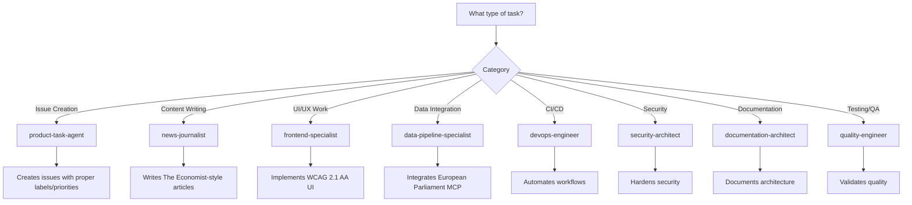

# 🤖 Custom GitHub Copilot Agents - EU Parliament Monitor

This directory contains custom agent profiles for GitHub Copilot, designed to provide domain-specific expertise for the EU Parliament Monitor project.

---

## 📋 Overview

Each agent profile is a Markdown file with YAML frontmatter that defines specialized expertise. When working on tasks related to a specific domain, GitHub Copilot can leverage these profiles to provide more informed and contextually appropriate assistance.

### Agent Architecture

All agents follow the **2026 GitHub Copilot Coding Agent Standard** with:

- **GitHub MCP Insiders API** integration for experimental features
- **Complete toolset support** (`--toolsets all --tools *`)
- **Organization-wide access** via PAT token (Hack23 repositories)
- **Modern Copilot features**: `assign_copilot_to_issue`, `create_pull_request_with_copilot`, stacked PRs, job tracking
- **Cross-repository patterns** for accessing European-Parliament-MCP-Server, riksdagsmonitor, cia, ISMS-PUBLIC
- **ISMS compliance** mapped to ISO 27001, NIST CSF 2.0, CIS Controls v8.1, GDPR, NIS2, EU CRA

---

## 🎯 Available Agents

### 1. 📊 Product Task Agent (`product-task-agent`)

**Expertise**: Product management, GitHub issue creation, European Parliament monitoring

**When to Use**:
- Creating GitHub issues for new features or improvements
- Analyzing repository health and quality metrics
- Coordinating work across multiple specialized agents
- Prioritizing tasks and managing product backlog
- European Parliament data integration planning
- ISMS compliance tracking and auditing

**Key Capabilities**:
- Automated issue creation with proper labels and priorities
- Playwright browser testing for visual regression
- Multi-language quality assurance (14 languages)
- WCAG 2.1 AA accessibility auditing
- European Parliament MCP integration monitoring
- ISMS policy enforcement (ISO 27001, GDPR, NIS2)
- Agent coordination and task assignment

**Example Use**:
```bash
@product-task-agent analyze the current state of multi-language support and create issues for any gaps found
```

---

### 2. 📰 News Journalist (`news-journalist`)

**Expertise**: The Economist-style European Parliament reporting, multi-language content generation

**When to Use**:
- Writing or editing news articles about European Parliament activities
- Generating week-ahead previews of plenary sessions
- Creating committee reports and analysis
- Covering legislative propositions and motions
- Multi-language content quality assurance
- SEO optimization and structured data

**Key Capabilities**:
- The Economist editorial standards and style
- European Parliament coverage (MEPs, committees, plenary sessions)
- Multi-language news generation (14 languages)
- European Parliament MCP data integration for articles
- Fact-checking and source verification
- GDPR-compliant political reporting
- SEO metadata and structured data generation

**Example Use**:
```bash
@news-journalist create a week-ahead article covering the upcoming plenary session using European Parliament MCP data
```

---

### 3. 🎨 Frontend Specialist (`frontend-specialist`)

**Expertise**: HTML5/CSS3, WCAG 2.1 AA accessibility, responsive design, multi-language UI

**When to Use**:
- Implementing or improving UI components
- Ensuring WCAG 2.1 AA accessibility compliance
- Creating responsive layouts (320px - 1440px+)
- Multi-language interface design
- Performance optimization (Core Web Vitals)
- Security headers configuration (CSP, HSTS)

**Key Capabilities**:
- Semantic HTML5 markup
- CSS3 responsive design patterns
- WCAG 2.1 AA accessibility implementation
- Keyboard navigation and screen reader support
- Multi-language UI patterns (14 languages, RTL support)
- Core Web Vitals optimization
- GitHub Pages deployment optimization

**Example Use**:
```bash
@frontend-specialist fix the language switcher to be fully keyboard accessible and WCAG 2.1 AA compliant
```

---

### 4. 🔄 Data Pipeline Specialist (`data-pipeline-specialist`)

**Expertise**: European Parliament MCP Server integration, data caching, API client patterns

**When to Use**:
- Integrating European Parliament MCP Server data
- Implementing data caching strategies
- Building retry logic and error handling
- Creating fallback mechanisms for MCP unavailability
- Validating data schemas and quality
- Optimizing API client performance

**Key Capabilities**:
- European Parliament MCP tool mastery (6 tools)
- ep-mcp-client.js patterns and best practices
- LRU cache implementation and TTL strategies
- Exponential backoff retry logic
- Undici HTTP client patterns
- Data schema validation
- Error handling and logging best practices

**Example Use**:
```bash
@data-pipeline-specialist implement caching for MEP data with a 24-hour TTL and retry logic for API failures
```

---

### 5. ⚙️ DevOps Engineer (`devops-engineer`)

**Expertise**: GitHub Actions, CI/CD, automation, deployment strategies

**When to Use**:
- Creating or modifying GitHub Actions workflows
- Setting up automated testing pipelines
- Implementing deployment automation
- Configuring Node.js and Playwright environments
- Managing MCP server pre-installation
- Branch protection and repository settings

**Key Capabilities**:
- GitHub Actions workflow authoring
- Daily news generation automation
- Playwright browser testing in CI
- Node.js 24 environment setup
- MCP server pre-installation and caching
- GitHub Pages deployment strategies
- Security scanning integration (Dependabot, CodeQL)

**Example Use**:
```bash
@devops-engineer create a GitHub Actions workflow to validate HTML/CSS on every PR
```

---

### 6. 🔒 Security Architect (`security-architect`)

**Expertise**: ISMS compliance, threat modeling, security hardening, GDPR/NIS2

**When to Use**:
- Implementing security controls and hardening
- Conducting threat modeling and risk assessments
- Ensuring ISMS policy compliance
- Implementing GDPR and NIS2 requirements
- Configuring security headers and TLS
- Reviewing code for security vulnerabilities

**Key Capabilities**:
- ISO 27001:2022 control implementation
- NIST CSF 2.0 function mapping
- CIS Controls v8.1 application
- GDPR, NIS2, EU CRA compliance
- Input validation and XSS prevention
- Security header configuration (CSP, HSTS, X-Frame-Options)
- Threat modeling and risk assessment

**Example Use**:
```bash
@security-architect review the article generation pipeline for potential XSS vulnerabilities and GDPR compliance
```

---

### 7. 📚 Documentation Architect (`documentation-architect`)

**Expertise**: C4 models, Mermaid diagrams, API documentation, architecture documentation

**When to Use**:
- Creating or updating architecture documentation
- Generating C4 diagrams (Context, Container, Component, Code)
- Creating Mermaid sequence or flow diagrams
- Documenting API endpoints and schemas
- Maintaining ARCHITECTURE.md and SECURITY_ARCHITECTURE.md
- Multi-language documentation strategies

**Key Capabilities**:
- C4 architecture model implementation
- Mermaid diagram generation
- European Parliament MCP API documentation
- ISMS policy documentation
- Multi-language documentation patterns (14 languages)
- README.md best practices
- Architecture decision records (ADRs)

**Example Use**:
```bash
@documentation-architect create a C4 Container diagram showing the European Parliament MCP integration architecture
```

---

### 8. ✅ Quality Engineer (`quality-engineer`)

**Expertise**: Testing, validation, accessibility testing, performance benchmarking

**When to Use**:
- Writing or improving tests
- Validating HTML/CSS with automated tools
- Conducting accessibility testing (WCAG 2.1 AA)
- Performance benchmarking and optimization
- Link integrity checking
- Multi-language quality assurance

**Key Capabilities**:
- Playwright visual regression testing
- HTMLHint and CSSLint validation
- WCAG 2.1 AA accessibility testing
- Core Web Vitals measurement
- Link integrity verification (linkinator)
- Test coverage and mutation testing
- Multi-language QA (14 languages)
- Cross-browser testing strategies

**Example Use**:
```bash
@quality-engineer create Playwright tests to validate all 14 language versions for accessibility compliance
```

---

## 🌍 European Parliament Context

All agents are configured with expertise in:

### Data Sources
- **European-Parliament-MCP-Server** (6 tools):
  - `get_meps` - MEP profiles and data
  - `get_plenary_sessions` - Session schedules and agendas
  - `search_documents` - Parliamentary document search
  - `get_parliamentary_questions` - Questions and answers
  - `get_committee_info` - Committee details and members
  - `get_voting_records` - Voting results and patterns

### Multi-Language Support (14 Languages)
- **EU Core**: English (en), German (de), French (fr), Spanish (es), Italian (it), Dutch (nl)
- **Nordic**: Swedish (sv), Danish (da), Finnish (fi)
- **Eastern Europe**: Polish (pl), Romanian (ro), Hungarian (hu)
- **Other**: Portuguese (pt), Greek (el)

### Article Types
- **Week Ahead**: Preview of upcoming plenary sessions and events
- **Committee Reports**: Analysis of committee activities and decisions
- **Propositions**: Government and parliamentary legislative proposals
- **Motions**: Parliamentary motions and resolutions

---

## 🔒 ISMS Compliance Framework

All agents enforce compliance with:

### ISO 27001:2022 Controls
- A.5.10: Information use (European Parliament transparency)
- A.8.3: Access restrictions (GitHub permissions, branch protection)
- A.8.23: Web filtering (CSP headers, security policies)
- A.8.24: Cryptography (TLS 1.3, HTTPS-only)
- A.8.28: Secure coding (HTML/CSS validation, input sanitization)

### NIST CSF 2.0 Functions
- **Identify**: Asset inventory (repositories, domains, data sources)
- **Protect**: Access control (GitHub MFA, branch protection)
- **Detect**: Monitoring (Dependabot, CodeQL, audit logs)
- **Respond**: Incident procedures (rollback, hotfix)
- **Recover**: Recovery planning (git history, backups)

### CIS Controls v8.1
- Control 1: Asset inventory
- Control 4: Secure configuration (GitHub Pages, headers)
- Control 6: Access control (branch protection, MFA)
- Control 8: Audit logging (GitHub audit logs)
- Control 16: Application security (validation, SAST)

### EU Regulations
- **GDPR**: Data protection, privacy by design
- **NIS2**: Network and information security directive
- **EU CRA**: Cyber Resilience Act compliance

**Reference**: [Hack23 ISMS-PUBLIC Repository](https://github.com/Hack23/ISMS-PUBLIC)

---

## 🤖 GitHub Copilot Insiders Features

All agents support modern Copilot coding agent features:

### 1. Basic Issue Assignment
```javascript
// Assign Copilot to an issue
await github.issue_write({
  method: "update",
  owner: "Hack23",
  repo: "euparliamentmonitor",
  issue_number: 42,
  assignees: ["copilot-swe-agent[bot]"]
});
```

### 2. Feature Branch Assignment
```javascript
// Work from a feature branch
await github.assign_copilot_to_issue({
  owner: "Hack23",
  repo: "euparliamentmonitor",
  issue_number: 42,
  base_ref: "feature/mep-profiles"
});
```

### 3. Custom Instructions Assignment
```javascript
// Provide additional context
await github.assign_copilot_to_issue({
  owner: "Hack23",
  repo: "euparliamentmonitor",
  issue_number: 42,
  base_ref: "main",
  custom_instructions: `
    - Follow European Parliament MCP patterns
    - Support all 14 languages
    - Ensure WCAG 2.1 AA compliance
    - Reference ISMS policies
  `
});
```

### 4. Direct PR Creation
```javascript
// Create PR with specific agent
await github.create_pull_request_with_copilot({
  owner: "Hack23",
  repo: "euparliamentmonitor",
  title: "Add MEP voting visualization",
  body: "Implement interactive voting charts using European Parliament MCP data",
  base_ref: "main",
  custom_agent: "data-pipeline-specialist"
});
```

### 5. Stacked PRs
```javascript
// Sequential PRs building on each other
const pr1 = await github.create_pull_request_with_copilot({
  owner: "Hack23",
  repo: "euparliamentmonitor",
  title: "Step 1: Add MEP data layer",
  body: "Implement European Parliament MCP client",
  base_ref: "main"
});

const pr2 = await github.create_pull_request_with_copilot({
  owner: "Hack23",
  repo: "euparliamentmonitor",
  title: "Step 2: Add MEP profiles",
  body: "Create multi-language MEP profile pages",
  base_ref: pr1.branch  // Stack on PR 1
});
```

### 6. Job Status Tracking
```javascript
// Monitor Copilot progress
const status = await github.get_copilot_job_status({
  owner: "Hack23",
  repo: "euparliamentmonitor",
  job_id: "abc123-def456"
});
```

---

## 🔗 Cross-Repository Access

All agents have access to the following Hack23 organization repositories:

| Repository | Purpose |
|-----------|---------|
| **European-Parliament-MCP-Server** | MCP server implementation, API schemas, tool documentation |
| **riksdagsmonitor** | Similar static site patterns, news generation workflows |
| **cia** | OSINT methodologies, intelligence analysis patterns |
| **ISMS-PUBLIC** | Compliance policies (ISO 27001, GDPR, NIS2), security requirements |
| **homepage** | Translation guides, multi-language best practices |

**Access Pattern Example**:
```javascript
// Reference riksdagsmonitor patterns
const riksdagPatterns = await github.get_file_contents({
  owner: "Hack23",
  repo: "riksdagsmonitor",
  path: "scripts/generate-news-enhanced.js"
});

// Check ISMS policies
const secureDevPolicy = await github.get_file_contents({
  owner: "Hack23",
  repo: "ISMS-PUBLIC",
  path: "Secure_Development_Policy.md"
});
```

---

## 📊 Agent Selection Guide

Use this decision tree to select the right agent:



### Quick Reference Table

| Task Type | Primary Agent | Secondary Agent(s) |
|-----------|--------------|-------------------|
| Create product issues | product-task-agent | - |
| Write news articles | news-journalist | data-pipeline-specialist |
| Fix accessibility | frontend-specialist | quality-engineer |
| Add MEP data | data-pipeline-specialist | frontend-specialist |
| Setup CI/CD | devops-engineer | security-architect |
| Security audit | security-architect | quality-engineer |
| Architecture docs | documentation-architect | - |
| Run tests | quality-engineer | frontend-specialist |

---

## 🚀 Usage Examples

### Example 1: Create Feature Issue

```bash
# Use product-task-agent to analyze and create issues
@product-task-agent analyze the European Parliament MCP integration and create issues for any missing features or quality gaps
```

**Expected Outcome**: Multiple well-structured GitHub issues with:
- Clear titles and descriptions
- Proper labels (`type:feature`, `priority:high`, etc.)
- Acceptance criteria
- ISMS compliance mapping
- Recommended agent assignments

---

### Example 2: Generate News Article

```bash
# Use news-journalist to create content
@news-journalist create a week-ahead article for the upcoming plenary session in all 14 languages using European Parliament MCP data
```

**Expected Outcome**: Multi-language news articles with:
- The Economist editorial style
- European Parliament MCP data integration
- SEO-optimized metadata
- Proper HTML5 semantic structure
- GDPR-compliant content

---

### Example 3: Implement Accessibility Fix

```bash
# Use frontend-specialist for UI improvements
@frontend-specialist make the language switcher fully keyboard accessible and ensure it passes WCAG 2.1 AA Level A compliance
```

**Expected Outcome**: Accessible UI component with:
- Keyboard navigation (Tab, Enter, Space, Arrow keys)
- ARIA attributes for screen readers
- Focus indicators
- Playwright tests for keyboard interaction
- WCAG 2.1 AA validation

---

### Example 4: Setup Automated Testing

```bash
# Use devops-engineer for CI/CD
@devops-engineer create a GitHub Actions workflow to validate HTML/CSS on every pull request and run Playwright accessibility tests
```

**Expected Outcome**: GitHub Actions workflow with:
- HTMLHint and CSSLint validation
- Playwright browser testing
- Accessibility auditing
- Multi-language testing
- Results reporting in PR comments

---

## 🏗️ Agent Development Patterns

### Pattern 1: Coordinated Multi-Agent Workflow

```bash
# Step 1: Product planning
@product-task-agent create a feature plan for MEP voting record visualization

# Step 2: Data integration
@data-pipeline-specialist implement the European Parliament MCP integration for voting records

# Step 3: Frontend implementation
@frontend-specialist create the responsive voting chart UI with WCAG 2.1 AA support

# Step 4: Quality assurance
@quality-engineer write Playwright tests and validate accessibility across all 14 languages

# Step 5: Documentation
@documentation-architect create C4 diagrams and API documentation for the voting visualization feature
```

### Pattern 2: Stacked PRs for Complex Features

```javascript
// PR 1: Data layer (data-pipeline-specialist)
const pr1 = await github.create_pull_request_with_copilot({
  owner: "Hack23",
  repo: "euparliamentmonitor",
  title: "Step 1: Add voting record data fetching",
  body: "Implement European Parliament MCP client for voting data",
  base_ref: "main",
  custom_agent: "data-pipeline-specialist"
});

// PR 2: UI layer (frontend-specialist)
const pr2 = await github.create_pull_request_with_copilot({
  owner: "Hack23",
  repo: "euparliamentmonitor",
  title: "Step 2: Add voting chart visualization",
  body: "Create responsive voting chart using data from PR #1",
  base_ref: pr1.branch,
  custom_agent: "frontend-specialist"
});

// PR 3: Testing (quality-engineer)
const pr3 = await github.create_pull_request_with_copilot({
  owner: "Hack23",
  repo: "euparliamentmonitor",
  title: "Step 3: Add comprehensive tests",
  body: "Implement Playwright tests and accessibility validation",
  base_ref: pr2.branch,
  custom_agent: "quality-engineer"
});
```

---

## 📚 Additional Resources

### Hack23 Organization
- **ISMS Policies**: https://github.com/Hack23/ISMS-PUBLIC
- **Riksdagsmonitor**: https://github.com/Hack23/riksdagsmonitor
- **CIA Platform**: https://github.com/Hack23/cia
- **Homepage**: https://github.com/Hack23/homepage

### European Parliament
- **MCP Server**: https://github.com/Hack23/European-Parliament-MCP-Server
- **Official APIs**: https://data.europarl.europa.eu/

### GitHub Copilot
- **Custom Agents**: https://docs.github.com/en/copilot/concepts/agents/coding-agent/about-custom-agents
- **MCP Protocol**: https://modelcontextprotocol.io/

### Standards & Compliance
- **ISO 27001:2022**: https://www.iso.org/standard/27001
- **NIST CSF 2.0**: https://www.nist.gov/cyberframework
- **CIS Controls v8.1**: https://www.cisecurity.org/controls
- **WCAG 2.1**: https://www.w3.org/WAI/WCAG21/quickref/
- **GDPR**: https://gdpr-info.eu/
- **NIS2 Directive**: https://digital-strategy.ec.europa.eu/en/policies/nis2-directive

---

## 🛠️ Development & Maintenance

### Adding New Agents

When creating new agents, follow this structure:

```markdown
---
name: agent-name
description: Brief description (max 200 chars)
tools: ["*"]
mcp-servers:
  github:
    # Standard GitHub MCP configuration
---

# Agent Title

## 📋 Required Context Files
## Role Definition
## Core Expertise
## Standards and Guidelines
## GitHub MCP Insiders Experimental Features
## Capabilities
## Boundaries & Limitations
## Integration with Other Agents
## Skills to Leverage
## Cross-Repository Access
## Quality Standards
## Remember
```

### Updating Agents

When updating agents:
1. Maintain YAML frontmatter structure
2. Ensure GitHub MCP Insiders features are documented
3. Keep ISMS compliance mappings current
4. Update cross-repository references as needed
5. Test agent behavior in GitHub Copilot
6. Document changes in commit messages

---

## 🤝 Contributing

When contributing to agent development:

1. **Follow Standards**: Use existing agents as templates
2. **Test Thoroughly**: Validate YAML syntax and agent behavior
3. **Document Fully**: Include examples and use cases
4. **ISMS Compliance**: Map to ISO 27001, NIST CSF, CIS Controls
5. **European Parliament Focus**: Ensure EU-specific context
6. **Multi-Language**: Support all 14 languages
7. **Security First**: Follow Hack23 Secure Development Policy

---

## 📞 Support

For questions or issues:

- **Repository Issues**: https://github.com/Hack23/euparliamentmonitor/issues
- **ISMS Questions**: Reference https://github.com/Hack23/ISMS-PUBLIC
- **Agent Curator**: @hack23-agent-curator (org-level agent)

---

**Last Updated**: 2026-02-16  
**Version**: 1.0  
**Maintained by**: Hack23 AB
