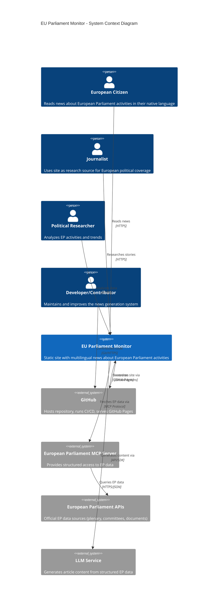
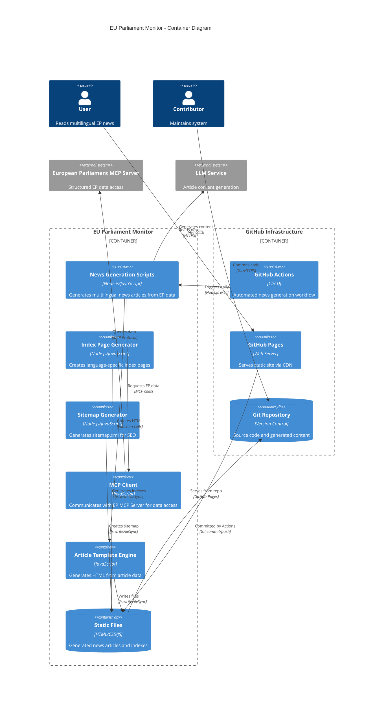
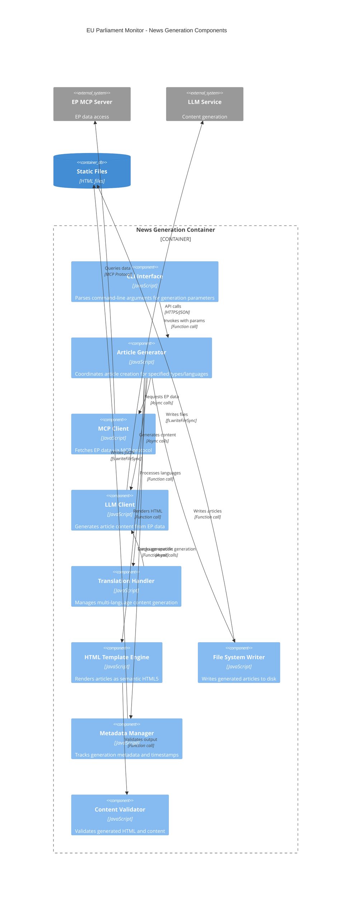
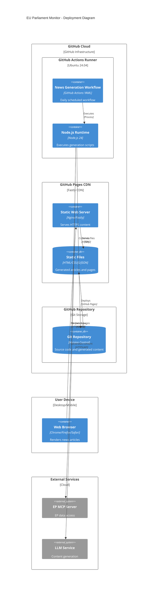
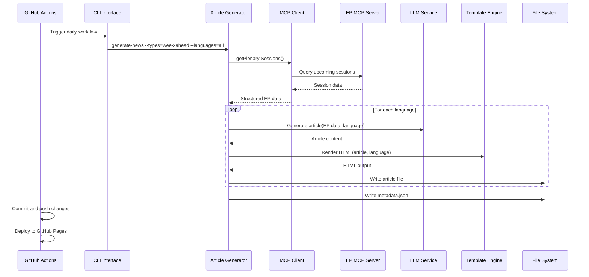
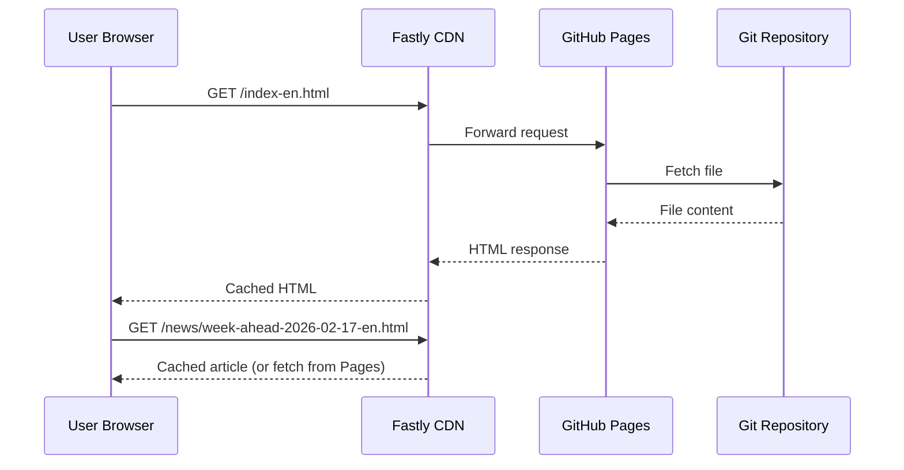

# 🏛️ EU Parliament Monitor Architecture

This document serves as the primary entry point for the EU Parliament Monitor's architectural documentation. It provides a comprehensive view of the system's design using the C4 model approach, starting from a high-level system context and drilling down to component interactions.

## 📚 Architecture Documentation Map

| Document                                            | Focus           | Description                               | Documentation Link                                                              |
| --------------------------------------------------- | --------------- | ----------------------------------------- | ------------------------------------------------------------------------------- |
| **[Architecture](ARCHITECTURE.md)**                 | 🏛️ Architecture | C4 model showing current system structure | [View Source](https://github.com/Hack23/euparliamentmonitor/blob/main/ARCHITECTURE.md)         |
| **[Future Architecture](FUTURE_ARCHITECTURE.md)**   | 🏛️ Architecture | C4 model showing future system structure | [View Source](https://github.com/Hack23/euparliamentmonitor/blob/main/FUTURE_ARCHITECTURE.md)         |
| **[Mindmaps](MINDMAP.md)**                          | 🧠 Concept      | Current system component relationships    | [View Source](https://github.com/Hack23/euparliamentmonitor/blob/main/MINDMAP.md)             |
| **[Future Mindmaps](FUTURE_MINDMAP.md)**            | 🧠 Concept      | Future capability evolution               | [View Source](https://github.com/Hack23/euparliamentmonitor/blob/main/FUTURE_MINDMAP.md)      |
| **[SWOT Analysis](SWOT.md)**                        | 💼 Business     | Current strategic assessment              | [View Source](https://github.com/Hack23/euparliamentmonitor/blob/main/SWOT.md)                |
| **[Future SWOT Analysis](FUTURE_SWOT.md)**          | 💼 Business     | Future strategic opportunities            | [View Source](https://github.com/Hack23/euparliamentmonitor/blob/main/FUTURE_SWOT.md)         |
| **[Data Model](DATA_MODEL.md)**                     | 📊 Data         | Current data structures and relationships | [View Source](https://github.com/Hack23/euparliamentmonitor/blob/main/DATA_MODEL.md)          |
| **[Future Data Model](FUTURE_DATA_MODEL.md)**       | 📊 Data         | Enhanced European Parliament data architecture      | [View Source](https://github.com/Hack23/euparliamentmonitor/blob/main/FUTURE_DATA_MODEL.md)   |
| **[Flowcharts](FLOWCHART.md)**                      | 🔄 Process      | Current data processing workflows         | [View Source](https://github.com/Hack23/euparliamentmonitor/blob/main/FLOWCHART.md)           |
| **[Future Flowcharts](FUTURE_FLOWCHART.md)**        | 🔄 Process      | Enhanced AI-driven workflows              | [View Source](https://github.com/Hack23/euparliamentmonitor/blob/main/FUTURE_FLOWCHART.md)    |
| **[State Diagrams](STATEDIAGRAM.md)**               | 🔄 Behavior     | Current system state transitions          | [View Source](https://github.com/Hack23/euparliamentmonitor/blob/main/STATEDIAGRAM.md)        |
| **[Future State Diagrams](FUTURE_STATEDIAGRAM.md)** | 🔄 Behavior     | Enhanced adaptive state transitions       | [View Source](https://github.com/Hack23/euparliamentmonitor/blob/main/FUTURE_STATEDIAGRAM.md) |
| **[Security Architecture](SECURITY_ARCHITECTURE.md)** | 🛡️ Security   | Current security implementation           | [View Source](https://github.com/Hack23/euparliamentmonitor/blob/main/SECURITY_ARCHITECTURE.md) |
| **[Future Security Architecture](FUTURE_SECURITY_ARCHITECTURE.md)** | 🛡️ Security | Security enhancement roadmap | [View Source](https://github.com/Hack23/euparliamentmonitor/blob/main/FUTURE_SECURITY_ARCHITECTURE.md) |

## 🎯 System Overview

EU Parliament Monitor is a static site generator that creates multi-language news articles about European Parliament activities, leveraging the European Parliament MCP Server for data access and LLM-based content generation.

### Mission Statement

**Enable democratic transparency** by providing automated, multilingual coverage of European Parliament activities through a secure, maintainable static site architecture.

### Key Characteristics

- **Zero Runtime Dependencies**: Pure static HTML/CSS/JS with no server-side execution
- **Multi-Language Support**: Generates content in 14 European languages
- **MCP Integration**: Uses European Parliament MCP Server for data access
- **Security by Design**: Minimal attack surface through static architecture
- **GitHub Hosted**: Leverages GitHub Pages for zero-infrastructure hosting

---

## 📊 C4 Model Level 1: System Context Diagram

**👤 User Focus:** Shows how different user types interact with the EU Parliament Monitor system and what external systems it depends on.

**🌐 Integration Focus:** Illustrates the relationships with GitHub infrastructure, European Parliament APIs, and LLM services.

### Context Diagram - Key Elements

| Element | Type | Description | Technology |
|---------|------|-------------|------------|
| **European Citizen** | User | Primary audience seeking EP news in native language | Web Browser |
| **Journalist** | User | Professional using site for research and story development | Web Browser |
| **Political Researcher** | User | Academic or analyst studying EP activities | Web Browser |
| **Developer/Contributor** | User | Maintainer improving system | Git, Node.js, VS Code |
| **EU Parliament Monitor** | System | Core static site generator | Node.js, JavaScript |
| **GitHub** | External System | Source control, CI/CD, hosting | GitHub Actions, Pages |
| **EP MCP Server** | External System | Structured EP data access | MCP Protocol, TypeScript |
| **EP APIs** | External System | Official data sources | REST APIs, JSON |
| **LLM Service** | External System | Content generation | API (OpenAI/Anthropic/etc.) |

---

## 📦 C4 Model Level 2: Container Diagram

**📦 Container Focus:** Shows the major containers (applications, data stores, microservices) that make up the system.

**🔄 Data Flow Focus:** Illustrates how data flows between containers during news generation.

### Container Diagram - Key Elements

| Container | Technology | Purpose | Data Flow |
|-----------|------------|---------|-----------|
| **News Generation Scripts** | Node.js/JavaScript | Core article generation logic | Orchestrates MCP data fetch and LLM generation |
| **Index Page Generator** | Node.js/JavaScript | Creates language-specific index pages | Aggregates article metadata into navigation |
| **Sitemap Generator** | Node.js/JavaScript | SEO sitemap creation | Lists all pages for search engine crawling |
| **MCP Client** | JavaScript | EP data access | Communicates with MCP Server for structured data |
| **Article Template Engine** | JavaScript | HTML generation | Converts article data to semantic HTML5 |
| **Static Files** | HTML/CSS/JS | Generated output | Committed to repository, served by GitHub Pages |
| **GitHub Actions** | CI/CD | Automation | Daily workflow execution, build and deploy |
| **GitHub Pages** | CDN/Web Server | Hosting | HTTPS delivery of static content |
| **Git Repository** | Version Control | Source & Content | Stores code, generated articles, configuration |

---

## 🧩 C4 Model Level 3: Component Diagram - News Generation

**🔧 Component Focus:** Detailed view of the news generation container's internal components.

**🎯 Responsibility Focus:** Shows how different components collaborate to generate multilingual news articles.

### Component Diagram - Key Elements

| Component | Responsibility | Dependencies | File Location |
|-----------|---------------|--------------|---------------|
| **CLI Interface** | Parse command-line arguments | Node.js process.argv | scripts/generate-news-enhanced.js |
| **Article Generator** | Orchestrate article creation | MCP Client, LLM Client, Template | scripts/generate-news-enhanced.js |
| **MCP Client** | Fetch EP data via MCP | EP MCP Server | scripts/ep-mcp-client.js |
| **LLM Client** | Generate article text | LLM Service API | Integrated in article generator |
| **Translation Handler** | Manage multi-language generation | LLM Client | scripts/generate-news-enhanced.js |
| **HTML Template Engine** | Render semantic HTML5 | Article data | scripts/article-template.js |
| **File System Writer** | Write files to disk | Node.js fs module | scripts/generate-news-enhanced.js |
| **Metadata Manager** | Track generation metadata | Article data | scripts/generate-news-enhanced.js |
| **Content Validator** | Validate HTML output | HTML validator | Integrated in template |

---

## 🔄 Deployment Diagram

**☁️ Infrastructure Focus:** Shows how the system is deployed on GitHub infrastructure.

**🚀 CI/CD Focus:** Illustrates the automated deployment pipeline.

### Deployment - Key Infrastructure

| Infrastructure Component | Technology | Purpose | Configuration |
|--------------------------|------------|---------|---------------|
| **GitHub Actions Runner** | Ubuntu 24.04, Node.js 24 | Execute generation workflow | .github/workflows/news-generation.yml |
| **GitHub Pages CDN** | Fastly CDN, Nginx | Serve static content globally | Enabled in repository settings |
| **Git Repository** | GitHub Storage | Version control + content storage | public repository |
| **Web Browser** | Modern browsers | Render news articles | HTML5, CSS3, ES6+ |
| **EP MCP Server** | External service | EP data access | MCP protocol endpoint |
| **LLM Service** | External API | Content generation | API key authentication |

---

## 📊 Technology Stack

### Core Technologies

| Layer | Technology | Version | Purpose |
|-------|------------|---------|---------|
| **Runtime** | Node.js | 24.x | JavaScript execution environment |
| **Language** | JavaScript | ES2022 | Primary development language |
| **Package Manager** | npm | 10.x | Dependency management |
| **Testing** | Vitest | 3.x | Unit and integration testing |
| **E2E Testing** | Playwright | 1.58.x | End-to-end browser testing |
| **Linting** | ESLint | 9.x | Code quality and security |
| **Formatting** | Prettier | 3.x | Code formatting |

### Security & Quality

| Tool | Purpose | Integration |
|------|---------|-------------|
| **CodeQL** | SAST scanning | GitHub Actions (weekly + PR) |
| **Dependabot** | Dependency vulnerability scanning | GitHub native (daily) |
| **npm audit** | Dependency security check | Pre-commit + CI |
| **ESLint Security** | Security-focused linting | Pre-commit + CI |
| **HTMLHint** | HTML validation | CI pipeline |
| **Husky** | Git hooks | Pre-commit, pre-push |

### Infrastructure

| Service | Purpose | Configuration |
|---------|---------|---------------|
| **GitHub Actions** | CI/CD automation | .github/workflows/ |
| **GitHub Pages** | Static site hosting | Repository settings |
| **Fastly CDN** | Content delivery | GitHub Pages integration |
| **Git** | Version control | Repository |

---

## 🔄 Data Flow

### News Generation Flow

### User Request Flow

---

## 🎯 Design Principles

### 1. Security by Design

- **Minimal Attack Surface**: Static architecture eliminates server-side vulnerabilities
- **No Runtime Execution**: Pure HTML/CSS/JS with no backend processing
- **Content Security Policy**: Strict CSP headers prevent XSS
- **HTTPS Only**: All content delivered over HTTPS

### 2. Separation of Concerns

- **Generation**: News generation scripts (Node.js)
- **Presentation**: Static HTML/CSS/JS
- **Data Access**: MCP Client abstraction
- **Infrastructure**: GitHub-managed CI/CD and hosting

### 3. Multi-Language First

- **14 Languages Supported**: Full European language coverage
- **Language-Specific Indexes**: Separate navigation for each language
- **SEO Per Language**: Individual sitemaps and metadata

### 4. Maintainability

- **Zero Dependencies**: No runtime dependencies, only dev dependencies
- **Standard Technologies**: HTML5, CSS3, vanilla JavaScript
- **Comprehensive Testing**: Unit, integration, and E2E tests
- **Documentation**: Architecture, security, and process docs

### 5. Scalability

- **Static Content**: Infinite scalability via CDN
- **No Database**: No scaling bottlenecks
- **Cacheable**: All content highly cacheable
- **GitHub Infrastructure**: Leverages GitHub's global infrastructure

---

## 📈 System Qualities

### Performance

- **Cold Start**: N/A (static site, no cold starts)
- **Page Load**: < 1s (static HTML, CDN cached)
- **Build Time**: ~5-10 minutes (generation for all languages)
- **Deployment Time**: < 1 minute (GitHub Pages deploy)

### Availability

- **Target**: 99.9% (GitHub Pages SLA)
- **Redundancy**: Fastly CDN with multiple POPs
- **Failover**: Automatic via GitHub infrastructure
- **Monitoring**: GitHub Status page

### Security

- **Attack Surface**: Minimal (static files only)
- **Vulnerability Scanning**: Daily (Dependabot + npm audit)
- **SAST**: Weekly (CodeQL)
- **Compliance**: ISO 27001, GDPR, NIS2, EU CRA aligned

### Maintainability

- **Code Complexity**: Low (simple scripts, no frameworks)
- **Test Coverage**: 82%+ lines, 83%+ branches
- **Documentation**: Comprehensive (10+ architecture docs)
- **Dependencies**: Zero production, 17 dev dependencies

---

## 🔗 Related Documentation

- **[Security Architecture](SECURITY_ARCHITECTURE.md)** - Detailed security implementation and threat model
- **[Future Architecture](FUTURE_ARCHITECTURE.md)** - Architectural evolution roadmap
- **[Data Model](DATA_MODEL.md)** - Data structures and EP API integration
- **[Flowcharts](FLOWCHART.md)** - Detailed process workflows
- **[State Diagrams](STATEDIAGRAM.md)** - System state transitions
- **[Mindmaps](MINDMAP.md)** - Conceptual system relationships
- **[SWOT Analysis](SWOT.md)** - Strategic analysis and positioning
- **[README.md](README.md)** - Getting started guide and features overview

---

**Document Status:** Living Document  
**Last Updated:** 2026-02-17  
**Next Review:** 2026-05-17  
**Owner:** Security Architect / CTO

This architecture documentation follows the [C4 model](https://c4model.com/) methodology and complies with [Hack23 ISMS Secure Development Policy](https://github.com/Hack23/ISMS-PUBLIC/blob/main/Secure_Development_Policy.md).

