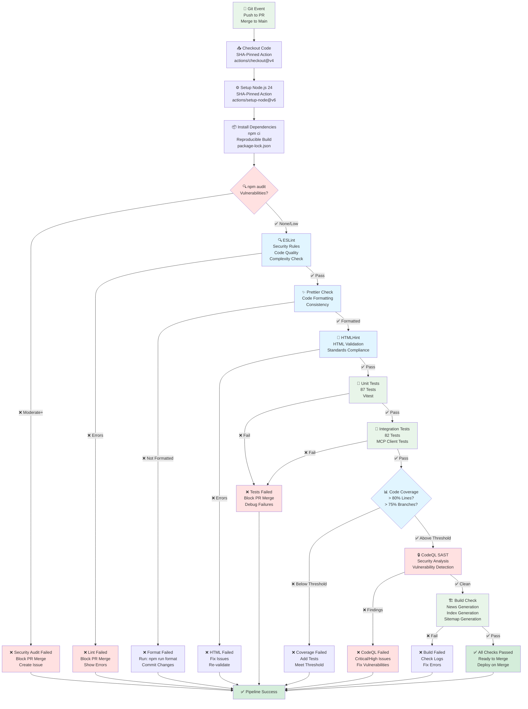
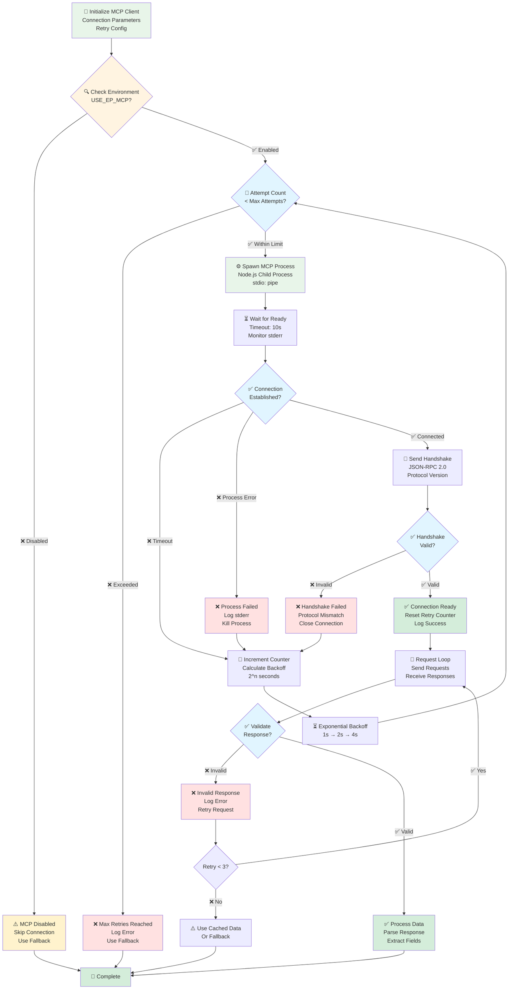
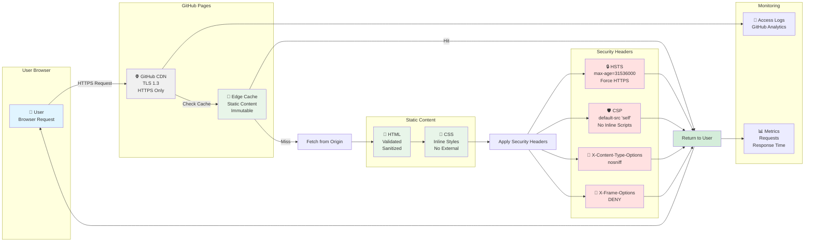
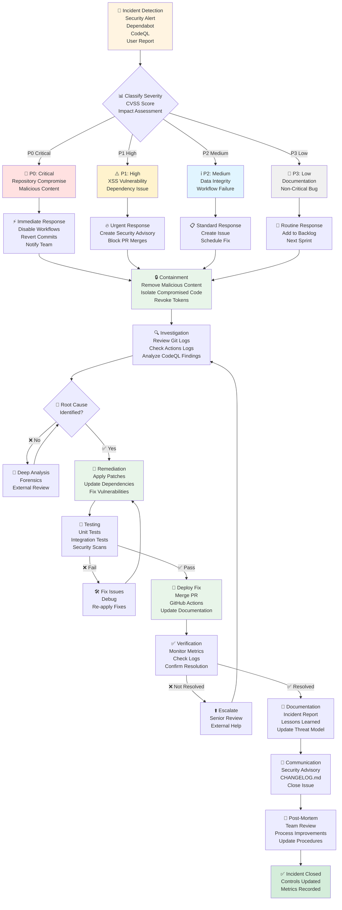

# 📈 EU Parliament Monitor — Security Flow Charts

**Version:** 1.0  
**Last Updated:** 2025-02-17  
**Status:** Active Documentation

---

## 📋 Overview

This document provides detailed process flow diagrams showing security controls, data flows, and decision points in the EU Parliament Monitor platform.

---

## 🔐 News Generation Security Flow

```mermaid
flowchart TD
    Start[🚀 GitHub Actions Trigger<br/>Schedule: 06:00 UTC<br/>Manual: workflow_dispatch] --> CheckMCP{🔌 MCP Server<br/>Available?}
    
    CheckMCP -->|✅ Yes| ConnectMCP[🔗 Connect to EP MCP Server<br/>stdio/localhost]
    CheckMCP -->|❌ No| Fallback[⚠️ Use Placeholder Content<br/>Log Error]
    
    ConnectMCP --> RetryCheck{🔄 Connection<br/>Successful?}
    RetryCheck -->|❌ No| RetryCount{Retry < 3?}
    RetryCount -->|✅ Yes| BackoffWait[⏳ Exponential Backoff<br/>Wait 1s, 2s, 4s]
    BackoffWait --> ConnectMCP
    RetryCount -->|❌ No| Fallback
    
    RetryCheck -->|✅ Yes| FetchData[📥 Fetch Parliamentary Data<br/>Plenary Sessions<br/>Committee Meetings<br/>Documents]
    
    FetchData --> ValidateSchema{✅ Validate<br/>JSON Schema?}
    ValidateSchema -->|❌ Invalid| LogError1[📝 Log Validation Error<br/>Error Type<br/>Field Name] --> Fallback
    ValidateSchema -->|✅ Valid| ValidateType{✅ Type Check<br/>Data Types?}
    
    ValidateType -->|❌ Invalid| LogError2[📝 Log Type Error<br/>Expected vs Actual] --> Fallback
    ValidateType -->|✅ Valid| ValidateRange{✅ Range Check<br/>Dates, Lengths?}
    
    ValidateRange -->|❌ Invalid| LogError3[📝 Log Range Error<br/>Out of Bounds] --> Fallback
    ValidateRange -->|✅ Valid| SanitizeHTML[🧹 Sanitize HTML<br/>Strip Script Tags<br/>Remove Event Handlers]
    
    Fallback --> Generate
    SanitizeHTML --> EncodeHTML[🔒 HTML Entity Encoding<br/>Convert: &lt; &gt; &amp; &quot; &#39;]
    
    EncodeHTML --> Generate[📝 Generate Articles<br/>All Languages<br/>All Types]
    
    Generate --> HTMLValidate[✅ Validate HTML<br/>htmlhint Rules<br/>Standards Compliance]
    
    HTMLValidate -->|❌ Fail| FixHTML[🔧 Fix HTML Issues<br/>Auto-correct<br/>Report Issues]
    FixHTML --> HTMLValidate
    
    HTMLValidate -->|✅ Pass| GenerateIndex[📋 Generate Language Indexes<br/>index-{lang}.html<br/>Sort by Date]
    
    GenerateIndex --> GenerateSitemap[🗺️ Generate Sitemap<br/>sitemap.xml<br/>SEO Optimization]
    
    GenerateSitemap --> RunTests[🧪 Run Security Tests<br/>ESLint Security<br/>npm audit<br/>Unit Tests]
    
    RunTests -->|❌ Fail| TestFail[❌ Tests Failed<br/>Block Commit<br/>Notify Team]
    RunTests -->|✅ Pass| CommitChanges[📦 Commit Changes<br/>Git Add<br/>Git Commit<br/>Git Push]
    
    CommitChanges --> Complete[✅ Generation Complete<br/>Articles Published<br/>Indexes Updated]
    TestFail --> End[❌ Workflow Failed]
    Complete --> End[🎉 Workflow Success]
    
    style Start fill:#e8f5e9
    style CheckMCP fill:#fff4e1
    style ConnectMCP fill:#e1f5ff
    style Fallback fill:#ffe1e1
    style ValidateSchema fill:#e1f5ff
    style ValidateType fill:#e1f5ff
    style ValidateRange fill:#e1f5ff
    style SanitizeHTML fill:#e8f5e9
    style EncodeHTML fill:#e8f5e9
    style Generate fill:#e8f5e9
    style HTMLValidate fill:#e1f5ff
    style CommitChanges fill:#e8f5e9
    style Complete fill:#d4edda
    style End fill:#d4edda
    style TestFail fill:#ffe1e1
```

---

## 🔍 Input Validation Security Flow

```mermaid
flowchart TD
    Input[📥 External Input<br/>European Parliament API<br/>Untrusted Data] --> Layer1{🛡️ Layer 1<br/>Schema Validation}
    
    Layer1 -->|❌ Invalid Structure| Reject1[❌ Reject Input<br/>Log: Invalid JSON<br/>Use Fallback]
    Layer1 -->|✅ Valid Structure| Layer2{🛡️ Layer 2<br/>Type Validation}
    
    Layer2 -->|❌ Wrong Types| Reject2[❌ Reject Input<br/>Log: Type Mismatch<br/>Use Fallback]
    Layer2 -->|✅ Correct Types| Layer3{🛡️ Layer 3<br/>Range Validation}
    
    Layer3 -->|❌ Out of Bounds| Reject3[❌ Reject Input<br/>Log: Range Error<br/>Use Fallback]
    Layer3 -->|✅ Within Bounds| Layer4{🛡️ Layer 4<br/>Content Sanitization}
    
    Layer4 --> StripScript[🧹 Strip Script Tags<br/>Remove: &lt;script&gt;<br/>Remove: &lt;iframe&gt;<br/>Remove: &lt;object&gt;]
    StripScript --> RemoveEvents[🧹 Remove Event Handlers<br/>Remove: onclick<br/>Remove: onerror<br/>Remove: onload]
    RemoveEvents --> ValidateURLs[🔍 Validate URLs<br/>Check Protocol<br/>Sanitize Path]
    
    ValidateURLs --> Layer5{🛡️ Layer 5<br/>HTML Encoding}
    
    Layer5 --> EncodeSpecial[🔒 Encode Special Chars<br/>&lt; → &amp;lt;<br/>&gt; → &amp;gt;<br/>&amp; → &amp;amp;<br/>&quot; → &amp;quot;<br/>&#39; → &amp;#39;]
    
    EncodeSpecial --> Layer6{🛡️ Layer 6<br/>CSP Compliance}
    
    Layer6 --> CheckCSP[✅ Check CSP Headers<br/>No Inline Scripts<br/>No Eval()<br/>No External Scripts]
    
    CheckCSP -->|❌ Violation| Reject4[❌ Block Content<br/>Log: CSP Violation<br/>Return Error]
    CheckCSP -->|✅ Compliant| SafeOutput[✅ Safe Output<br/>Validated<br/>Sanitized<br/>Encoded]
    
    Reject1 --> FallbackContent[⚠️ Fallback Content<br/>Placeholder Articles<br/>Safe Default]
    Reject2 --> FallbackContent
    Reject3 --> FallbackContent
    Reject4 --> FallbackContent
    
    SafeOutput --> DeliverContent[📤 Deliver to Template<br/>Generate HTML<br/>Serve to Users]
    FallbackContent --> DeliverContent
    
    style Input fill:#fff4e1
    style Layer1 fill:#e1f5ff
    style Layer2 fill:#e1f5ff
    style Layer3 fill:#e1f5ff
    style Layer4 fill:#e8f5e9
    style Layer5 fill:#e8f5e9
    style Layer6 fill:#e8f5e9
    style Reject1 fill:#ffe1e1
    style Reject2 fill:#ffe1e1
    style Reject3 fill:#ffe1e1
    style Reject4 fill:#ffe1e1
    style SafeOutput fill:#d4edda
    style FallbackContent fill:#fff3cd
    style DeliverContent fill:#d4edda
```

---

## 🤖 CI/CD Security Pipeline



---

## 🔐 MCP Client Connection Security Flow



---

## 📊 Content Delivery Security Flow



---

## 🚨 Incident Response Flow



---

## 🚀 Release Workflow with Documentation Automation

This comprehensive flow shows the automated release process with SLSA Level 3 attestations and documentation-as-code implementation.

```mermaid
flowchart TD
    Start[🚀 Release Trigger<br/>Manual or Tag Push] --> Prepare[📋 Prepare Job]
    
    Prepare --> Lint[🔍 Run Linter<br/>ESLint Validation]
    Lint --> HTMLVal[✅ Validate HTML<br/>htmlhint]
    HTMLVal --> Coverage[📊 Run Tests with Coverage<br/>169 Unit Tests<br/>82%+ Coverage]
    
    Coverage --> CoverageCheck{Coverage<br/>Thresholds?}
    CoverageCheck -->|❌ Fail| Fail1[❌ Build Failed]
    CoverageCheck -->|✅ Pass| E2E[🎭 Run E2E Tests<br/>Playwright Chromium]
    
    E2E --> E2ECheck{E2E Tests<br/>Pass?}
    E2ECheck -->|❌ Fail| Fail2[❌ Build Failed]
    E2ECheck -->|✅ Pass| CleanDocs[🧹 Clean Old Documentation<br/>Remove docs/api, coverage, test-results]
    
    CleanDocs --> GenAPI[📖 Generate API Documentation<br/>JSDoc → docs/api/<br/>52 files]
    GenAPI --> CopyReports[📋 Copy Test Reports<br/>Coverage → docs/coverage/<br/>Test Results → docs/test-results/]
    
    CopyReports --> GenIndex[🎨 Generate Documentation Index<br/>Beautiful Hub Page<br/>docs/index.html]
    
    GenIndex --> VerifyDocs{Verify<br/>Documentation<br/>Structure?}
    VerifyDocs -->|❌ Missing Files| Fail3[❌ Build Failed]
    VerifyDocs -->|✅ Complete| CommitDocs[💾 Commit Documentation<br/>Git Auto-Commit<br/>To Main Branch]
    
    CommitDocs --> TagVersion{Workflow<br/>Dispatch?}
    TagVersion -->|✅ Yes| CreateTag[🏷️ Create Version Tag<br/>npm version + git tag]
    TagVersion -->|❌ No| Build[🔨 Build Job]
    CreateTag --> Build
    
    Build --> Checkout2[📥 Checkout at Tag]
    Checkout2 --> GenNews{News<br/>Directory<br/>Empty?}
    GenNews -->|✅ Yes| SampleNews[📰 Generate Sample News<br/>Week Ahead Articles]
    GenNews -->|❌ No| CreateArtifact
    SampleNews --> CreateArtifact[📦 Create Release Artifacts<br/>Include docs/, playwright-report/<br/>ZIP Archive]
    
    CreateArtifact --> GenSBOM[🔐 Generate SBOM<br/>SPDX JSON Format<br/>Anchore SBOM Action]
    GenSBOM --> BuildProv[📜 Build Provenance Attestation<br/>SLSA Level 3<br/>GitHub Attestations API]
    BuildProv --> SBOMAttest[🔏 SBOM Attestation<br/>Cryptographic Signing]
    
    SBOMAttest --> UploadArtifacts[📤 Upload All Artifacts<br/>Build + Security Artifacts]
    
    UploadArtifacts --> Release[🚀 Release Job]
    Release --> DraftNotes[📝 Draft Release Notes<br/>Release Drafter]
    DraftNotes --> CreateRelease[🎉 Create GitHub Release<br/>Attach All Artifacts]
    
    CreateRelease --> Verify{Verification<br/>Required?}
    Verify -->|✅ Yes| VerifyCmd[🔍 Verify Attestations<br/>gh attestation verify]
    Verify -->|❌ No| Complete[✅ Release Complete<br/>Documentation Published<br/>Artifacts Attested]
    VerifyCmd --> Complete
    
    style Start fill:#e3f2fd
    style Prepare fill:#f0f4c3
    style Lint fill:#e1f5ff
    style Coverage fill:#e1f5ff
    style E2E fill:#e1f5ff
    style CleanDocs fill:#fff9c4
    style GenAPI fill:#c8e6c9
    style CopyReports fill:#c8e6c9
    style GenIndex fill:#c8e6c9
    style CommitDocs fill:#a5d6a7
    style Build fill:#f0f4c3
    style GenSBOM fill:#ffe1e1
    style BuildProv fill:#ffe1e1
    style SBOMAttest fill:#ffe1e1
    style Release fill:#f0f4c3
    style CreateRelease fill:#c5cae9
    style Complete fill:#c8e6c9
    style Fail1 fill:#ffcdd2
    style Fail2 fill:#ffcdd2
    style Fail3 fill:#ffcdd2
```



### Release Workflow Security Controls

| Stage | Control | Purpose | ISMS Reference |
|-------|---------|---------|----------------|
| **Validation** | Linter + HTML validation | Code quality, syntax errors | Quality standards |
| **Testing** | 169 unit tests, 82%+ coverage | Functional correctness | §3.3 Testing Requirements |
| **E2E Testing** | Playwright across browsers | User workflow validation | Quality assurance |
| **Documentation** | JSDoc, coverage, E2E reports | Evidence generation | §3.2 Architecture Documentation |
| **Version Control** | Git commit + tag | Audit trail, traceability | ISO 27001 A.12.1.1 |
| **SBOM Generation** | SPDX format, all dependencies | Supply chain transparency | §4.4 Supply Chain Security |
| **Build Provenance** | SLSA Level 3 attestation | Build integrity | SLSA Framework |
| **SBOM Attestation** | Cryptographic signing | Artifact authenticity | Non-repudiation |
| **Verification** | gh attestation verify | Release validation | Trust establishment |

### Documentation-as-Code Benefits

**Integrity:**
- ✅ Generated automatically from code and tests
- ✅ Version controlled with full git history
- ✅ Reproducible from any release tag
- ✅ Part of attested release artifacts

**Transparency:**
- ✅ Public access via GitHub Pages
- ✅ Real-time updates with every release
- ✅ Complete test coverage visibility
- ✅ API documentation always current

**Compliance:**
- ✅ ISMS §3.2 architecture documentation requirement
- ✅ ISO 27001 A.12.1.1 documented procedures
- ✅ Audit trail for all documentation changes
- ✅ Eliminates documentation drift

### ISMS Evidence

- **Workflow**: [release.yml](.github/workflows/release.yml)
- **Documentation**: [docs/index.html](https://hack23.github.io/euparliamentmonitor/docs/)
- **Process Guide**: [docs/RELEASE_PROCESS.md](docs/RELEASE_PROCESS.md)
- **Workflow Documentation**: [WORKFLOW.md](WORKFLOW.md#5-release-workflow)
- **Attestations**: [GitHub Attestations](https://github.com/Hack23/euparliamentmonitor/attestations)
- **Policy**: [ISMS Secure Development §3.2](https://github.com/Hack23/ISMS-PUBLIC/blob/main/Secure_Development_Policy.md#32-architecture-documentation)

---

## 📚 References

- [SECURITY_ARCHITECTURE.md](SECURITY_ARCHITECTURE.md)
- [WORKFLOW.md](WORKFLOW.md) - Current CI/CD workflows
- [FUTURE_WORKFLOW.md](FUTURE_WORKFLOW.md) - Planned enhancements
- [DATA_MODEL.md](DATA_MODEL.md)
- [NIST Incident Response](https://csrc.nist.gov/publications/detail/sp/800-61/rev-2/final)
- [OWASP Testing Guide](https://owasp.org/www-project-web-security-testing-guide/)
- [SLSA Framework](https://slsa.dev/)

---

**Document Status**: Active  
**Next Review**: 2026-05-17  
**Owner**: Development Team, Hack23 AB
