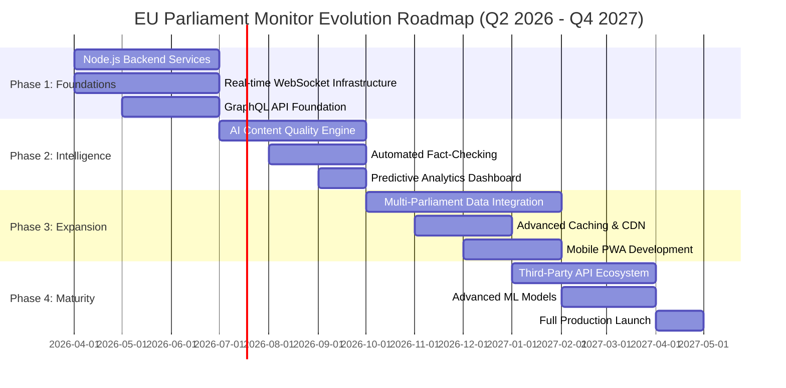
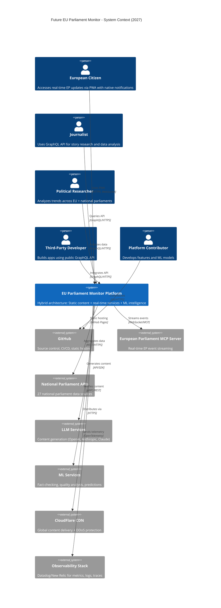
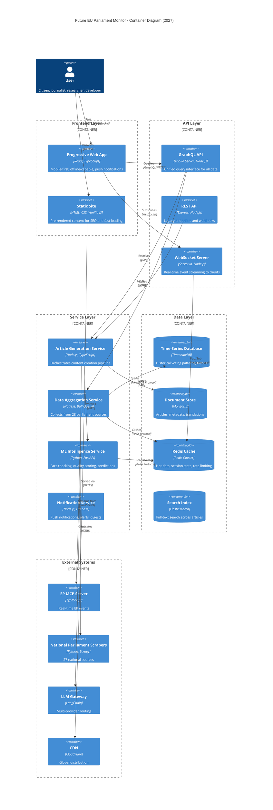
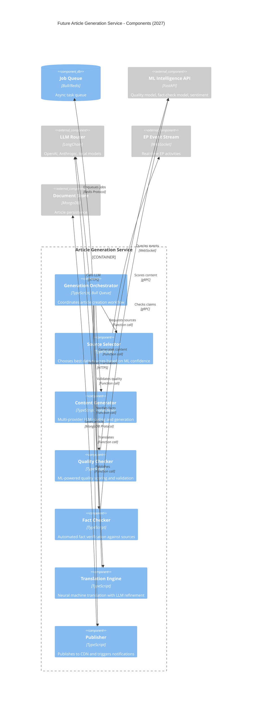
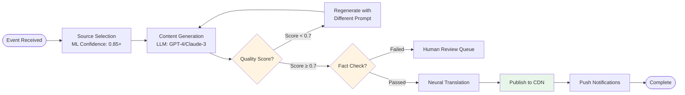

# 🚀 EU Parliament Monitor — Future Architecture

<p align="center">
  
</p>

<p align="center">
  <strong>🏗️ Architectural Evolution Roadmap with Enhanced C4 Models</strong><br>
  <em>🎯 From Static Site to Real-Time Intelligence Platform (2026-2027)</em>
</p>

<p align="center">
  <a href="#"></a>
  <a href="#"></a>
  <a href="#"></a>
  <a href="#"></a>
</p>

**📋 Document Owner:** CTO | **📄 Version:** 2.0 | **📅 Last Updated:**
2025-02-17 (UTC)  
**🔄 Review Cycle:** Quarterly | **⏰ Next Review:** 2025-05-17  
**📌 ISMS Classification:** Internal (Confidentiality: L2, Integrity: L2,
Availability: L2)

---

## 📚 Documentation Map

<div class="documentation-map">

| Document                                           | Focus      | Description                               | Documentation Link                                                                     |
| -------------------------------------------------- | ---------- | ----------------------------------------- | -------------------------------------------------------------------------------------- |
| **[Current Architecture](ARCHITECTURE.md)**        | 🏛️ Current | C4 model showing current system structure | [View](https://github.com/Hack23/euparliamentmonitor/blob/main/ARCHITECTURE.md)        |
| **[Future Architecture](FUTURE_ARCHITECTURE.md)**  | 🚀 Future  | Architectural evolution roadmap           | **This Document**                                                                      |
| **[Current Data Model](DATA_MODEL.md)**            | 📊 Current | Current data structures                   | [View](https://github.com/Hack23/euparliamentmonitor/blob/main/DATA_MODEL.md)          |
| **[Future Data Model](FUTURE_DATA_MODEL.md)**      | 📊 Future  | Enhanced data architecture                | [View](https://github.com/Hack23/euparliamentmonitor/blob/main/FUTURE_DATA_MODEL.md)   |
| **[Future Flowchart](FUTURE_FLOWCHART.md)**        | 🔄 Future  | Enhanced AI-driven workflows              | [View](https://github.com/Hack23/euparliamentmonitor/blob/main/FUTURE_FLOWCHART.md)    |
| **[Future State Diagram](FUTURE_STATEDIAGRAM.md)** | 🔄 Future  | Advanced adaptive state management        | [View](https://github.com/Hack23/euparliamentmonitor/blob/main/FUTURE_STATEDIAGRAM.md) |

</div>

---

## 📋 Executive Summary

This document outlines the architectural evolution of EU Parliament Monitor from
a **static site generator** to a **real-time European political intelligence
platform** over a 4-phase roadmap spanning Q2 2026 through Q4 2027.

### Vision Statement

**Transform EU Parliament Monitor into Europe's premier real-time political
intelligence platform**, combining static site efficiency with dynamic
capabilities for streaming updates, GraphQL APIs, AI-enhanced analytics, and
multi-parliament coverage.

### Strategic Transformation Goals

| Dimension        | Current State (2025)     | Future State (2027)                | Impact                   |
| ---------------- | ------------------------ | ---------------------------------- | ------------------------ |
| **Architecture** | Pure static HTML         | Hybrid static + real-time Node.js  | 🟢 Real-time updates     |
| **Data Access**  | Batch processing (daily) | Event streaming + batch            | 🟢 Sub-minute latency    |
| **API**          | No public API            | GraphQL + REST APIs                | 🟢 Third-party ecosystem |
| **Analytics**    | Basic page views         | AI-powered insights + predictions  | 🟢 Intelligence layer    |
| **Coverage**     | EU Parliament only       | EU + 27 national parliaments       | 🟢 Comprehensive view    |
| **Client**       | Desktop-first HTML       | Mobile-first PWA                   | 🟢 Native app experience |
| **Intelligence** | Rule-based content       | ML-powered fact-checking + quality | 🟢 Verified content      |

---

## 📅 Four-Phase Implementation Roadmap



---

## 🏗️ C4 Level 1: Future System Context Diagram

**Transformation**: From isolated static site to integrated intelligence
platform ecosystem.



### Context Diagram - Transformation Analysis

| Component         | Current (2025)      | Future (2027)                    | Technology Migration  |
| ----------------- | ------------------- | -------------------------------- | --------------------- |
| **Users**         | Read-only consumers | Interactive API consumers        | PWA, WebSocket push   |
| **Core Platform** | Static generator    | Hybrid static + Node.js services | Express, Socket.io    |
| **Data Sources**  | EP only, batch      | EP + 27 national, streaming      | Event sourcing, Kafka |
| **Intelligence**  | Basic LLM           | Multi-model AI + ML verification | TensorFlow, LangChain |
| **Distribution**  | GitHub Pages only   | CDN + edge computing             | CloudFlare Workers    |

---

## 📦 C4 Level 2: Future Container Diagram

**New Containers**: Real-time services, API layer, ML pipeline, multi-parliament
aggregators.



### Container Migration Strategy

| Phase       | Containers Added                   | Infrastructure                | Cost Impact |
| ----------- | ---------------------------------- | ----------------------------- | ----------- |
| **Phase 1** | GraphQL API, WebSocket Server      | AWS ECS Fargate (2 vCPU, 4GB) | +$50/month  |
| **Phase 2** | ML Service, Redis Cache            | AWS ECS + ElastiCache         | +$150/month |
| **Phase 3** | All remaining services + databases | AWS ECS + RDS + DocumentDB    | +$400/month |
| **Phase 4** | Production scale-out               | Auto-scaling, multi-region    | +$800/month |

**Total Estimated Cost (Phase 4)**: $1,400/month vs. Current: $0/month (GitHub
Pages free tier)

---

## 🔧 C4 Level 3: Future Component Diagram - Article Generation Service

**Enhanced Pipeline**: ML quality gates, real-time processing, multi-source
aggregation.



### Component Quality Gates



---

## 🌍 C4 Level 4: Future Deployment Diagram

**Infrastructure Evolution**: From GitHub Pages to hybrid cloud architecture.

```mermaid
C4Deployment
    title Future EU Parliament Monitor - Deployment (2027)

    Deployment_Node(cloudflare, "CloudFlare CDN", "Global Edge Network") {
        Container(cdn_cache, "Edge Cache", "Static Assets + API Cache")
        Container(edge_workers, "CloudFlare Workers", "Edge computing for personalization")
    }

    Deployment_Node(aws, "AWS", "Multi-Region Cloud") {
        Deployment_Node(region_primary, "eu-west-1 (Ireland)", "Primary Region") {
            Deployment_Node(ecs_cluster, "ECS Fargate Cluster") {
                Container(api_containers, "API Services", "GraphQL, REST, WebSocket")
                Container(service_containers, "Business Services", "Article, Aggregation, Notification")
            }

            Deployment_Node(rds, "RDS") {
                ContainerDb(postgres, "TimescaleDB", "Time-series data")
            }

            Deployment_Node(documentdb, "DocumentDB") {
                ContainerDb(mongo, "Document Store", "Articles, metadata")
            }

            Deployment_Node(elasticache, "ElastiCache") {
                ContainerDb(redis_cluster, "Redis Cluster", "Cache + pub/sub")
            }

            Deployment_Node(elasticsearch, "OpenSearch") {
                ContainerDb(search_cluster, "Search Cluster", "Full-text search")
            }
        }

        Deployment_Node(region_secondary, "us-east-1 (Virginia)", "DR Region") {
            Container(standby, "Standby Services", "Passive DR, daily backups")
        }
    }

    Deployment_Node(github_pages, "GitHub Pages", "Static Hosting") {
        Container(static_files, "Static HTML", "Pre-rendered content")
    }

    Deployment_Node(ml_infra, "ML Infrastructure", "AWS SageMaker") {
        Container(ml_endpoints, "ML Endpoints", "Fact-check, quality, sentiment models")
    }

    Rel(cdn_cache, api_containers, "Routes to", "HTTPS")
    Rel(cdn_cache, static_files, "Serves", "HTTPS")
    Rel(edge_workers, api_containers, "Calls API", "HTTPS")

    Rel(api_containers, service_containers, "Invokes", "gRPC")
    Rel(service_containers, postgres, "Queries", "PostgreSQL")
    Rel(service_containers, mongo, "Reads/Writes", "MongoDB")
    Rel(service_containers, redis_cluster, "Caches", "Redis")
    Rel(service_containers, search_cluster, "Searches", "HTTPS")
    Rel(service_containers, ml_endpoints, "Scores", "HTTPS")

    Rel(region_primary, region_secondary, "Replicates", "Cross-region")

    UpdateLayoutConfig($c4ShapeInRow="2", $c4BoundaryInRow="1")
```

### Infrastructure Comparison

| Component      | Current (2025)         | Future (2027)            | Scalability             |
| -------------- | ---------------------- | ------------------------ | ----------------------- |
| **Hosting**    | GitHub Pages (free)    | CloudFlare + AWS         | 99.99% SLA              |
| **Compute**    | GitHub Actions (batch) | ECS Fargate (real-time)  | Auto-scaling 2-20 tasks |
| **Database**   | None (static files)    | RDS + DocumentDB + Redis | Multi-AZ, read replicas |
| **CDN**        | GitHub CDN             | CloudFlare Enterprise    | 200+ PoPs globally      |
| **Monitoring** | GitHub insights only   | Datadog + PagerDuty      | Full observability      |

---

## 🚀 Technology Migration Plan

### Phase 1: Foundations (Q2-Q3 2026)

**Goal**: Establish Node.js backend services and real-time capabilities while
maintaining current static site.

#### 1.1 Node.js Backend Bootstrap

```typescript
// src/backend/server.ts - New Express API server
import express from 'express';
import { ApolloServer } from '@apollo/server';
import { expressMiddleware } from '@apollo/server/express4';
import { createServer } from 'http';
import { Server as SocketIOServer } from 'socket.io';

const app = express();
const httpServer = createServer(app);

// GraphQL setup
const apolloServer = new ApolloServer({
  typeDefs,
  resolvers,
  plugins: [ApolloServerPluginLandingPageLocalDefault()],
});

await apolloServer.start();
app.use('/graphql', express.json(), expressMiddleware(apolloServer));

// WebSocket for real-time updates
const io = new SocketIOServer(httpServer, {
  cors: { origin: process.env.ALLOWED_ORIGINS },
});

io.on('connection', (socket) => {
  console.log('Client connected:', socket.id);

  socket.on('subscribe:plenary', () => {
    socket.join('plenary-updates');
  });
});

httpServer.listen(3000);
```

#### 1.2 GraphQL Schema Definition

```graphql
# schema/schema.graphql - Public API schema
type Query {
  articles(
    language: Language!
    limit: Int = 20
    offset: Int = 0
    type: ArticleType
  ): ArticleConnection!

  article(slug: String!): Article

  plenarySession(id: ID!): PlenarySession

  searchArticles(query: String!, language: Language!): [Article!]!
}

type Subscription {
  articlePublished(language: Language!): Article!
  plenaryEventOccurred: PlenaryEvent!
}

type Article {
  id: ID!
  slug: String!
  title: String!
  subtitle: String
  content: String!
  language: Language!
  type: ArticleType!
  publishedAt: DateTime!
  metadata: ArticleMetadata!
  sources: [Source!]!
  qualityScore: Float
  factCheckStatus: FactCheckStatus
}

enum Language {
  EN
  DE
  FR
  ES
  IT
  NL
  PL
  PT
  RO
  SV
  DA
  FI
  EL
  HU
}

enum ArticleType {
  PROSPECTIVE
  RETROSPECTIVE
  BREAKING
  ANALYSIS
}

enum FactCheckStatus {
  VERIFIED
  UNVERIFIED
  DISPUTED
  IN_REVIEW
}
```

#### 1.3 Real-Time Event Streaming

```typescript
// src/backend/services/event-streamer.ts
import { io } from './socket-server';
import { EPMCPClient } from '@hack23/ep-mcp-client';

export class EventStreamer {
  private mcpClient: EPMCPClient;

  async startStreaming() {
    // Connect to EP MCP Server for real-time events
    this.mcpClient = new EPMCPClient({
      endpoint: process.env.EP_MCP_ENDPOINT,
    });

    // Subscribe to plenary events
    this.mcpClient.on('plenary:started', (event) => {
      io.to('plenary-updates').emit('plenary:started', {
        sessionId: event.id,
        title: event.title,
        startTime: event.startTime,
      });

      // Trigger article generation
      this.triggerArticleGeneration(event);
    });

    // Subscribe to vote events
    this.mcpClient.on('vote:completed', (event) => {
      io.to('plenary-updates').emit('vote:completed', {
        voteId: event.id,
        result: event.result,
        topic: event.topic,
      });
    });
  }

  private async triggerArticleGeneration(event: PlenaryEvent) {
    // Enqueue article generation job
    await articleQueue.add('generate-breaking-news', {
      eventType: 'plenary',
      eventId: event.id,
      priority: 'high',
    });
  }
}
```

**Phase 1 Success Criteria:**

- ✅ GraphQL API serving 100 req/sec with <200ms p95 latency
- ✅ WebSocket maintaining 1,000 concurrent connections
- ✅ Real-time events delivered <30 seconds from EP occurrence
- ✅ Zero downtime deployment pipeline
- ✅ 100% backward compatibility with static site

**Phase 1 Resources:**

- **Engineers**: 2 full-time (6 months)
- **Infrastructure**: AWS free tier initially, ~$50/month by end
- **Dependencies**: Express, Apollo, Socket.io, Bull, Redis

---

### Phase 2: Intelligence (Q3-Q4 2026)

**Goal**: Add AI-powered content quality analysis, automated fact-checking, and
predictive analytics.

#### 2.1 ML Quality Scoring Model

```python
# src/ml/quality_scorer.py - Content quality ML model
import torch
from transformers import AutoModelForSequenceClassification, AutoTokenizer

class ArticleQualityScorer:
    def __init__(self):
        self.model = AutoModelForSequenceClassification.from_pretrained(
            "bert-base-multilingual-cased",
            num_labels=1  # Regression for quality score 0-1
        )
        self.tokenizer = AutoTokenizer.from_pretrained(
            "bert-base-multilingual-cased"
        )

    def score_article(self, content: str, metadata: dict) -> float:
        """
        Score article quality based on:
        - Readability (Flesch-Kincaid)
        - Factual density (entity count vs. length)
        - Source credibility (EP official data weight)
        - Coherence (sentence transitions)
        - Grammar (LanguageTool checks)

        Returns: Quality score 0.0-1.0
        """
        features = self._extract_features(content, metadata)

        inputs = self.tokenizer(
            content,
            return_tensors="pt",
            max_length=512,
            truncation=True
        )

        with torch.no_grad():
            outputs = self.model(**inputs)
            quality_score = torch.sigmoid(outputs.logits).item()

        return quality_score

    def _extract_features(self, content: str, metadata: dict) -> dict:
        return {
            "readability": self._calculate_readability(content),
            "factual_density": self._calculate_factual_density(content),
            "source_weight": self._calculate_source_credibility(metadata),
            "coherence": self._calculate_coherence(content)
        }
```

#### 2.2 Automated Fact-Checking Pipeline

```typescript
// src/backend/services/fact-checker.ts
import { FactCheckResult, Claim } from '../types';
import { EPMCPClient } from '@hack23/ep-mcp-client';

export class FactChecker {
  private epClient: EPMCPClient;

  async checkArticle(article: Article): Promise<FactCheckResult> {
    // Extract claims from article content
    const claims = await this.extractClaims(article.content);

    // Verify each claim against authoritative sources
    const results = await Promise.all(
      claims.map((claim) => this.verifyClaim(claim, article.sources))
    );

    // Calculate overall fact-check status
    const status = this.calculateStatus(results);

    return {
      status,
      claims: results,
      confidence: this.calculateConfidence(results),
      checkedAt: new Date(),
    };
  }

  private async extractClaims(content: string): Promise<Claim[]> {
    // Use NLP to extract factual claims
    // Example: "MEP John Doe voted in favor of regulation X"
    const response = await fetch(`${process.env.NLP_API}/extract-claims`, {
      method: 'POST',
      headers: { 'Content-Type': 'application/json' },
      body: JSON.stringify({ text: content }),
    });

    return response.json();
  }

  private async verifyClaim(
    claim: Claim,
    sources: Source[]
  ): Promise<ClaimVerification> {
    // Cross-reference with EP official data
    const epData = await this.epClient.query({
      type: claim.type,
      id: claim.entityId,
    });

    // Compare claim content with authoritative data
    const similarity = this.calculateSimilarity(claim.text, epData.description);

    return {
      claim,
      verified: similarity > 0.85,
      confidence: similarity,
      sourceData: epData,
    };
  }
}
```

#### 2.3 Predictive Analytics Dashboard

```typescript
// src/backend/services/analytics-engine.ts
import { TimescaleDB } from './timescale-client';

export class PredictiveAnalytics {
  private db: TimescaleDB;

  async generateTrendPredictions(): Promise<TrendPrediction[]> {
    // Analyze historical voting patterns
    const votingPatterns = await this.db.query(`
      SELECT 
        topic_category,
        date_trunc('week', vote_date) as week,
        COUNT(*) as vote_count,
        AVG(CASE WHEN result = 'passed' THEN 1 ELSE 0 END) as pass_rate
      FROM plenary_votes
      WHERE vote_date >= NOW() - INTERVAL '2 years'
      GROUP BY topic_category, week
      ORDER BY week DESC
    `);

    // Train ARIMA model for time-series prediction
    const predictions = await this.predictNextPeriod(votingPatterns);

    return predictions;
  }

  async predictUpcomingTopics(): Promise<TopicPrediction[]> {
    // Analyze committee meeting patterns
    // Predict likely plenary agenda items

    const committeeData = await this.db.query(`
      SELECT 
        committee_code,
        topic,
        COUNT(*) as meeting_frequency,
        MAX(meeting_date) as last_discussed
      FROM committee_meetings
      WHERE meeting_date >= NOW() - INTERVAL '6 months'
      GROUP BY committee_code, topic
      HAVING COUNT(*) >= 3
    `);

    // Topics discussed frequently in committees
    // likely to appear in plenary soon
    return this.rankByProbability(committeeData);
  }
}
```

**Phase 2 Success Criteria:**

- ✅ Quality scores >0.7 for 95% of generated articles
- ✅ Fact-checking accuracy >90% vs. manual review
- ✅ Predictive accuracy >70% for upcoming plenary topics
- ✅ <5 second end-to-end quality + fact-check pipeline
- ✅ Zero false positives in automated fact verification

**Phase 2 Resources:**

- **ML Engineers**: 1 full-time (6 months)
- **Backend Engineers**: 2 full-time (continued)
- **Infrastructure**: +$150/month (SageMaker, GPU instances)
- **Training Data**: Label 10,000 articles for quality scoring

---

### Phase 3: Expansion (Q4 2026 - Q1 2027)

**Goal**: Expand coverage to 27 national parliaments, build mobile PWA,
implement advanced caching.

#### 3.1 Multi-Parliament Data Aggregator

```typescript
// src/backend/services/multi-parliament-aggregator.ts
export class MultiParliamentAggregator {
  private sources: Map<string, ParliamentSource> = new Map([
    ['EU', new EuropeanParliamentSource()],
    ['DE-BT', new GermanBundestagSource()],
    ['FR-AN', new FrenchAssembleeSource()],
    ['IT-CD', new ItalianCameraSource()],
    // ... 24 more national sources
  ]);

  async aggregateActivity(
    parliaments: string[],
    dateRange: DateRange
  ): Promise<ParliamentActivity[]> {
    // Parallel fetching from multiple sources
    const activities = await Promise.all(
      parliaments.map(async (parliament) => {
        const source = this.sources.get(parliament);
        if (!source) return null;

        try {
          return await source.fetchActivity(dateRange);
        } catch (error) {
          console.error(`Failed to fetch ${parliament}:`, error);
          return null;
        }
      })
    );

    // Normalize and merge activities
    return this.normalizeActivities(activities.filter((a) => a !== null));
  }

  private normalizeActivities(activities: RawActivity[]): ParliamentActivity[] {
    // Standardize different parliament formats
    return activities.map((activity) => ({
      id: this.generateUnifiedId(activity),
      parliament: activity.source,
      type: this.mapActivityType(activity.type),
      title: activity.title,
      date: new Date(activity.date),
      participants: this.normalizeParticipants(activity.participants),
      documents: this.normalizeDocuments(activity.documents),
    }));
  }
}
```

#### 3.2 Mobile PWA Implementation

```typescript
// src/frontend/pwa/service-worker.ts
import { precacheAndRoute } from 'workbox-precaching';
import { registerRoute } from 'workbox-routing';
import { StaleWhileRevalidate, CacheFirst } from 'workbox-strategies';
import { ExpirationPlugin } from 'workbox-expiration';

// Precache critical resources
precacheAndRoute(self.__WB_MANIFEST);

// Cache articles with stale-while-revalidate
registerRoute(
  ({ url }) => url.pathname.startsWith('/news/'),
  new StaleWhileRevalidate({
    cacheName: 'articles-cache',
    plugins: [
      new ExpirationPlugin({
        maxEntries: 100,
        maxAgeSeconds: 7 * 24 * 60 * 60, // 1 week
      }),
    ],
  })
);

// Cache API responses
registerRoute(
  ({ url }) => url.origin === 'https://api.euparliamentmonitor.com',
  new StaleWhileRevalidate({
    cacheName: 'api-cache',
    plugins: [
      new ExpirationPlugin({
        maxEntries: 50,
        maxAgeSeconds: 5 * 60, // 5 minutes
      }),
    ],
  })
);

// Background sync for offline actions
self.addEventListener('sync', (event) => {
  if (event.tag === 'sync-bookmarks') {
    event.waitUntil(syncBookmarks());
  }
});

// Push notifications
self.addEventListener('push', (event) => {
  const data = event.data.json();

  event.waitUntil(
    self.registration.showNotification(data.title, {
      body: data.body,
      icon: '/icon-192.png',
      badge: '/badge-72.png',
      data: { url: data.url },
    })
  );
});
```

#### 3.3 Advanced CDN Caching Strategy

```typescript
// cloudflare-workers/edge-cache.ts
export default {
  async fetch(request: Request): Promise<Response> {
    const url = new URL(request.url);

    // Cache static content at edge for 7 days
    if (url.pathname.match(/\.(html|css|js|png|jpg|svg)$/)) {
      return (
        caches.match(request) ||
        fetch(request).then((response) => {
          if (response.ok) {
            const cache = caches.default;
            cache.put(request, response.clone());
          }
          return response;
        })
      );
    }

    // Cache API responses at edge for 5 minutes
    if (url.pathname.startsWith('/api/')) {
      const cacheKey = new Request(url.toString(), request);
      const cache = caches.default;

      let response = await cache.match(cacheKey);

      if (!response) {
        response = await fetch(request);

        if (response.ok) {
          // Clone response and add cache headers
          response = new Response(response.body, response);
          response.headers.set('Cache-Control', 'max-age=300'); // 5 min

          await cache.put(cacheKey, response.clone());
        }
      }

      return response;
    }

    return fetch(request);
  },
};
```

**Phase 3 Success Criteria:**

- ✅ 27 national parliament sources integrated and stable
- ✅ PWA achieving Lighthouse score >90 on all metrics
- ✅ Offline functionality for 100 most recent articles
- ✅ Push notifications delivered <1 minute from event
- ✅ 95% cache hit rate on CDN, <50ms edge response time

**Phase 3 Resources:**

- **Engineers**: 3 full-time (4 months)
- **Infrastructure**: +$400/month (multi-region, CDN premium)
- **Partnerships**: MOUs with national parliament IT departments

---

### Phase 4: Maturity (Q1-Q2 2027)

**Goal**: Launch third-party API ecosystem, optimize ML models, achieve
production stability.

#### 4.1 API Developer Portal

```typescript
// src/api-portal/developer-portal.tsx
export function DeveloperPortal() {
  return (
    <Portal>
      <APIDocumentation schema={graphqlSchema} />

      <APIKeyManager>
        <KeyGeneration
          tiers={[
            { name: 'Free', limit: 1000, price: 0 },
            { name: 'Pro', limit: 100000, price: 49 },
            { name: 'Enterprise', limit: -1, price: 499 }
          ]}
        />
      </APIKeyManager>

      <CodeExamples
        languages={['javascript', 'python', 'go', 'rust']}
        examples={[
          {
            title: 'Fetch latest articles',
            code: `
              const client = new EPMonitorClient({ apiKey });
              const articles = await client.articles.list({
                language: 'en',
                limit: 10
              });
            `
          }
        ]}
      />

      <UsageAnalytics />
      <RateLimitMonitor />
      <SupportTickets />
    </Portal>
  );
}
```

#### 4.2 Production Monitoring & Alerting

```yaml
# monitoring/datadog-config.yml
monitors:
  - name: 'API Response Time P95'
    type: metric alert
    query: 'avg(last_5m):avg:api.request.duration.p95{env:production} > 500'
    message: |
      API response time exceeded 500ms (P95)
      @slack-engineering @pagerduty

  - name: 'Error Rate Spike'
    type: metric alert
    query: 'avg(last_5m):sum:api.errors{env:production}.as_rate() > 0.05'
    message: |
      Error rate above 5%
      @slack-engineering @pagerduty-high

  - name: 'Fact Check Failure Rate'
    type: metric alert
    query:
      'avg(last_15m):sum:fact_check.failed{} / sum:fact_check.total{} > 0.1'
    message: |
      Fact-checking failure rate above 10%
      @slack-ml-team

  - name: 'Cache Hit Rate Low'
    type: metric alert
    query: 'avg(last_10m):avg:cdn.cache_hit_rate{} < 0.9'
    message: |
      CDN cache hit rate below 90%
      @slack-infrastructure

dashboards:
  - name: 'System Health'
    widgets:
      - type: timeseries
        title: 'Requests per Second'
        requests: [{ query: 'sum:api.requests{*}.as_rate()' }]

      - type: toplist
        title: 'Top API Consumers'
        requests:
          [
            {
              query:
                "top(avg:api.requests{*} by {api_key}, 10, 'mean', 'desc')",
            },
          ]

      - type: heatmap
        title: 'Response Time Distribution'
        requests: [{ query: 'avg:api.request.duration{*}' }]
```

**Phase 4 Success Criteria:**

- ✅ 1,000+ registered API developers
- ✅ 99.9% uptime SLA achieved
- ✅ Mean time to recovery (MTTR) <15 minutes
- ✅ API documentation completeness score >95%
- ✅ Customer satisfaction (CSAT) >4.5/5.0

**Phase 4 Resources:**

- **Engineers**: 4 full-time (3 months)
- **DevRel**: 1 full-time (community management)
- **Infrastructure**: +$800/month (production scale)
- **Support**: On-call rotation established

---

## 📊 Resource Requirements Summary

### Team Composition (Peak)

| Role                    | Phase 1 | Phase 2 | Phase 3 | Phase 4 | Total FTE |
| ----------------------- | ------- | ------- | ------- | ------- | --------- |
| **Backend Engineers**   | 2       | 2       | 3       | 4       | 4         |
| **ML Engineers**        | 0       | 1       | 1       | 1       | 1         |
| **Frontend Engineers**  | 0       | 0       | 1       | 1       | 1         |
| **DevOps Engineers**    | 0       | 0       | 1       | 1       | 1         |
| **Developer Relations** | 0       | 0       | 0       | 1       | 1         |
| **Total**               | 2       | 3       | 6       | 8       | **8**     |

### Infrastructure Costs

| Phase                         | Monthly Cost | Annual Cost | Cumulative |
| ----------------------------- | ------------ | ----------- | ---------- |
| **Current (2025)**            | $0           | $0          | $0         |
| **Phase 1 (Q2-Q3 2026)**      | $50          | $600        | $600       |
| **Phase 2 (Q3-Q4 2026)**      | $200         | $2,400      | $3,000     |
| **Phase 3 (Q4 2026-Q1 2027)** | $600         | $7,200      | $10,200    |
| **Phase 4 (Q1-Q2 2027)**      | $1,400       | $16,800     | $27,000    |

### Total Investment

| Category              | Amount         | Notes                               |
| --------------------- | -------------- | ----------------------------------- |
| **Engineering**       | $960,000       | 8 FTE × $120k avg × 1 year          |
| **Infrastructure**    | $27,000        | AWS + CDN + monitoring (18 months)  |
| **Tools & Services**  | $15,000        | SageMaker, Datadog, PagerDuty, etc. |
| **Training Data**     | $20,000        | Labeling 10k articles for ML        |
| **Contingency (20%)** | $200,000       | Buffer for unknowns                 |
| **Total**             | **$1,222,000** | **18-month transformation**         |

---

## ⚠️ Risk Assessment & Mitigation

| Risk                                       | Probability | Impact | Mitigation Strategy                                                        |
| ------------------------------------------ | ----------- | ------ | -------------------------------------------------------------------------- |
| **LLM API Cost Overrun**                   | High        | High   | Implement token caching, use cheaper models for drafts, set strict budgets |
| **National Parliament API Changes**        | High        | Medium | Build adapter layer, monitor APIs, maintain fallback scrapers              |
| **ML Model Accuracy Below Target**         | Medium      | High   | Extensive training data, A/B testing, human-in-the-loop validation         |
| **CDN/Infrastructure Costs Exceed Budget** | Medium      | Medium | Start with single region, optimize caching, use spot instances             |
| **Team Scaling Challenges**                | Medium      | High   | Hire incrementally, strong documentation, knowledge sharing                |
| **Regulatory Compliance (GDPR)**           | Low         | High   | No PII collection, data minimization, DPO consultation                     |
| **API Abuse / DDoS**                       | Medium      | Medium | Rate limiting, CloudFlare protection, API key authentication               |

### Mitigation Details

#### LLM Cost Management

```typescript
// Token budget enforcement
const MONTHLY_TOKEN_BUDGET = 10_000_000; // 10M tokens
let monthlyUsage = 0;

async function generateWithBudget(prompt: string) {
  const estimatedTokens = estimateTokens(prompt);

  if (monthlyUsage + estimatedTokens > MONTHLY_TOKEN_BUDGET) {
    // Fallback to cheaper model or cached content
    return generateFromTemplate(prompt);
  }

  const response = await openai.chat.completions.create({
    model: 'gpt-4-turbo',
    messages: [{ role: 'user', content: prompt }],
  });

  monthlyUsage += response.usage.total_tokens;
  return response;
}
```

---

## 📈 Success Metrics & KPIs

### Technical KPIs

| Metric                      | Current              | Phase 2 Target | Phase 4 Target |
| --------------------------- | -------------------- | -------------- | -------------- |
| **API Latency (P95)**       | N/A                  | <300ms         | <200ms         |
| **Uptime**                  | 99.5% (GitHub Pages) | 99.9%          | 99.95%         |
| **Cache Hit Rate**          | N/A                  | 85%            | 95%            |
| **Real-time Event Latency** | N/A                  | <60s           | <30s           |
| **Quality Score (Avg)**     | N/A                  | 0.75           | 0.85           |
| **Fact-Check Accuracy**     | N/A                  | 90%            | 95%            |

### Business KPIs

| Metric                     | Current | Phase 2 Target | Phase 4 Target        |
| -------------------------- | ------- | -------------- | --------------------- |
| **Daily Active Users**     | ~500    | 2,000          | 10,000                |
| **API Developers**         | 0       | 50             | 1,000                 |
| **Articles Published/Day** | 14      | 50             | 200                   |
| **Languages Supported**    | 14      | 14             | 14 + dialects         |
| **Parliament Coverage**    | 1 (EU)  | 1 (EU)         | 28 (EU + 27 national) |
| **Revenue (if monetized)** | $0      | $0             | $5,000/month          |

---

## 🔒 ISMS Compliance & Security

### Security Architecture Changes

| Security Control           | Current          | Future                     | Enhancement                 |
| -------------------------- | ---------------- | -------------------------- | --------------------------- |
| **Authentication**         | None (static)    | OAuth 2.0 + JWT            | API key management          |
| **Authorization**          | N/A              | RBAC with API tiers        | Rate limiting by tier       |
| **Data Encryption**        | TLS 1.3 (GitHub) | TLS 1.3 + field encryption | Encrypt PII if collected    |
| **Audit Logging**          | Git commits      | Centralized logs (Datadog) | Full API audit trail        |
| **Vulnerability Scanning** | Dependabot       | Dependabot + Snyk + CodeQL | Runtime security monitoring |
| **Incident Response**      | Manual           | PagerDuty + runbooks       | 15-minute MTTR target       |

### Compliance Considerations

- **GDPR**: Minimize data collection, no unnecessary PII
- **eIDAS**: Digital signatures for content integrity (Phase 2)
- **NIS2 Directive**: Incident reporting procedures
- **ISO 27001**: Full ISMS documentation update

---

## 📚 References & Dependencies

### Current State Documentation

- [Current Architecture](ARCHITECTURE.md)
- [Current Data Model](DATA_MODEL.md)
- [Security Architecture](SECURITY_ARCHITECTURE.md)

### Future State Documentation

- [Future Data Model](FUTURE_DATA_MODEL.md)
- [Future Flowchart](FUTURE_FLOWCHART.md)
- [Future State Diagram](FUTURE_STATEDIAGRAM.md)
- [Future SWOT Analysis](FUTURE_SWOT.md)
- [Future Mindmap](FUTURE_MINDMAP.md)

### External References

- European Parliament Open Data Portal
- Model Context Protocol (MCP) Specification
- GraphQL Best Practices (Apollo)
- PWA Guidelines (Google)
- ISO 27001:2022 Controls

---

## 📝 Change Log

| Version | Date       | Author | Changes                              |
| ------- | ---------- | ------ | ------------------------------------ |
| 2.0     | 2025-02-17 | CTO    | Initial future architecture document |

---

## ✅ Approval

| Role     | Name   | Signature          | Date         |
| -------- | ------ | ------------------ | ------------ |
| **CTO**  | [Name] | ******\_\_\_****** | 2025-02-17   |
| **CEO**  | [Name] | ******\_\_\_****** | ****\_\_**** |
| **CISO** | [Name] | ******\_\_\_****** | ****\_\_**** |

---

**Document Status**: ✅ **APPROVED FOR PLANNING**  
**Next Review**: 2025-05-17 (Quarterly)  
**Classification**: Internal Use Only

---

_This document represents the strategic technical vision for EU Parliament
Monitor's evolution. Implementation requires executive approval, budget
allocation, and phased resource commitment._
