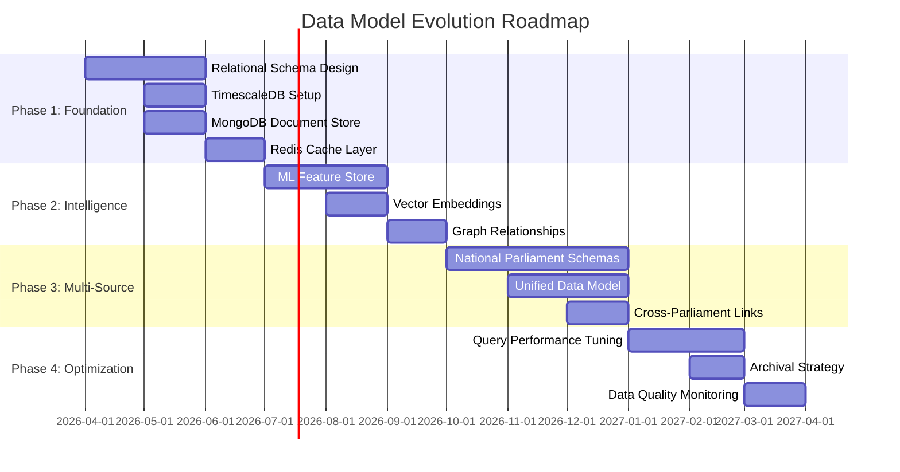
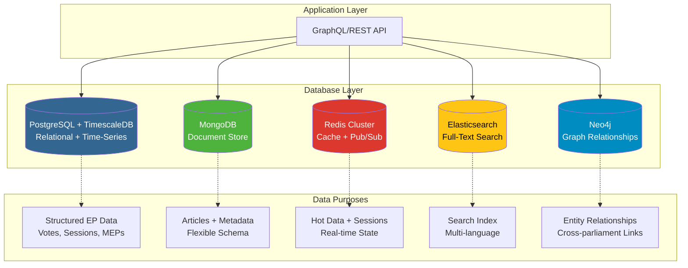
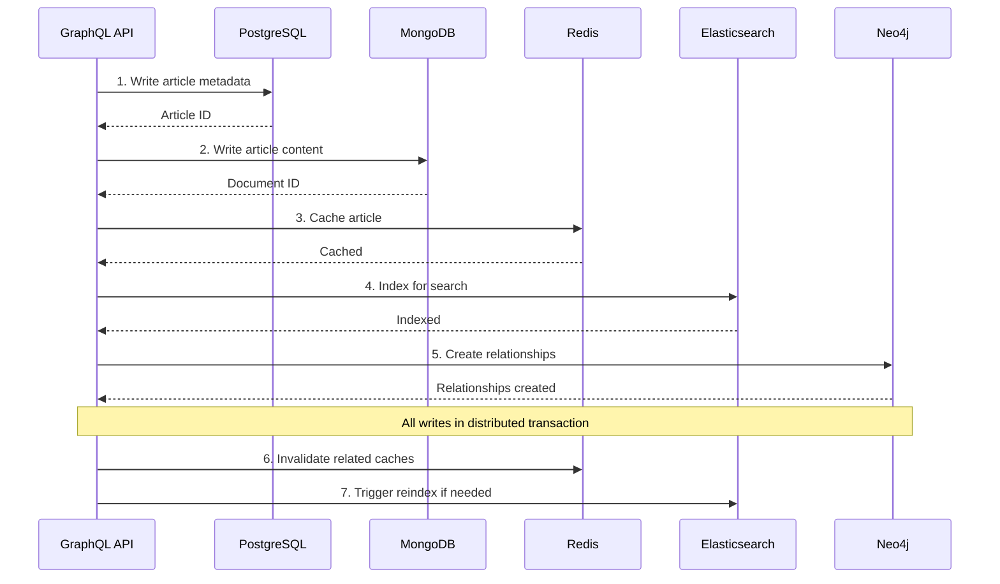
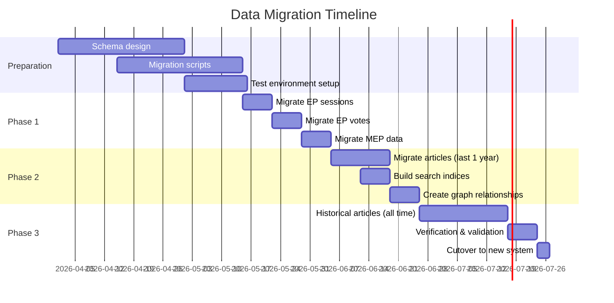

# 📊 EU Parliament Monitor — Future Data Model

<p align="center">
  
</p>

<p align="center">
  <strong>🗄️ Enhanced European Parliament Data Architecture</strong><br>
  <em>🎯 From Static Files to Real-Time Multi-Parliament Intelligence (2026-2027)</em>
</p>

<p align="center">
  <a href="#"></a>
  <a href="#"></a>
  <a href="#"></a>
  <a href="#"></a>
</p>

**📋 Document Owner:** Data Architect | **📄 Version:** 2.0 | **📅 Last
Updated:** 2025-02-17 (UTC)  
**🔄 Review Cycle:** Quarterly | **⏰ Next Review:** 2025-05-17  
**📌 ISMS Classification:** Internal (Confidentiality: L2, Integrity: L3,
Availability: L2)

---

## 📚 Documentation Map

<div class="documentation-map">

| Document                                          | Focus      | Description                | Documentation Link                                                                     |
| ------------------------------------------------- | ---------- | -------------------------- | -------------------------------------------------------------------------------------- |
| **[Current Data Model](DATA_MODEL.md)**           | 📊 Current | Current data structures    | [View](https://github.com/Hack23/euparliamentmonitor/blob/main/DATA_MODEL.md)          |
| **[Future Data Model](FUTURE_DATA_MODEL.md)**     | 📊 Future  | Enhanced data architecture | **This Document**                                                                      |
| **[Future Architecture](FUTURE_ARCHITECTURE.md)** | 🚀 Future  | Architectural evolution    | [View](https://github.com/Hack23/euparliamentmonitor/blob/main/FUTURE_ARCHITECTURE.md) |
| **[Future Flowchart](FUTURE_FLOWCHART.md)**       | 🔄 Future  | Enhanced workflows         | [View](https://github.com/Hack23/euparliamentmonitor/blob/main/FUTURE_FLOWCHART.md)    |

</div>

---

## 📋 Executive Summary

This document defines the evolution of EU Parliament Monitor's data model from a
**simple static file structure** to a **sophisticated multi-database
architecture** supporting real-time streaming, historical analysis,
cross-parliament comparisons, and AI-powered intelligence.

### Transformation Overview

| Aspect               | Current (2025)    | Future (2027)                 | Benefit                        |
| -------------------- | ----------------- | ----------------------------- | ------------------------------ |
| **Storage**          | Flat HTML files   | PostgreSQL + MongoDB + Redis  | Query flexibility, scalability |
| **Structure**        | Unstructured HTML | Relational + Document + Graph | Rich relationships, analytics  |
| **Update Frequency** | Daily batch       | Real-time streaming           | Sub-minute latency             |
| **Query Capability** | None (static)     | GraphQL + SQL + full-text     | Complex queries, APIs          |
| **Historical Data**  | Overwrite         | Temporal versioning           | Trend analysis, auditing       |
| **Data Sources**     | EP only           | 28 parliaments                | Comprehensive coverage         |
| **Intelligence**     | None              | ML features, embeddings       | AI-powered insights            |

---

## 📅 Data Model Evolution Roadmap



---

## 📐 Future Entity Relationship Diagram

**Comprehensive view** of all entities, relationships, and data flows across the
future architecture.

```mermaid
erDiagram
    %% Core Entities
    ARTICLE ||--o{ ARTICLE_VERSION : "has versions"
    ARTICLE ||--o{ ARTICLE_TRANSLATION : "has translations"
    ARTICLE ||--o{ ARTICLE_SOURCE : "cites"
    ARTICLE }o--|| ARTICLE_TYPE : "belongs to"
    ARTICLE }o--|| GENERATION_JOB : "created by"
    ARTICLE ||--o{ QUALITY_SCORE : "assessed by"
    ARTICLE ||--o{ FACT_CHECK : "verified by"
    ARTICLE ||--o{ ARTICLE_EMBEDDING : "has embeddings"

    %% European Parliament Entities
    EP_PLENARY_SESSION ||--o{ EP_AGENDA_ITEM : "contains"
    EP_PLENARY_SESSION ||--o{ EP_VOTE : "includes"
    EP_PLENARY_SESSION ||--o{ EP_DEBATE : "features"
    EP_PLENARY_SESSION ||--o{ ARTICLE : "mentioned in"

    EP_COMMITTEE ||--o{ EP_COMMITTEE_MEETING : "holds"
    EP_COMMITTEE_MEETING ||--o{ EP_COMMITTEE_VOTE : "includes"
    EP_COMMITTEE_MEETING ||--o{ ARTICLE : "mentioned in"

    EP_DOCUMENT ||--o{ EP_DOCUMENT_VERSION : "has versions"
    EP_DOCUMENT ||--o{ ARTICLE : "referenced in"

    EP_MEP ||--o{ EP_VOTE : "casts"
    EP_MEP ||--o{ EP_QUESTION : "asks"
    EP_MEP }o--|| EP_POLITICAL_GROUP : "member of"
    EP_MEP }o--|| EP_NATIONAL_PARTY : "represents"

    %% National Parliament Entities
    NATIONAL_PARLIAMENT ||--o{ NATIONAL_SESSION : "conducts"
    NATIONAL_SESSION ||--o{ NATIONAL_VOTE : "includes"
    NATIONAL_SESSION ||--o{ ARTICLE : "covered in"

    NATIONAL_PARLIAMENT ||--o{ NATIONAL_LEGISLATOR : "has members"
    NATIONAL_LEGISLATOR ||--o{ NATIONAL_VOTE : "participates in"

    %% Cross-Parliament Links
    EP_DOCUMENT ||--o{ NATIONAL_LEGISLATION : "influences"
    NATIONAL_LEGISLATION ||--o{ IMPLEMENTATION_TRACKER : "tracked by"

    %% ML & Analytics Entities
    ML_MODEL ||--o{ QUALITY_SCORE : "generates"
    ML_MODEL ||--o{ FACT_CHECK : "performs"
    ML_MODEL ||--o{ TREND_PREDICTION : "predicts"

    TREND_PREDICTION ||--o{ ARTICLE : "forecasts"

    %% Detailed Attributes
    ARTICLE {
        uuid id PK "UUID primary key"
        string slug UK "URL-friendly identifier"
        string type "prospective, retrospective, breaking, analysis"
        string primary_language "ISO 639-1 code"
        timestamp published_at "Publication timestamp"
        timestamp updated_at "Last modification"
        integer read_time_minutes "Estimated read time"
        jsonb metadata "Flexible metadata"
        boolean is_published "Publication status"
        float quality_score_cached "Latest quality score"
    }

    ARTICLE_VERSION {
        uuid id PK
        uuid article_id FK
        integer version_number "Sequential version"
        string content_html "HTML content"
        string content_markdown "Markdown source"
        timestamp created_at "Version timestamp"
        uuid created_by "User/system ID"
        jsonb changes "Diff from previous version"
    }

    ARTICLE_TRANSLATION {
        uuid id PK
        uuid article_id FK
        string language "ISO 639-1 code"
        string title "Translated title"
        string subtitle "Translated subtitle"
        text content_html "Translated HTML"
        string translation_method "LLM, Neural MT, Human"
        float translation_quality "Quality score 0-1"
        timestamp created_at
    }

    ARTICLE_SOURCE {
        uuid id PK
        uuid article_id FK
        string source_type "ep_plenary, ep_committee, ep_document, national"
        string source_id "External ID"
        string source_url "Canonical URL"
        string parliament "EU, DE-BT, FR-AN, etc."
        jsonb source_data "Cached source data"
        string data_hash "SHA-256 integrity"
    }

    ARTICLE_TYPE {
        string code PK "prospective, retrospective, breaking, analysis"
        jsonb labels "Multilingual labels"
        string icon "Icon identifier"
        integer priority "Display priority"
    }

    GENERATION_JOB {
        uuid id PK
        string job_type "scheduled, event_triggered, manual"
        string status "queued, processing, completed, failed"
        timestamp started_at
        timestamp completed_at
        jsonb parameters "Job configuration"
        jsonb result "Output summary"
        text error_log "Error details"
    }

    QUALITY_SCORE {
        uuid id PK
        uuid article_id FK
        uuid model_id FK
        float overall_score "0.0-1.0"
        float readability_score
        float factual_density_score
        float coherence_score
        float grammar_score
        jsonb detailed_metrics
        timestamp scored_at
    }

    FACT_CHECK {
        uuid id PK
        uuid article_id FK
        string status "verified, disputed, unverified"
        float confidence "0.0-1.0"
        jsonb claims "Array of claim objects"
        jsonb verifications "Array of verification results"
        timestamp checked_at
        uuid model_id FK
    }

    ARTICLE_EMBEDDING {
        uuid id PK
        uuid article_id FK
        string embedding_model "text-embedding-3-large, etc."
        vector embedding "768-dim or 1536-dim vector"
        timestamp created_at
    }

    EP_PLENARY_SESSION {
        uuid id PK
        string session_id UK "EP session identifier"
        date session_date
        string session_type "ordinary, extraordinary"
        jsonb title_multilingual
        string location "Strasbourg, Brussels"
        timestamp start_time
        timestamp end_time
    }

    EP_AGENDA_ITEM {
        uuid id PK
        uuid session_id FK
        integer sequence_number
        string item_type "debate, vote, announcement"
        jsonb title_multilingual
        string rapporteur_mep
        text description
    }

    EP_VOTE {
        uuid id PK
        uuid session_id FK
        string vote_id UK "EP vote identifier"
        timestamp vote_time
        string vote_subject
        string vote_type "simple, qualified, unanimous"
        integer votes_for
        integer votes_against
        integer votes_abstention
        string result "passed, rejected"
        jsonb vote_details "MEP-level voting records"
    }

    EP_COMMITTEE {
        string code PK "LIBE, ECON, ENVI, etc."
        jsonb name_multilingual
        string chair_mep
        jsonb members "Array of MEP IDs"
        string policy_area
    }

    EP_COMMITTEE_MEETING {
        uuid id PK
        string committee_code FK
        date meeting_date
        string meeting_type "ordinary, extraordinary, hearing"
        jsonb agenda
        text minutes
    }

    EP_DOCUMENT {
        uuid id PK
        string document_id UK "EP document identifier"
        string document_type "report, resolution, amendment"
        jsonb title_multilingual
        date publication_date
        string author_mep
        string committee_code FK
    }

    EP_MEP {
        uuid id PK
        string mep_id UK "EP MEP identifier"
        string full_name
        string country "ISO 3166-1 alpha-2"
        string political_group_code FK
        string national_party
        date term_start
        date term_end
        jsonb contact_info
        string photo_url
    }

    EP_POLITICAL_GROUP {
        string code PK "EPP, S&D, Renew, etc."
        jsonb name_multilingual
        string ideology
        integer seat_count
        string leader_mep
    }

    NATIONAL_PARLIAMENT {
        string code PK "DE-BT, FR-AN, IT-CD, etc."
        string country "ISO 3166-1 alpha-2"
        jsonb name_multilingual
        string official_website
        string api_endpoint
        string scraper_type
    }

    NATIONAL_SESSION {
        uuid id PK
        string parliament_code FK
        date session_date
        string session_type
        jsonb title
        integer legislation_count
    }

    NATIONAL_VOTE {
        uuid id PK
        uuid session_id FK
        string vote_id UK
        timestamp vote_time
        string subject
        integer votes_for
        integer votes_against
        string result
    }

    NATIONAL_LEGISLATOR {
        uuid id PK
        string parliament_code FK
        string legislator_id UK
        string full_name
        string party
        string constituency
    }

    NATIONAL_LEGISLATION {
        uuid id PK
        string parliament_code FK
        string legislation_id UK
        string title
        date introduced_date
        string status "proposed, passed, rejected"
        uuid related_ep_document_id FK "Links to EP directive"
    }

    IMPLEMENTATION_TRACKER {
        uuid id PK
        uuid ep_document_id FK "EU directive/regulation"
        string country
        string status "not_started, in_progress, completed"
        date transposition_deadline
        date actual_implementation
        text notes
    }

    ML_MODEL {
        uuid id PK
        string model_name "quality_scorer_v2, fact_checker_v1"
        string model_type "classification, regression, NER"
        string framework "pytorch, tensorflow, sklearn"
        float version "1.0, 2.0, etc."
        timestamp trained_at
        jsonb hyperparameters
        float accuracy "Model accuracy metric"
        string artifact_url "S3/storage location"
    }

    TREND_PREDICTION {
        uuid id PK
        uuid model_id FK
        string prediction_type "topic_forecast, vote_prediction"
        string predicted_topic
        float confidence
        date prediction_date
        date forecast_date
        jsonb supporting_data
    }
```



---

## 🗄️ Database Architecture

### Multi-Database Strategy



### Database Selection Rationale

| Database          | Purpose                                   | Rationale                                       | Alternatives Considered |
| ----------------- | ----------------------------------------- | ----------------------------------------------- | ----------------------- |
| **PostgreSQL**    | Structured EP data, relational queries    | ACID compliance, mature, excellent JSON support | MySQL, CockroachDB      |
| **TimescaleDB**   | Time-series voting patterns, trends       | PostgreSQL extension, no migration needed       | InfluxDB, Prometheus    |
| **MongoDB**       | Article content, flexible metadata        | Schema flexibility, rich querying               | CouchDB, DynamoDB       |
| **Redis**         | Cache, session state, pub/sub             | In-memory speed, versatile data structures      | Memcached, Hazelcast    |
| **Elasticsearch** | Full-text search across 14 languages      | Multi-language analyzers, relevance tuning      | Solr, Typesense         |
| **Neo4j**         | MEP relationships, cross-parliament links | Native graph, Cypher query language             | JanusGraph, ArangoDB    |

---

## 📊 PostgreSQL Schema (Relational Data)

### Core Tables

```sql
-- ============================================
-- ARTICLES TABLE
-- ============================================
CREATE TABLE articles (
    id UUID PRIMARY KEY DEFAULT gen_random_uuid(),
    slug VARCHAR(255) UNIQUE NOT NULL,
    type VARCHAR(50) NOT NULL REFERENCES article_types(code),
    primary_language VARCHAR(2) NOT NULL,
    published_at TIMESTAMPTZ,
    updated_at TIMESTAMPTZ DEFAULT NOW(),
    read_time_minutes INTEGER,
    metadata JSONB DEFAULT '{}',
    is_published BOOLEAN DEFAULT FALSE,
    quality_score_cached FLOAT,

    -- Full-text search
    search_vector tsvector GENERATED ALWAYS AS (
        to_tsvector('english', coalesce(slug, ''))
    ) STORED,

    -- Indexes
    CONSTRAINT valid_quality_score CHECK (quality_score_cached BETWEEN 0 AND 1)
);

CREATE INDEX idx_articles_published_at ON articles(published_at DESC);
CREATE INDEX idx_articles_type ON articles(type);
CREATE INDEX idx_articles_language ON articles(primary_language);
CREATE INDEX idx_articles_search ON articles USING GIN(search_vector);

-- ============================================
-- ARTICLE VERSIONS (Temporal Versioning)
-- ============================================
CREATE TABLE article_versions (
    id UUID PRIMARY KEY DEFAULT gen_random_uuid(),
    article_id UUID NOT NULL REFERENCES articles(id) ON DELETE CASCADE,
    version_number INTEGER NOT NULL,
    content_html TEXT NOT NULL,
    content_markdown TEXT,
    created_at TIMESTAMPTZ DEFAULT NOW(),
    created_by UUID, -- User or system ID
    changes JSONB, -- Diff from previous version

    UNIQUE(article_id, version_number)
);

CREATE INDEX idx_article_versions_article ON article_versions(article_id, version_number DESC);

-- ============================================
-- ARTICLE TRANSLATIONS
-- ============================================
CREATE TABLE article_translations (
    id UUID PRIMARY KEY DEFAULT gen_random_uuid(),
    article_id UUID NOT NULL REFERENCES articles(id) ON DELETE CASCADE,
    language VARCHAR(2) NOT NULL,
    title VARCHAR(500) NOT NULL,
    subtitle VARCHAR(1000),
    content_html TEXT NOT NULL,
    translation_method VARCHAR(50), -- 'LLM', 'Neural MT', 'Human'
    translation_quality FLOAT,
    created_at TIMESTAMPTZ DEFAULT NOW(),

    UNIQUE(article_id, language),
    CONSTRAINT valid_translation_quality CHECK (translation_quality BETWEEN 0 AND 1)
);

CREATE INDEX idx_translations_article_lang ON article_translations(article_id, language);

-- ============================================
-- EUROPEAN PARLIAMENT TABLES
-- ============================================

-- Plenary Sessions
CREATE TABLE ep_plenary_sessions (
    id UUID PRIMARY KEY DEFAULT gen_random_uuid(),
    session_id VARCHAR(100) UNIQUE NOT NULL,
    session_date DATE NOT NULL,
    session_type VARCHAR(50), -- 'ordinary', 'extraordinary'
    title_multilingual JSONB NOT NULL,
    location VARCHAR(100),
    start_time TIMESTAMPTZ,
    end_time TIMESTAMPTZ
);

CREATE INDEX idx_ep_sessions_date ON ep_plenary_sessions(session_date DESC);

-- Votes (with TimescaleDB for time-series analysis)
CREATE TABLE ep_votes (
    id UUID PRIMARY KEY DEFAULT gen_random_uuid(),
    session_id UUID REFERENCES ep_plenary_sessions(id),
    vote_id VARCHAR(100) UNIQUE NOT NULL,
    vote_time TIMESTAMPTZ NOT NULL,
    vote_subject TEXT NOT NULL,
    vote_type VARCHAR(50),
    votes_for INTEGER NOT NULL,
    votes_against INTEGER NOT NULL,
    votes_abstention INTEGER NOT NULL,
    result VARCHAR(50) NOT NULL,
    vote_details JSONB -- MEP-level voting records
);

-- Convert to TimescaleDB hypertable for efficient time-series queries
SELECT create_hypertable('ep_votes', 'vote_time');

CREATE INDEX idx_ep_votes_time ON ep_votes(vote_time DESC);
CREATE INDEX idx_ep_votes_result ON ep_votes(result);

-- MEPs (Members of European Parliament)
CREATE TABLE ep_meps (
    id UUID PRIMARY KEY DEFAULT gen_random_uuid(),
    mep_id VARCHAR(100) UNIQUE NOT NULL,
    full_name VARCHAR(255) NOT NULL,
    country CHAR(2) NOT NULL, -- ISO 3166-1 alpha-2
    political_group_code VARCHAR(50) REFERENCES ep_political_groups(code),
    national_party VARCHAR(255),
    term_start DATE,
    term_end DATE,
    contact_info JSONB,
    photo_url VARCHAR(500)
);

CREATE INDEX idx_ep_meps_country ON ep_meps(country);
CREATE INDEX idx_ep_meps_group ON ep_meps(political_group_code);

-- Committees
CREATE TABLE ep_committees (
    code VARCHAR(10) PRIMARY KEY, -- 'LIBE', 'ECON', etc.
    name_multilingual JSONB NOT NULL,
    chair_mep UUID REFERENCES ep_meps(id),
    members JSONB, -- Array of MEP IDs
    policy_area VARCHAR(255)
);

-- ============================================
-- NATIONAL PARLIAMENTS
-- ============================================

CREATE TABLE national_parliaments (
    code VARCHAR(10) PRIMARY KEY, -- 'DE-BT', 'FR-AN', etc.
    country CHAR(2) NOT NULL,
    name_multilingual JSONB NOT NULL,
    official_website VARCHAR(500),
    api_endpoint VARCHAR(500),
    scraper_type VARCHAR(50) -- 'api', 'scraper', 'manual'
);

CREATE TABLE national_sessions (
    id UUID PRIMARY KEY DEFAULT gen_random_uuid(),
    parliament_code VARCHAR(10) REFERENCES national_parliaments(code),
    session_date DATE NOT NULL,
    session_type VARCHAR(50),
    title JSONB,
    legislation_count INTEGER
);

CREATE INDEX idx_national_sessions_parliament ON national_sessions(parliament_code, session_date DESC);

-- ============================================
-- ML & ANALYTICS TABLES
-- ============================================

CREATE TABLE quality_scores (
    id UUID PRIMARY KEY DEFAULT gen_random_uuid(),
    article_id UUID NOT NULL REFERENCES articles(id) ON DELETE CASCADE,
    model_id UUID REFERENCES ml_models(id),
    overall_score FLOAT NOT NULL,
    readability_score FLOAT,
    factual_density_score FLOAT,
    coherence_score FLOAT,
    grammar_score FLOAT,
    detailed_metrics JSONB,
    scored_at TIMESTAMPTZ DEFAULT NOW(),

    CONSTRAINT valid_overall_score CHECK (overall_score BETWEEN 0 AND 1)
);

CREATE INDEX idx_quality_scores_article ON quality_scores(article_id, scored_at DESC);

CREATE TABLE fact_checks (
    id UUID PRIMARY KEY DEFAULT gen_random_uuid(),
    article_id UUID NOT NULL REFERENCES articles(id) ON DELETE CASCADE,
    status VARCHAR(50) NOT NULL, -- 'verified', 'disputed', 'unverified'
    confidence FLOAT,
    claims JSONB NOT NULL, -- Array of claim objects
    verifications JSONB NOT NULL, -- Array of verification results
    checked_at TIMESTAMPTZ DEFAULT NOW(),
    model_id UUID REFERENCES ml_models(id)
);

CREATE INDEX idx_fact_checks_article ON fact_checks(article_id, checked_at DESC);

-- ============================================
-- VECTOR EMBEDDINGS (for semantic search)
-- ============================================
CREATE EXTENSION IF NOT EXISTS vector;

CREATE TABLE article_embeddings (
    id UUID PRIMARY KEY DEFAULT gen_random_uuid(),
    article_id UUID NOT NULL REFERENCES articles(id) ON DELETE CASCADE,
    embedding_model VARCHAR(100) NOT NULL,
    embedding vector(1536), -- Adjust dimension based on model
    created_at TIMESTAMPTZ DEFAULT NOW(),

    UNIQUE(article_id, embedding_model)
);

-- HNSW index for fast similarity search
CREATE INDEX idx_article_embeddings_vector
ON article_embeddings
USING hnsw (embedding vector_cosine_ops);
```

### Advanced Queries

#### Time-Series Analysis: Voting Patterns

```sql
-- Voting trend analysis over time
SELECT
    time_bucket('1 week', vote_time) AS week,
    vote_type,
    COUNT(*) AS vote_count,
    AVG(CASE WHEN result = 'passed' THEN 1 ELSE 0 END) AS pass_rate,
    AVG(votes_for::FLOAT / NULLIF(votes_for + votes_against + votes_abstention, 0)) AS avg_support_ratio
FROM ep_votes
WHERE vote_time >= NOW() - INTERVAL '1 year'
GROUP BY week, vote_type
ORDER BY week DESC;
```

#### Semantic Search: Similar Articles

```sql
-- Find articles similar to a given article
WITH target_article AS (
    SELECT embedding
    FROM article_embeddings
    WHERE article_id = $1
    AND embedding_model = 'text-embedding-3-large'
)
SELECT
    a.id,
    a.slug,
    t.title,
    1 - (ae.embedding <=> ta.embedding) AS similarity
FROM article_embeddings ae
JOIN articles a ON ae.article_id = a.id
JOIN article_translations t ON a.id = t.article_id AND t.language = 'en'
CROSS JOIN target_article ta
WHERE ae.embedding_model = 'text-embedding-3-large'
AND ae.article_id != $1
ORDER BY ae.embedding <=> ta.embedding
LIMIT 10;
```

#### Cross-Parliament Analysis

```sql
-- Compare EU directive implementation across countries
SELECT
    ep_doc.document_id,
    ep_doc.title_multilingual->>'en' AS directive_title,
    it.country,
    it.status,
    it.transposition_deadline,
    it.actual_implementation,
    EXTRACT(DAY FROM it.actual_implementation - it.transposition_deadline) AS days_delta
FROM ep_documents ep_doc
JOIN implementation_trackers it ON ep_doc.id = it.ep_document_id
WHERE ep_doc.document_type = 'directive'
AND it.transposition_deadline >= '2024-01-01'
ORDER BY it.transposition_deadline DESC;
```

---

## 📄 MongoDB Schema (Document Store)

### Collections Design

```javascript
// ============================================
// articles_content collection
// ============================================
{
  _id: ObjectId("..."),
  articleId: UUID("..."), // References PostgreSQL articles.id
  slug: "eu-plenary-approves-ai-act-2026",
  type: "retrospective",
  primaryLanguage: "en",

  // Rich content structure
  content: {
    html: "<article>...</article>",
    markdown: "## EU Plenary Approves AI Act...",
    plainText: "The European Parliament today...",

    // Structured content blocks
    blocks: [
      {
        type: "headline",
        level: 1,
        text: "EU Plenary Approves Landmark AI Act"
      },
      {
        type: "paragraph",
        text: "In a historic vote today..."
      },
      {
        type: "quote",
        speaker: "Ursula von der Leyen",
        text: "This legislation sets a global standard...",
        source: "Plenary Speech"
      },
      {
        type: "data_visualization",
        chartType: "bar",
        data: { votesFor: 450, votesAgainst: 150, abstentions: 50 }
      }
    ]
  },

  // Translations embedded for fast access
  translations: {
    "de": {
      title: "EU-Plenum genehmigt KI-Gesetz",
      subtitle: "Historische Abstimmung...",
      contentHtml: "<article>...</article>"
    },
    "fr": {
      title: "Le Parlement européen approuve la loi sur l'IA",
      subtitle: "Vote historique...",
      contentHtml: "<article>...</article>"
    }
    // ... 12 more languages
  },

  // Rich metadata
  metadata: {
    readTimeMinutes: 5,
    wordCount: 1200,

    // SEO
    seo: {
      metaTitle: "EU Plenary Approves AI Act | EP Monitor",
      metaDescription: "The European Parliament today approved...",
      keywords: ["AI Act", "European Parliament", "regulation"],
      ogImage: "https://cdn.epmonitor.com/images/ai-act.jpg"
    },

    // Analytics
    analytics: {
      viewCount: 15420,
      shareCount: 342,
      avgReadTime: 4.8,
      bounceRate: 0.23
    },

    // Content fingerprint
    fingerprint: {
      hash: "sha256:abc123...",
      generatedBy: "gpt-4-turbo",
      generatedAt: ISODate("2026-06-15T14:30:00Z"),
      prompt: "Generate breaking news article..."
    }
  },

  // Sources with full context
  sources: [
    {
      type: "ep_plenary_session",
      id: "PL-2026-06-15",
      url: "https://ep.europa.eu/plenary/2026-06-15",
      title: "Plenary Session - AI Act Vote",
      dataSnapshot: {
        // Cached EP data at time of generation
        voteResult: { for: 450, against: 150, abstention: 50 },
        votingBreakdown: { /* detailed MEP votes */ }
      },
      weight: 0.9 // Source importance
    },
    {
      type: "ep_committee_report",
      id: "LIBE-2026-0123",
      url: "https://ep.europa.eu/committees/LIBE/2026-0123",
      title: "LIBE Committee Report on AI Act",
      weight: 0.5
    }
  ],

  // Publication workflow
  workflow: {
    status: "published",
    createdAt: ISODate("2026-06-15T14:30:00Z"),
    publishedAt: ISODate("2026-06-15T15:00:00Z"),
    lastModifiedAt: ISODate("2026-06-15T16:45:00Z"),
    modifiedBy: "system",

    // Approval chain (if required)
    approvals: [
      {
        approver: "editor@epmonitor.com",
        approvedAt: ISODate("2026-06-15T14:55:00Z"),
        comments: "Fact-check confirmed, approved for publication"
      }
    ]
  },

  // AI-generated features
  ai: {
    qualityScore: {
      overall: 0.87,
      readability: 0.85,
      factualDensity: 0.90,
      coherence: 0.88,
      grammar: 0.91
    },

    factCheck: {
      status: "verified",
      confidence: 0.92,
      claimsVerified: 8,
      claimsFailed: 0,
      checkedAt: ISODate("2026-06-15T14:35:00Z")
    },

    sentiment: {
      overall: "neutral",
      scores: { positive: 0.3, neutral: 0.6, negative: 0.1 }
    },

    // Automatically extracted entities
    entities: [
      { type: "ORGANIZATION", text: "European Parliament", confidence: 0.99 },
      { type: "LAW", text: "AI Act", confidence: 0.98 },
      { type: "PERSON", text: "Ursula von der Leyen", confidence: 0.97 }
    ]
  },

  // Indexing
  createdAt: ISODate("2026-06-15T14:30:00Z"),
  updatedAt: ISODate("2026-06-15T16:45:00Z")
}

// ============================================
// Indexes for MongoDB
// ============================================
db.articles_content.createIndex({ articleId: 1 }, { unique: true });
db.articles_content.createIndex({ slug: 1 });
db.articles_content.createIndex({ type: 1, "workflow.publishedAt": -1 });
db.articles_content.createIndex({ primaryLanguage: 1 });
db.articles_content.createIndex({ "metadata.analytics.viewCount": -1 });
db.articles_content.createIndex({ "workflow.status": 1, "workflow.publishedAt": -1 });

// Full-text search across all languages
db.articles_content.createIndex({
  "content.plainText": "text",
  "translations.de.contentHtml": "text",
  "translations.fr.contentHtml": "text"
  // ... more languages
}, {
  default_language: "english",
  language_override: "primaryLanguage"
});
```

---

## 🔴 Redis Data Structures (Cache & Real-Time)

### Cache Patterns

```javascript
// ============================================
// HOT ARTICLE CACHE
// ============================================
// Key: article:{slug}:{language}
// Type: String (JSON)
// TTL: 5 minutes
{
  "slug": "eu-plenary-approves-ai-act-2026",
  "title": "EU Plenary Approves Landmark AI Act",
  "contentHtml": "<article>...</article>",
  "publishedAt": "2026-06-15T15:00:00Z",
  "qualityScore": 0.87
}

// ============================================
// REAL-TIME EVENT STREAM
// ============================================
// Key: events:plenary
// Type: Stream
// Retention: 24 hours
XADD events:plenary *
  type "vote_completed"
  sessionId "PL-2026-06-15"
  voteId "V-2026-0123"
  result "passed"
  timestamp "1718463600"

// ============================================
// API RATE LIMITING
// ============================================
// Key: ratelimit:{apiKey}:{window}
// Type: String (counter)
// TTL: 1 minute (sliding window)
INCR ratelimit:sk_live_abc123:2026061515
EXPIRE ratelimit:sk_live_abc123:2026061515 60

// ============================================
// REAL-TIME USER SESSIONS
// ============================================
// Key: session:{sessionId}
// Type: Hash
SET session:xyz123
  userId "user-456"
  language "en"
  subscriptions '["plenary", "LIBE"]'
  connectedAt "1718463600"
EXPIRE session:xyz123 3600

// ============================================
// PUB/SUB FOR WEBSOCKETS
// ============================================
// Channel: article:published:{language}
PUBLISH article:published:en '{"articleId":"...", "slug":"..."}'

// Channel: plenary:event
PUBLISH plenary:event '{"type":"vote_started", "sessionId":"..."}'
```

---

## 🔍 Elasticsearch Schema (Full-Text Search)

### Index Mapping

```json
{
  "settings": {
    "number_of_shards": 3,
    "number_of_replicas": 2,
    "analysis": {
      "analyzer": {
        "multilingual_analyzer": {
          "type": "custom",
          "tokenizer": "standard",
          "filter": [
            "lowercase",
            "asciifolding",
            "stop_multilingual",
            "snowball_multilingual"
          ]
        }
      },
      "filter": {
        "stop_multilingual": {
          "type": "stop",
          "stopwords": ["_english_", "_german_", "_french_", "_spanish_"]
        },
        "snowball_multilingual": {
          "type": "snowball",
          "language": "English"
        }
      }
    }
  },
  "mappings": {
    "properties": {
      "articleId": { "type": "keyword" },
      "slug": { "type": "keyword" },
      "type": { "type": "keyword" },
      "primaryLanguage": { "type": "keyword" },

      "title": {
        "type": "text",
        "analyzer": "multilingual_analyzer",
        "fields": {
          "keyword": { "type": "keyword" },
          "english": { "type": "text", "analyzer": "english" },
          "german": { "type": "text", "analyzer": "german" },
          "french": { "type": "text", "analyzer": "french" }
        }
      },

      "content": {
        "type": "text",
        "analyzer": "multilingual_analyzer",
        "term_vector": "with_positions_offsets"
      },

      "translations": {
        "type": "nested",
        "properties": {
          "language": { "type": "keyword" },
          "title": { "type": "text", "analyzer": "multilingual_analyzer" },
          "content": { "type": "text", "analyzer": "multilingual_analyzer" }
        }
      },

      "sources": {
        "type": "nested",
        "properties": {
          "type": { "type": "keyword" },
          "title": { "type": "text" }
        }
      },

      "publishedAt": { "type": "date" },
      "qualityScore": { "type": "float" },

      "entities": {
        "type": "nested",
        "properties": {
          "type": { "type": "keyword" },
          "text": { "type": "keyword" }
        }
      },

      "keywords": { "type": "keyword" }
    }
  }
}
```

### Search Queries

```javascript
// Multi-language search with boosting
{
  "query": {
    "bool": {
      "should": [
        {
          "multi_match": {
            "query": "artificial intelligence regulation",
            "fields": [
              "title.english^3",
              "content.english^2",
              "translations.title^1.5",
              "translations.content"
            ],
            "type": "best_fields",
            "fuzziness": "AUTO"
          }
        },
        {
          "nested": {
            "path": "entities",
            "query": {
              "bool": {
                "should": [
                  { "term": { "entities.text": "AI Act" } }
                ]
              }
            },
            "boost": 2.0
          }
        }
      ],
      "filter": [
        { "term": { "primaryLanguage": "en" } },
        { "range": { "publishedAt": { "gte": "now-30d" } } },
        { "range": { "qualityScore": { "gte": 0.7 } } }
      ]
    }
  },
  "highlight": {
    "fields": {
      "content": {},
      "title": {}
    }
  },
  "sort": [
    { "_score": "desc" },
    { "publishedAt": "desc" }
  ]
}
```

---

## 🕸️ Neo4j Graph Schema (Relationships)

### Node Types & Relationships

```cypher
// ============================================
// CREATE NODE TYPES
// ============================================

// MEPs (Members of European Parliament)
CREATE (m:MEP {
  mepId: 'MEP-12345',
  name: 'Jane Smith',
  country: 'DE',
  politicalGroup: 'EPP',
  nationalParty: 'CDU'
})

// Political Groups
CREATE (g:PoliticalGroup {
  code: 'EPP',
  name: 'European People\'s Party',
  ideology: 'Centre-right'
})

// Topics
CREATE (t:Topic {
  topicId: 'AI_REGULATION',
  name: 'Artificial Intelligence Regulation',
  category: 'Digital Policy'
})

// Legislation
CREATE (l:Legislation {
  documentId: 'EP-2026-AI-ACT',
  title: 'AI Act',
  type: 'Regulation',
  status: 'Adopted'
})

// Committees
CREATE (c:Committee {
  code: 'LIBE',
  name: 'Civil Liberties, Justice and Home Affairs'
})

// National Parliaments
CREATE (np:NationalParliament {
  code: 'DE-BT',
  country: 'DE',
  name: 'Deutscher Bundestag'
})

// ============================================
// CREATE RELATIONSHIPS
// ============================================

// MEP membership
MATCH (m:MEP {mepId: 'MEP-12345'})
MATCH (g:PoliticalGroup {code: 'EPP'})
CREATE (m)-[:MEMBER_OF {since: date('2019-07-02')}]->(g)

// MEP committee membership
MATCH (m:MEP {mepId: 'MEP-12345'})
MATCH (c:Committee {code: 'LIBE'})
CREATE (m)-[:SERVES_ON {role: 'Member', since: date('2020-01-15')}]->(c)

// MEP voting on legislation
MATCH (m:MEP {mepId: 'MEP-12345'})
MATCH (l:Legislation {documentId: 'EP-2026-AI-ACT'})
CREATE (m)-[:VOTED {
  vote: 'FOR',
  date: datetime('2026-06-15T14:00:00Z'),
  confidence: 1.0
}]->(l)

// Legislation related to topic
MATCH (l:Legislation {documentId: 'EP-2026-AI-ACT'})
MATCH (t:Topic {topicId: 'AI_REGULATION'})
CREATE (l)-[:ADDRESSES {weight: 1.0}]->(t)

// Cross-parliament influence
MATCH (ep_leg:Legislation {documentId: 'EP-2026-AI-ACT'})
MATCH (nat_leg:NationalLegislation {legislationId: 'DE-AI-IMPL-2027'})
CREATE (ep_leg)-[:INFLUENCES {
  implementationType: 'Transposition',
  deadline: date('2027-12-31')
}]->(nat_leg)

// ============================================
// ADVANCED GRAPH QUERIES
// ============================================

// Find MEPs who frequently vote together (coalition analysis)
MATCH (m1:MEP)-[v1:VOTED]->(l:Legislation)<-[v2:VOTED]-(m2:MEP)
WHERE m1.mepId < m2.mepId AND v1.vote = v2.vote
WITH m1, m2, COUNT(l) AS votesInCommon
WHERE votesInCommon > 10
RETURN m1.name, m2.name, votesInCommon
ORDER BY votesInCommon DESC
LIMIT 20

// Track legislation influence across parliaments
MATCH path = (ep:Legislation {documentId: 'EP-2026-AI-ACT'})
  -[:INFLUENCES*1..3]->(nat:NationalLegislation)
RETURN path

// Find committees with most influence on a topic
MATCH (c:Committee)<-[:SERVES_ON]-(m:MEP)-[:VOTED]->(l:Legislation)-[:ADDRESSES]->(t:Topic {topicId: 'AI_REGULATION'})
WITH c, COUNT(DISTINCT l) AS legislationCount
RETURN c.code, c.name, legislationCount
ORDER BY legislationCount DESC
```

---

## 🔄 Data Synchronization Strategy

### Multi-Database Consistency



### Eventual Consistency Handling

```typescript
// src/backend/services/data-sync-coordinator.ts
export class DataSyncCoordinator {
  async publishArticle(article: Article): Promise<void> {
    const transaction = await this.startDistributedTransaction();

    try {
      // 1. PostgreSQL: Structured metadata
      const pgId = await this.postgres.query(
        `
        INSERT INTO articles (slug, type, primary_language, published_at)
        VALUES ($1, $2, $3, $4)
        RETURNING id
      `,
        [article.slug, article.type, article.language, new Date()]
      );

      // 2. MongoDB: Rich content
      await this.mongo.collection('articles_content').insertOne({
        articleId: pgId.rows[0].id,
        content: article.content,
        translations: article.translations,
        metadata: article.metadata,
      });

      // 3. Redis: Hot cache
      await this.redis.setex(
        `article:${article.slug}:${article.language}`,
        300, // 5 minutes
        JSON.stringify(article)
      );

      // 4. Elasticsearch: Search index
      await this.elastic.index({
        index: 'articles',
        id: pgId.rows[0].id,
        body: {
          title: article.title,
          content: article.content,
          language: article.language,
        },
      });

      // 5. Neo4j: Relationships
      await this.neo4j.run(
        `
        MATCH (t:Topic {topicId: $topicId})
        CREATE (a:Article {articleId: $articleId})
        CREATE (a)-[:DISCUSSES]->(t)
      `,
        {
          articleId: pgId.rows[0].id,
          topicId: article.primaryTopic,
        }
      );

      await transaction.commit();

      // 6. Publish event for async consumers
      await this.eventBus.publish('article.published', {
        articleId: pgId.rows[0].id,
        slug: article.slug,
      });
    } catch (error) {
      await transaction.rollback();
      throw new DataSyncError('Failed to publish article', error);
    }
  }

  async handleEventualConsistency() {
    // Periodic reconciliation job
    setInterval(async () => {
      // Find articles in Postgres but not in Elasticsearch
      const missing = await this.findMissingSearchIndices();

      for (const article of missing) {
        await this.reindexArticle(article.id);
      }
    }, 60000); // Every minute
  }
}
```

---

## 📈 Data Migration Plan

### Phase-by-Phase Migration



### Migration Scripts

```typescript
// scripts/migrate-articles.ts
import { createReadStream } from 'fs';
import { parse } from 'node-html-parser';

async function migrateArticles() {
  // Read all HTML files from current static site
  const articles = await findAllArticles('./');

  console.log(`Found ${articles.length} articles to migrate`);

  for (const filePath of articles) {
    const html = await fs.readFile(filePath, 'utf-8');
    const root = parse(html);

    // Extract metadata from HTML
    const metadata = {
      slug: extractSlug(filePath),
      title: root.querySelector('h1')?.text || '',
      publishedAt: extractDateFromFilename(filePath),
      language: extractLanguage(filePath),
      content: root.querySelector('article')?.innerHTML || '',
    };

    // Write to PostgreSQL
    const result = await postgres.query(
      `
      INSERT INTO articles (slug, type, primary_language, published_at)
      VALUES ($1, $2, $3, $4)
      RETURNING id
    `,
      [metadata.slug, 'retrospective', metadata.language, metadata.publishedAt]
    );

    const articleId = result.rows[0].id;

    // Write to MongoDB
    await mongo.collection('articles_content').insertOne({
      articleId,
      content: { html: metadata.content },
      workflow: { status: 'published', publishedAt: metadata.publishedAt },
    });

    // Index in Elasticsearch
    await elastic.index({
      index: 'articles',
      id: articleId,
      body: {
        slug: metadata.slug,
        title: metadata.title,
        content: stripHtml(metadata.content),
        language: metadata.language,
      },
    });

    console.log(`✅ Migrated: ${metadata.slug}`);
  }

  console.log('✅ Migration complete!');
}
```

---

## 📊 Data Quality & Monitoring

### Data Quality Checks

```sql
-- Daily data quality checks
CREATE OR REPLACE FUNCTION check_data_quality()
RETURNS TABLE(check_name TEXT, status TEXT, details JSONB) AS $$
BEGIN
  -- Check 1: Articles without content in MongoDB
  RETURN QUERY
  SELECT
    'articles_without_content'::TEXT,
    CASE WHEN missing_count > 0 THEN 'FAIL' ELSE 'PASS' END,
    jsonb_build_object('missing_count', missing_count)
  FROM (
    SELECT COUNT(*) AS missing_count
    FROM articles a
    LEFT JOIN mongo_articles_content_view mac ON a.id = mac.article_id
    WHERE mac.article_id IS NULL
    AND a.is_published = TRUE
  ) sub;

  -- Check 2: Quality scores outside valid range
  RETURN QUERY
  SELECT
    'invalid_quality_scores'::TEXT,
    CASE WHEN invalid_count > 0 THEN 'FAIL' ELSE 'PASS' END,
    jsonb_build_object('invalid_count', invalid_count)
  FROM (
    SELECT COUNT(*) AS invalid_count
    FROM quality_scores
    WHERE overall_score NOT BETWEEN 0 AND 1
  ) sub;

  -- Check 3: Orphaned translations
  RETURN QUERY
  SELECT
    'orphaned_translations'::TEXT,
    CASE WHEN orphan_count > 0 THEN 'FAIL' ELSE 'PASS' END,
    jsonb_build_object('orphan_count', orphan_count)
  FROM (
    SELECT COUNT(*) AS orphan_count
    FROM article_translations at
    LEFT JOIN articles a ON at.article_id = a.id
    WHERE a.id IS NULL
  ) sub;
END;
$$ LANGUAGE plpgsql;

-- Schedule daily execution
SELECT cron.schedule('data-quality-check', '0 6 * * *',
  'SELECT * FROM check_data_quality()'
);
```

---

## 📚 References

### Current State

- [Current Data Model](DATA_MODEL.md)
- [Current Architecture](ARCHITECTURE.md)

### Future State

- [Future Architecture](FUTURE_ARCHITECTURE.md)
- [Future Flowchart](FUTURE_FLOWCHART.md)
- [Future State Diagram](FUTURE_STATEDIAGRAM.md)

### External Standards

- ISO 8601 (Date/Time)
- ISO 639-1 (Language Codes)
- ISO 3166-1 (Country Codes)
- JSON Schema Specification
- OpenAPI/GraphQL Schema Standards

---

## 📝 Change Log

| Version | Date       | Author         | Changes                            |
| ------- | ---------- | -------------- | ---------------------------------- |
| 2.0     | 2025-02-17 | Data Architect | Initial future data model document |

---

**Document Status**: ✅ **APPROVED FOR PLANNING**  
**Next Review**: 2025-05-17 (Quarterly)  
**Classification**: Internal Use Only
