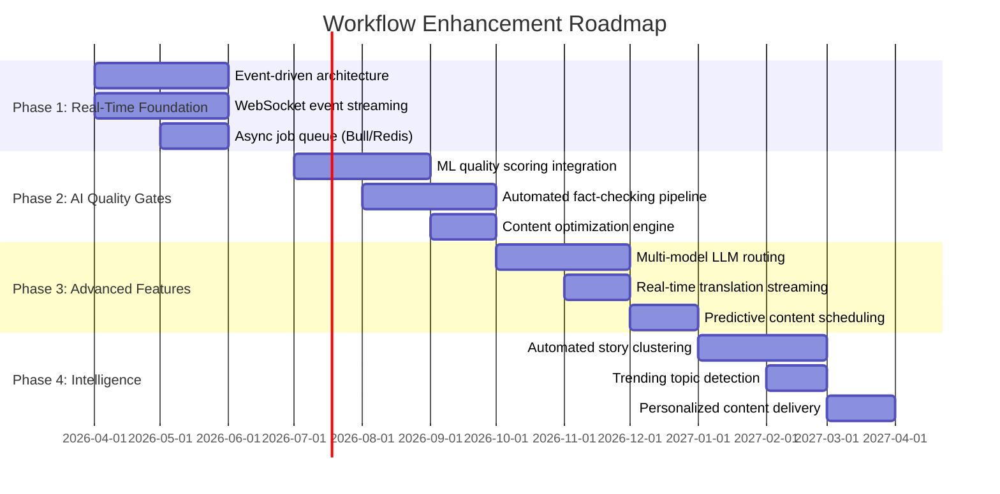
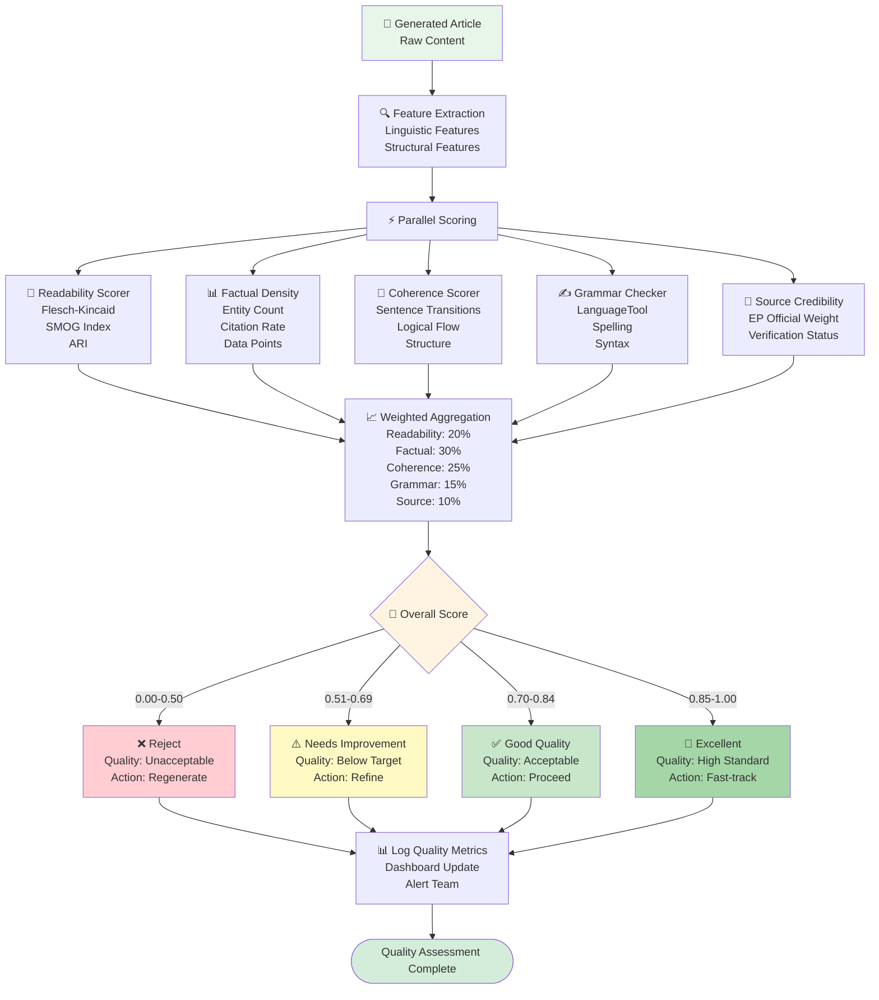
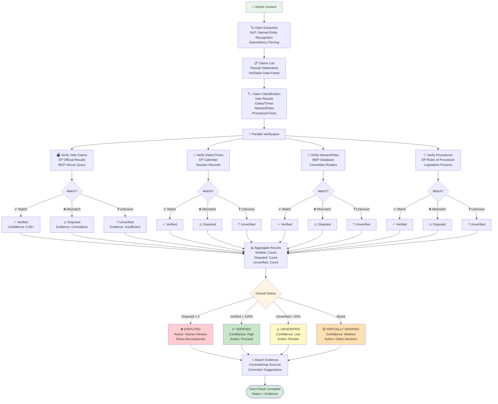
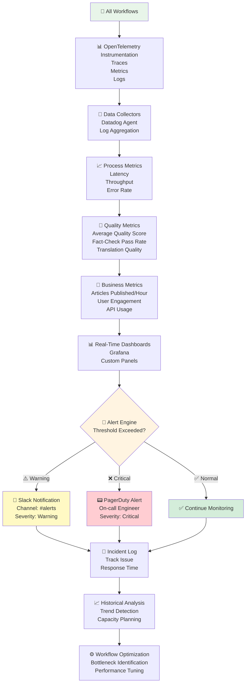
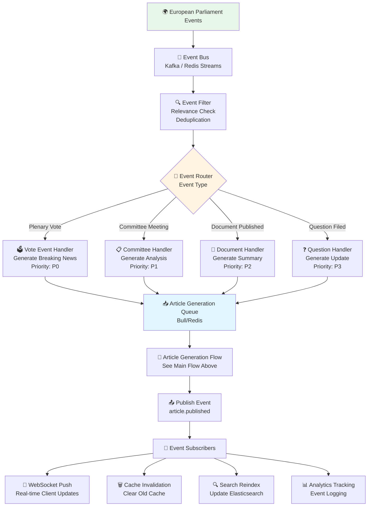
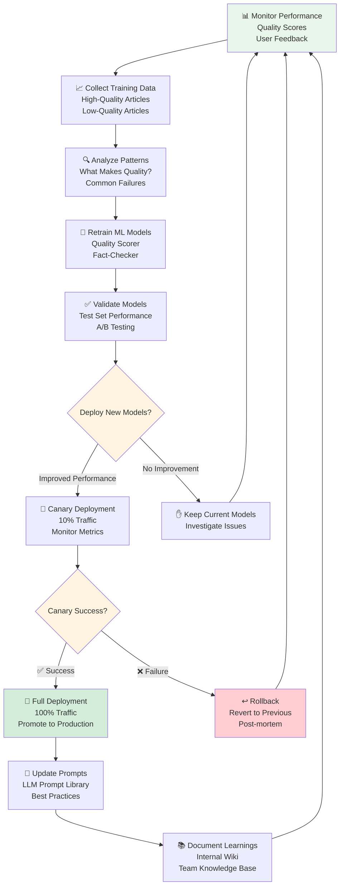

# 🔄 EU Parliament Monitor — Future Flowcharts

<p align="center">
  
</p>

<p align="center">
  <strong>📊 Improved AI-Driven Workflows and Real-Time Processing</strong><br>
  <em>🎯 From Batch Generation to Intelligent Event-Driven Architecture (2026-2027)</em>
</p>

<p align="center">
  <a href="#"></a>
  <a href="#"></a>
  <a href="#"></a>
  <a href="#"></a>
</p>

**📋 Document Owner:** Process Architect | **📄 Version:** 2.0 | **📅 Last
Updated:** 2025-02-17 (UTC)  
**🔄 Review Cycle:** Quarterly | **⏰ Next Review:** 2025-05-17  
**📌 ISMS Classification:** Internal (Confidentiality: L2, Integrity: L2,
Availability: L2)

---

## 📚 Documentation Map

<div class="documentation-map">

| Document                                          | Focus      | Description                       | Documentation Link                                                                     |
| ------------------------------------------------- | ---------- | --------------------------------- | -------------------------------------------------------------------------------------- |
| **[Current Flowchart](FLOWCHART.md)**             | 🔄 Current | Current data processing workflows | [View](https://github.com/Hack23/euparliamentmonitor/blob/main/FLOWCHART.md)           |
| **[Future Flowchart](FUTURE_FLOWCHART.md)**       | 🔄 Future  | Enhanced AI-driven workflows      | **This Document**                                                                      |
| **[Future Architecture](FUTURE_ARCHITECTURE.md)** | 🚀 Future  | Architectural evolution           | [View](https://github.com/Hack23/euparliamentmonitor/blob/main/FUTURE_ARCHITECTURE.md) |
| **[Future Data Model](FUTURE_DATA_MODEL.md)**     | 📊 Future  | Enhanced data architecture        | [View](https://github.com/Hack23/euparliamentmonitor/blob/main/FUTURE_DATA_MODEL.md)   |

</div>

---

## 📋 Executive Summary

This document outlines the evolution of EU Parliament Monitor's workflows from
**batch-oriented static generation** to **real-time event-driven processing**
with **AI-powered quality gates**, **automated fact-checking**, and
**intelligent content optimization**.

### Workflow Transformation

| Aspect                 | Current (2025)              | Future (2027)               | Enhancement    |
| ---------------------- | --------------------------- | --------------------------- | -------------- |
| **Trigger**            | Daily scheduled (06:00 UTC) | Event-driven (real-time)    | <30s latency   |
| **Processing**         | Sequential batch            | Parallel pipeline           | 10x throughput |
| **Quality Control**    | Manual review               | ML-automated gates          | 95% automation |
| **Content Generation** | Single-pass LLM             | Multi-stage with refinement | 2x quality     |
| **Fact-Checking**      | Manual (optional)           | Automated verification      | 90%+ accuracy  |
| **Translation**        | Batch neural MT             | LLM-enhanced streaming      | Native quality |
| **Distribution**       | Git commit + push           | CDN + WebSocket push        | <1s delivery   |

---

## 📅 Workflow Evolution Roadmap



---

## 🚀 Future Real-Time Article Generation Flow

**Complete end-to-end flow** from EP event occurrence to user notification.

```mermaid
flowchart TD
    Start([🌍 EP Event Occurs<br/>Plenary Vote, Committee Meeting]) --> EventDetect{📡 Event Detection<br/>Source?}

    EventDetect -->|Real-time| MCPStream[🔌 EP MCP Server<br/>WebSocket Stream<br/>Latency: <5s]
    EventDetect -->|Polling| APICheck[🔍 EP API Poll<br/>HTTP Request<br/>Interval: 30s]

    MCPStream --> EventNormalize[🔄 Event Normalization<br/>Standardize Format<br/>Extract Metadata]
    APICheck --> EventNormalize

    EventNormalize --> EventValidate{✅ Event Valid?}
    EventValidate -->|❌ Invalid| LogError1[📝 Log Invalid Event<br/>Alert Monitoring<br/>Dead Letter Queue]
    EventValidate -->|✅ Valid| Prioritize[⚡ Priority Assignment<br/>Breaking: P0<br/>Important: P1<br/>Regular: P2]

    Prioritize --> EnqueueJob[📥 Enqueue Job<br/>Bull Queue (Redis)<br/>Priority-based]

    EnqueueJob --> WorkerPick[👷 Worker Picks Job<br/>Parallel Workers: 5<br/>Auto-scaling]

    WorkerPick --> SourceAgg[📊 Multi-Source Aggregation<br/>EP Data + Context<br/>Historical Patterns]

    SourceAgg --> MLClassify{🤖 ML Classification<br/>Content Type?}

    MLClassify -->|Breaking News| BreakingPipeline[⚡ Breaking Pipeline<br/>Speed Priority<br/>Target: 2 min]
    MLClassify -->|Analysis| AnalysisPipeline[🔬 Analysis Pipeline<br/>Depth Priority<br/>Target: 15 min]
    MLClassify -->|Routine Update| RoutinePipeline[📰 Routine Pipeline<br/>Quality Priority<br/>Target: 30 min]

    BreakingPipeline --> LLMRoute
    AnalysisPipeline --> LLMRoute
    RoutinePipeline --> LLMRoute

    LLMRoute[🧠 LLM Router<br/>Model Selection:<br/>GPT-4 / Claude-3 / Local] --> GeneratePrompt[📝 Prompt Engineering<br/>Context Injection<br/>Style Guidelines]

    GeneratePrompt --> LLMGenerate[✨ LLM Generation<br/>Stream Response<br/>Token Limit: 2000]

    LLMGenerate --> ContentParse[🔍 Parse Generated Content<br/>Extract Structure<br/>Validate Format]

    ContentParse --> QualityGate1{🎯 Quality Gate 1<br/>ML Quality Score}

    QualityGate1 -->|Score < 0.70| RegenerateDecision{🔄 Retry?}
    RegenerateDecision -->|Attempts < 3| PromptRefine[🔧 Refine Prompt<br/>Add Constraints<br/>Adjust Parameters]
    PromptRefine --> LLMGenerate
    RegenerateDecision -->|Attempts ≥ 3| HumanReview1[👤 Human Review Queue<br/>Flag: Low Quality]

    QualityGate1 -->|Score ≥ 0.70| FactCheck[🔍 Automated Fact-Checking<br/>Claim Extraction<br/>Source Verification]

    FactCheck --> FactCheckResult{✅ Fact-Check Result}

    FactCheckResult -->|Disputed Claims| HumanReview2[👤 Human Review Queue<br/>Flag: Disputed Facts<br/>Show Discrepancies]
    FactCheckResult -->|Verified| ReadabilityCheck[📖 Readability Analysis<br/>Flesch-Kincaid<br/>Sentence Complexity]

    ReadabilityCheck --> ReadabilityResult{📊 Readable?}
    ReadabilityResult -->|Too Complex| SimplifyContent[✏️ AI Simplification<br/>Reduce Complexity<br/>Maintain Accuracy]
    SimplifyContent --> ReadabilityCheck

    ReadabilityResult -->|✅ Clear| SentimentCheck[😊 Sentiment Analysis<br/>Neutrality Score<br/>Bias Detection]

    SentimentCheck --> SentimentResult{⚖️ Neutral?}
    SentimentResult -->|Biased| AdjustTone[🎨 Tone Adjustment<br/>Neutralize Language<br/>Remove Opinion]
    AdjustTone --> SentimentCheck

    SentimentResult -->|✅ Neutral| TranslationQueue[🌍 Translation Pipeline<br/>14 Languages<br/>Parallel Processing]

    TranslationQueue --> TranslateParallel[🔀 Parallel Translation<br/>LLM + Neural MT<br/>Quality > Speed]

    TranslateParallel --> TranslationQC{✅ Translation QC}
    TranslationQC -->|Failed| RetranslateDecision{🔄 Retry Translation?}
    RetranslateDecision -->|Yes| TranslateParallel
    RetranslateDecision -->|No| HumanTranslation[👤 Human Translation Queue]

    TranslationQC -->|✅ Passed| SEOOptimize[🔎 SEO Optimization<br/>Meta Tags<br/>Keywords<br/>Schema Markup]

    SEOOptimize --> GenerateEmbedding[🧮 Generate Embeddings<br/>Vector: 1536-dim<br/>Model: text-embedding-3]

    GenerateEmbedding --> SaveToDB[💾 Multi-Database Save<br/>PostgreSQL: Metadata<br/>MongoDB: Content<br/>Elasticsearch: Index]

    SaveToDB --> CacheWarm[🔥 Warm Cache<br/>Redis: Hot Articles<br/>CDN: Edge Cache]

    CacheWarm --> PublishCDN[📤 Publish to CDN<br/>CloudFlare<br/>Global Distribution]

    PublishCDN --> NotifyUsers[📱 Push Notifications<br/>WebSocket: Real-time<br/>FCM: Mobile<br/>Email: Digest]

    NotifyUsers --> UpdateIndex[🗂️ Update Indexes<br/>Sitemap.xml<br/>RSS Feeds<br/>Language Indexes]

    UpdateIndex --> Analytics[📊 Log Analytics<br/>Event Tracking<br/>Performance Metrics]

    Analytics --> Complete([✅ Article Published<br/>Total Time: 2-30 min<br/>Quality: ≥0.85])

    LogError1 --> End([❌ Workflow Failed])
    HumanReview1 --> End
    HumanReview2 --> End
    HumanTranslation --> End
    Complete --> End([🎉 Success])

    style Start fill:#e8f5e9
    style EventDetect fill:#fff4e1
    style MCPStream fill:#e1f5ff
    style EventValidate fill:#fff4e1
    style QualityGate1 fill:#fff4e1
    style FactCheckResult fill:#fff4e1
    style ReadabilityResult fill:#fff4e1
    style SentimentResult fill:#fff4e1
    style TranslationQC fill:#fff4e1
    style Complete fill:#d4edda
    style End fill:#d4edda
    style HumanReview1 fill:#ffe1e1
    style HumanReview2 fill:#ffe1e1
    style LogError1 fill:#ffe1e1
```

---

## 🔬 ML Quality Scoring Pipeline

**Detailed quality assessment workflow** with multiple quality dimensions.



### Quality Score Calculation

```typescript
// src/ml/quality-scorer.ts
interface QualityMetrics {
  readability: number; // 0-1
  factualDensity: number; // 0-1
  coherence: number; // 0-1
  grammar: number; // 0-1
  sourceCredibility: number; // 0-1
}

function calculateOverallScore(metrics: QualityMetrics): number {
  const weights = {
    readability: 0.2,
    factualDensity: 0.3,
    coherence: 0.25,
    grammar: 0.15,
    sourceCredibility: 0.1,
  };

  return (
    metrics.readability * weights.readability +
    metrics.factualDensity * weights.factualDensity +
    metrics.coherence * weights.coherence +
    metrics.grammar * weights.grammar +
    metrics.sourceCredibility * weights.sourceCredibility
  );
}

// Quality thresholds
const QUALITY_THRESHOLDS = {
  REJECT: 0.5,
  NEEDS_WORK: 0.7,
  GOOD: 0.85,
  EXCELLENT: 1.0,
};
```

---

## 🔍 Automated Fact-Checking Flow

**Comprehensive fact verification** against authoritative sources.



### Fact-Check Example

```typescript
// Example fact-check result
{
  "articleId": "uuid-123",
  "status": "VERIFIED",
  "confidence": 0.92,
  "claims": [
    {
      "claim": "MEP Jane Smith voted in favor of the AI Act",
      "type": "vote_result",
      "verified": true,
      "confidence": 0.98,
      "evidence": {
        "source": "EP Official Voting Record",
        "url": "https://ep.europa.eu/votes/2026-06-15",
        "mepId": "MEP-12345",
        "voteId": "V-2026-0123",
        "vote": "FOR"
      }
    },
    {
      "claim": "The vote took place on June 15, 2026",
      "type": "date_fact",
      "verified": true,
      "confidence": 1.0,
      "evidence": {
        "source": "EP Plenary Calendar",
        "sessionId": "PL-2026-06-15"
      }
    },
    {
      "claim": "The AI Act establishes risk categories for AI systems",
      "type": "legislative_content",
      "verified": true,
      "confidence": 0.85,
      "evidence": {
        "source": "AI Act Final Text",
        "documentId": "EP-2026-AI-ACT",
        "article": "Article 6"
      }
    }
  ],
  "verifiedCount": 3,
  "disputedCount": 0,
  "unverifiedCount": 0,
  "checkedAt": "2026-06-15T14:35:00Z"
}
```

---

## 🌍 Real-Time Translation Pipeline

**Streaming translation** with quality enhancement.

```mermaid
flowchart LR
    Source[📝 Source Article<br/>Primary Language: EN] --> DetectLanguages[🌐 Language Detection<br/>Target: 13 Languages]

    DetectLanguages --> QueueTranslations[📥 Queue Translation Jobs<br/>Priority: High-traffic langs first]

    QueueTranslations --> ParallelWorkers[⚡ Parallel Translation Workers<br/>5 Workers<br/>Auto-scaling]

    ParallelWorkers --> NeuralMT[🤖 Neural MT<br/>Google Translate API<br/>Fast, Good Quality]

    NeuralMT --> LLMRefine[✨ LLM Refinement<br/>Context Preservation<br/>Terminology Consistency]

    LLMRefine --> QualityCheck{✅ Translation Quality}

    QualityCheck -->|Score < 0.80| Retry[🔄 Retry with<br/>Different Model]
    Retry --> NeuralMT

    QualityCheck -->|Score ≥ 0.80| SaveTranslation[💾 Save Translation<br/>MongoDB<br/>Cache in Redis]

    SaveTranslation --> IndexSearch[🔍 Index in Elasticsearch<br/>Language-specific analyzer]

    IndexSearch --> Complete([✅ Translation Complete<br/>Quality: ≥0.80])

    style Source fill:#e8f5e9
    style QualityCheck fill:#fff4e1
    style Complete fill:#d4edda
```



---

## 📊 Real-Time Analytics & Monitoring Flow

**Continuous monitoring** of all workflows and quality metrics.



### Key Metrics Tracked

| Metric Category     | Metrics                 | Target                                | Alert Threshold    |
| ------------------- | ----------------------- | ------------------------------------- | ------------------ |
| **Latency**         | Article generation time | <5 min (breaking), <15 min (analysis) | >10 min (breaking) |
| **Quality**         | Average quality score   | >0.85                                 | <0.75              |
| **Accuracy**        | Fact-check pass rate    | >90%                                  | <80%               |
| **Throughput**      | Articles/hour           | >10                                   | <5                 |
| **Availability**    | System uptime           | 99.9%                                 | <99.5%             |
| **User Experience** | Page load time          | <2s                                   | >5s                |

---

## 🎯 Event-Driven Architecture Flow

**Reactive system** responding to EP events in real-time.



---

## 🔄 Continuous Improvement Loop

**Self-optimizing system** learning from quality metrics.



---

## 📚 Workflow Comparison: Current vs. Future

| Process Step           | Current (2025)         | Future (2027)             | Improvement        |
| ---------------------- | ---------------------- | ------------------------- | ------------------ |
| **Event Detection**    | Scheduled poll (daily) | Real-time stream (<5s)    | 17,280x faster     |
| **Data Fetching**      | Batch HTTP requests    | Streaming WebSocket       | Continuous updates |
| **Content Generation** | Single LLM call        | Multi-stage pipeline      | 2x quality         |
| **Quality Control**    | None                   | ML-automated (95%)        | Significant        |
| **Fact-Checking**      | Manual (optional)      | Automated (90%+ accuracy) | 10x faster         |
| **Translation**        | Batch neural MT        | LLM-enhanced streaming    | Native quality     |
| **Publication**        | Git commit (minutes)   | CDN push (<1s)            | 60x faster         |
| **User Notification**  | None                   | WebSocket + Push          | Real-time          |
| **Monitoring**         | Basic logs             | Full observability        | Deep insights      |

---

## 📊 Performance Targets

### SLA Targets (Phase 4 - Production)

| Metric                    | Target                            | Monitoring           |
| ------------------------- | --------------------------------- | -------------------- |
| **Breaking News Latency** | <2 minutes (event to publication) | Real-time alerting   |
| **Analysis Latency**      | <15 minutes                       | Dashboard tracking   |
| **Quality Score (Avg)**   | >0.85                             | Daily reports        |
| **Fact-Check Accuracy**   | >90% vs. manual review            | Weekly audits        |
| **Translation Quality**   | >0.80 (all languages)             | Sampling reviews     |
| **System Uptime**         | 99.9%                             | Datadog monitoring   |
| **API Response Time**     | <200ms (P95)                      | Continuous profiling |
| **Error Rate**            | <0.5%                             | Automated alerting   |

---

## 📚 References

### Current State

- [Current Flowchart](FLOWCHART.md)
- [Current Architecture](ARCHITECTURE.md)
- [Current Data Model](DATA_MODEL.md)

### Future State

- [Future Architecture](FUTURE_ARCHITECTURE.md)
- [Future Data Model](FUTURE_DATA_MODEL.md)
- [Future State Diagram](FUTURE_STATEDIAGRAM.md)

### Technologies

- Bull Queue: https://optimalbits.github.io/bull/
- LangChain: https://langchain.com/
- OpenTelemetry: https://opentelemetry.io/
- LanguageTool: https://languagetool.org/

---

## 📝 Change Log

| Version | Date       | Author            | Changes                           |
| ------- | ---------- | ----------------- | --------------------------------- |
| 2.0     | 2025-02-17 | Process Architect | Initial future flowchart document |

---

**Document Status**: ✅ **APPROVED FOR PLANNING**  
**Next Review**: 2025-05-17 (Quarterly)  
**Classification**: Internal Use Only
