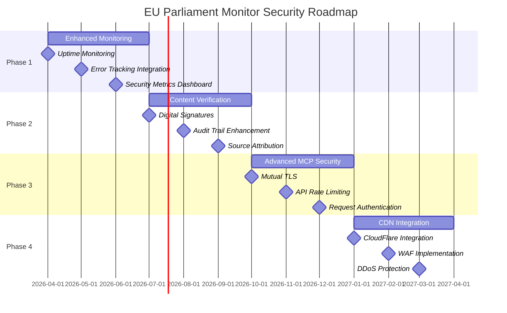
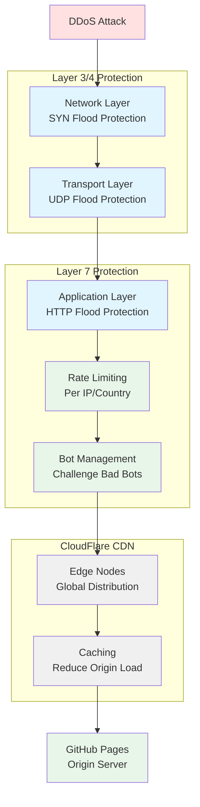

# 🚀 EU Parliament Monitor — Future Security Architecture

**Version:** 1.0  
**Last Updated:** 2025-02-17  
**Status:** Planning Document  
**Review Cycle:** Quarterly

---

## 📋 Executive Summary

This document outlines the planned security architecture enhancements for EU Parliament Monitor over the next 18 months (Q2 2026 - Q1 2027). The roadmap focuses on **proactive security**, **automated verification**, and **resilience** while maintaining the platform's core principles of simplicity and transparency.

## 🎯 Strategic Security Goals

1. **Enhanced Monitoring** (Q2 2026): Real-time visibility into system health and security events
2. **Content Verification** (Q3 2026): Cryptographic integrity verification for generated content
3. **Advanced MCP Security** (Q4 2026): Authenticated and encrypted MCP communication
4. **CDN Integration** (Q1 2027): Global distribution with advanced protection

## 📅 Implementation Roadmap



---

## 🔍 Phase 1: Enhanced Monitoring (Q2 2026)

**Goal**: Implement comprehensive monitoring for proactive security and performance management.

### 1.1 Uptime Monitoring

**Implementation**: Pingdom or StatusCake integration

```yaml
# .github/workflows/uptime-check.yml
name: Uptime Monitoring

on:
  schedule:
    - cron: '*/5 * * * *' # Every 5 minutes
  workflow_dispatch:

jobs:
  uptime-check:
    runs-on: ubuntu-latest
    steps:
      - name: Check Website Availability
        run: |
          response=$(curl -s -o /dev/null -w "%{http_code}" https://euparliamentmonitor.com)
          if [ $response -ne 200 ]; then
            echo "::error::Website returned $response"
            exit 1
          fi
      
      - name: Validate Content Integrity
        run: |
          content=$(curl -s https://euparliamentmonitor.com/index-en.html)
          if ! echo "$content" | grep -q "EU Parliament Monitor"; then
            echo "::error::Content integrity check failed"
            exit 1
          fi
```

**Metrics Tracked:**
- HTTP response codes
- Response time (latency)
- Content availability
- SSL certificate validity
- DNS resolution time

**Alerting:**
- Slack/Discord notifications on downtime
- Email alerts for SSL expiry (30 days before)
- GitHub Issues auto-created for incidents

### 1.2 Error Tracking & Alerting

**Implementation**: Sentry integration for client-side error tracking

```html
<!-- Add to article-template.js -->
<script src="https://browser.sentry-cdn.com/7.x.x/bundle.min.js" 
        integrity="sha384-..."
        crossorigin="anonymous">
</script>
<script>
  Sentry.init({
    dsn: 'https://...@sentry.io/...',
    environment: 'production',
    sampleRate: 0.1, // 10% sampling for performance
    beforeSend(event) {
      // Filter out PII, only track errors
      return event;
    }
  });
</script>
```

**Error Categories:**
- JavaScript errors (if any future JS added)
- Resource loading failures
- CSP violations
- Browser compatibility issues

### 1.3 Performance Metrics Collection

**Implementation**: Lighthouse CI integration

```yaml
# .github/workflows/lighthouse.yml
name: Lighthouse CI

on:
  push:
    branches: [main]
  pull_request:

jobs:
  lighthouse:
    runs-on: ubuntu-latest
    steps:
      - uses: actions/checkout@v4
      - name: Run Lighthouse CI
        uses: treosh/lighthouse-ci-action@v10
        with:
          urls: |
            https://euparliamentmonitor.com
            https://euparliamentmonitor.com/index-en.html
          uploadArtifacts: true
          temporaryPublicStorage: true
```

**Metrics:**
- Performance score (target: > 90)
- Accessibility score (target: 100)
- Best Practices score (target: 100)
- SEO score (target: 100)

### 1.4 Security Metrics Dashboard

**Implementation**: Custom GitHub Pages dashboard

```javascript
// scripts/generate-security-dashboard.js
export function generateSecurityDashboard() {
  const metrics = {
    vulnerabilities: fetchDependabotAlerts(),
    codeQlFindings: fetchCodeQLFindings(),
    testCoverage: parseVitestCoverage(),
    uptime: fetchUptimeMetrics(),
    deployments: fetchGitHubActions()
  };
  
  return generateHTMLDashboard(metrics);
}
```

**Dashboard Components:**
- Vulnerability count (target: 0)
- Test coverage trend
- Deployment success rate
- Uptime percentage (30-day rolling)
- CodeQL findings by severity

---

## 🔐 Phase 2: Content Verification (Q3 2026)

**Goal**: Implement cryptographic verification to ensure content integrity and authenticity.

### 2.1 Digital Signatures for Articles

**Implementation**: GPG signing of generated articles

```javascript
// scripts/sign-articles.js
import { execSync } from 'child_process';
import { readFileSync, writeFileSync } from 'fs';

export function signArticle(articlePath) {
  const content = readFileSync(articlePath, 'utf-8');
  const signature = execSync(
    'gpg --clearsign --armor',
    { input: content, encoding: 'utf-8' }
  );
  
  // Embed signature in HTML meta tag
  const signedContent = content.replace(
    '</head>',
    `  <meta name="signature" content="${signature}">\n</head>`
  );
  
  writeFileSync(articlePath, signedContent);
}
```

**Signature Verification:**
- Public key published in repository
- Verification instructions in footer
- Automated verification tool

```bash
# Verify article signature
curl https://euparliamentmonitor.com/news/2026-week-ahead-en.html \
  | grep 'meta name="signature"' \
  | cut -d'"' -f4 \
  | gpg --verify
```

### 2.2 Cryptographic Integrity Verification

**Implementation**: SHA-256 checksums for content integrity

```javascript
// scripts/generate-checksums.js
import { createHash } from 'crypto';
import { readdirSync, readFileSync, writeFileSync } from 'fs';

export function generateChecksums(directory) {
  const checksums = {};
  
  const files = readdirSync(directory, { recursive: true });
  for (const file of files) {
    if (file.endsWith('.html')) {
      const content = readFileSync(`${directory}/${file}`, 'utf-8');
      const hash = createHash('sha256').update(content).digest('hex');
      checksums[file] = hash;
    }
  }
  
  writeFileSync(
    `${directory}/checksums.json`,
    JSON.stringify(checksums, null, 2)
  );
}
```

**Checksum Verification:**
```json
// news/checksums.json
{
  "2026-week-ahead-en.html": "abc123...",
  "2026-week-ahead-de.html": "def456...",
  "metadata/2026-week-ahead.json": "789ghi..."
}
```

### 2.3 Audit Trail Enhancement

**Implementation**: Immutable audit log with content provenance

```javascript
// scripts/audit-trail.js
export function recordGeneration(article, metadata) {
  const auditEntry = {
    timestamp: new Date().toISOString(),
    article_id: article.slug,
    type: article.type,
    language: article.lang,
    mcp_version: metadata.mcpVersion,
    generator_version: metadata.generatorVersion,
    source_data_hash: metadata.sourceDataHash,
    commit_sha: process.env.GITHUB_SHA,
    workflow_run: process.env.GITHUB_RUN_ID
  };
  
  // Append to audit log (Git-tracked)
  appendAuditLog('news/audit-trail.jsonl', auditEntry);
}
```

**Audit Trail Query:**
```bash
# Find all articles generated from specific EP data
jq -r 'select(.source_data_hash == "abc123") | .article_id' \
  news/audit-trail.jsonl
```

### 2.4 Source Attribution Verification

**Implementation**: Embed European Parliament data references

```html
<!-- Article footer -->
<div class="source-attribution">
  <h3>Data Sources</h3>
  <ul>
    <li>
      <strong>Plenary Session:</strong>
      <a href="https://data.europarl.europa.eu/sessions/2026-03-01">
        2026-03-01 Plenary Session
      </a>
      <span class="data-hash">SHA-256: abc123...</span>
    </li>
    <li>
      <strong>Committee Meeting:</strong>
      <a href="https://data.europarl.europa.eu/committees/LIBE/2026-02-25">
        LIBE Committee 2026-02-25
      </a>
      <span class="data-hash">SHA-256: def456...</span>
    </li>
  </ul>
  <p>
    <small>
      Generated: 2026-03-01T06:15:32Z |
      MCP Version: 1.2.3 |
      Commit: <a href="https://github.com/Hack23/euparliamentmonitor/commit/...">abc123d</a>
    </small>
  </p>
</div>
```

---

## 🔒 Phase 3: Advanced MCP Security (Q4 2026)

**Goal**: Secure MCP communication with authentication, encryption, and rate limiting.

### 3.1 Mutual TLS for MCP Communication

**Implementation**: TLS 1.3 with client certificate authentication

```javascript
// scripts/ep-mcp-client-tls.js
import { spawn } from 'child_process';
import { readFileSync } from 'fs';

export class SecureEPMCPClient extends EuropeanParliamentMCPClient {
  constructor(options = {}) {
    super(options);
    this.tlsConfig = {
      cert: readFileSync(options.clientCert),
      key: readFileSync(options.clientKey),
      ca: readFileSync(options.serverCA),
      minVersion: 'TLSv1.3',
      ciphers: 'TLS_AES_256_GCM_SHA384:TLS_CHACHA20_POLY1305_SHA256'
    };
  }
  
  async connect() {
    this.process = spawn('node', [this.serverPath], {
      stdio: ['pipe', 'pipe', 'pipe'],
      env: {
        ...process.env,
        MCP_TLS_CERT: this.tlsConfig.cert,
        MCP_TLS_KEY: this.tlsConfig.key,
        MCP_TLS_CA: this.tlsConfig.ca
      }
    });
    
    // TLS handshake verification
    await this.verifyTLSConnection();
  }
}
```

**Certificate Management:**
- GitHub Secrets for private keys
- Automated rotation (90-day cycle)
- Certificate pinning for server verification

### 3.2 API Rate Limiting

**Implementation**: Token bucket algorithm for MCP requests

```javascript
// scripts/rate-limiter.js
export class RateLimiter {
  constructor(maxRequests = 100, windowMs = 60000) {
    this.maxRequests = maxRequests;
    this.windowMs = windowMs;
    this.requests = [];
  }
  
  async checkLimit() {
    const now = Date.now();
    this.requests = this.requests.filter(time => now - time < this.windowMs);
    
    if (this.requests.length >= this.maxRequests) {
      const oldestRequest = Math.min(...this.requests);
      const waitTime = this.windowMs - (now - oldestRequest);
      throw new Error(`Rate limit exceeded. Retry after ${waitTime}ms`);
    }
    
    this.requests.push(now);
  }
}

// Usage in MCP client
const rateLimiter = new RateLimiter(100, 60000); // 100 req/min
await rateLimiter.checkLimit();
const response = await mcpClient.sendRequest(request);
```

### 3.3 Request Authentication

**Implementation**: HMAC-SHA256 request signing

```javascript
// scripts/request-signer.js
import { createHmac } from 'crypto';

export function signRequest(request, secret) {
  const timestamp = Date.now();
  const nonce = crypto.randomBytes(16).toString('hex');
  
  const payload = JSON.stringify({
    method: request.method,
    params: request.params,
    timestamp,
    nonce
  });
  
  const signature = createHmac('sha256', secret)
    .update(payload)
    .digest('hex');
  
  return {
    ...request,
    auth: {
      timestamp,
      nonce,
      signature
    }
  };
}

export function verifyRequest(request, secret, maxAge = 300000) {
  const now = Date.now();
  
  // Check timestamp freshness (5 min window)
  if (now - request.auth.timestamp > maxAge) {
    throw new Error('Request expired');
  }
  
  // Recompute signature
  const payload = JSON.stringify({
    method: request.method,
    params: request.params,
    timestamp: request.auth.timestamp,
    nonce: request.auth.nonce
  });
  
  const expectedSignature = createHmac('sha256', secret)
    .update(payload)
    .digest('hex');
  
  if (expectedSignature !== request.auth.signature) {
    throw new Error('Invalid signature');
  }
}
```

### 3.4 Response Validation Schemas

**Implementation**: JSON Schema validation for MCP responses

```javascript
// scripts/mcp-schema-validator.js
import Ajv from 'ajv';

const ajv = new Ajv({ strict: true });

const plenarySessionSchema = {
  type: 'object',
  required: ['session_id', 'date', 'title', 'agenda'],
  properties: {
    session_id: { type: 'string', pattern: '^PS-\\d{4}-\\d{2}-\\d{2}$' },
    date: { type: 'string', format: 'date' },
    title: { type: 'string', minLength: 1, maxLength: 500 },
    agenda: {
      type: 'array',
      items: {
        type: 'object',
        required: ['item_id', 'title'],
        properties: {
          item_id: { type: 'string' },
          title: { type: 'string' },
          description: { type: 'string' }
        }
      }
    }
  },
  additionalProperties: false
};

const validatePlenarySession = ajv.compile(plenarySessionSchema);

export function validateMCPResponse(response, schema) {
  const validate = ajv.compile(schema);
  const valid = validate(response);
  
  if (!valid) {
    console.error('Validation errors:', validate.errors);
    throw new Error('Invalid MCP response schema');
  }
  
  return response;
}
```

---

## 🌐 Phase 4: CDN Integration (Q1 2027)

**Goal**: Global content delivery with advanced DDoS protection and performance optimization.

### 4.1 CloudFlare Integration

**Implementation**: CloudFlare Pages deployment with custom configuration

```yaml
# .github/workflows/deploy-cloudflare.yml
name: Deploy to CloudFlare Pages

on:
  push:
    branches: [main]

jobs:
  deploy:
    runs-on: ubuntu-latest
    steps:
      - uses: actions/checkout@v4
      
      - name: Generate News
        run: npm run generate-news
      
      - name: Deploy to CloudFlare Pages
        uses: cloudflare/pages-action@v1
        with:
          apiToken: ${{ secrets.CLOUDFLARE_API_TOKEN }}
          accountId: ${{ secrets.CLOUDFLARE_ACCOUNT_ID }}
          projectName: euparliamentmonitor
          directory: .
          gitHubToken: ${{ secrets.GITHUB_TOKEN }}
```

**CloudFlare Configuration:**
```toml
# cloudflare-pages.toml
[build]
command = "npm run generate-news && npm run generate-sitemap"
publish = "."

[build.environment]
NODE_VERSION = "24"

[[redirects]]
from = "/index.html"
to = "/index-en.html"
status = 302

[[headers]]
for = "/*"
[headers.values]
X-Content-Type-Options = "nosniff"
X-Frame-Options = "DENY"
Referrer-Policy = "strict-origin-when-cross-origin"
Permissions-Policy = "geolocation=(), microphone=(), camera=()"
Content-Security-Policy = "default-src 'self'; script-src 'self'; style-src 'self' 'unsafe-inline'; img-src 'self' data: https:; font-src 'self'; connect-src 'self'; frame-ancestors 'none'; base-uri 'self'; form-action 'none';"

[[headers]]
for = "/*.html"
[headers.values]
Cache-Control = "public, max-age=3600, must-revalidate"

[[headers]]
for = "/news/*"
[headers.values]
Cache-Control = "public, max-age=86400, immutable"
```

### 4.2 WAF Implementation

**Implementation**: CloudFlare WAF with OWASP rule set

```javascript
// CloudFlare WAF Rules Configuration
const wafRules = [
  {
    description: "Block SQL injection attempts",
    expression: "(http.request.uri.query contains \"' OR 1=1\" or http.request.uri.query contains \"UNION SELECT\")",
    action: "block"
  },
  {
    description: "Block XSS attempts",
    expression: "(http.request.uri.query contains \"<script\" or http.request.uri.query contains \"javascript:\")",
    action: "block"
  },
  {
    description: "Rate limit per IP",
    expression: "(cf.threat_score > 14)",
    action: "challenge"
  },
  {
    description: "Block known bad bots",
    expression: "(cf.bot_management.score < 30)",
    action: "block"
  },
  {
    description: "OWASP ModSecurity Core Rule Set",
    expression: "cf.waf.score > 10",
    action: "challenge"
  }
];
```

**WAF Protection Layers:**
- OWASP Top 10 protection
- DDoS mitigation (L3/L4/L7)
- Bot management
- Rate limiting (per IP, per country)
- GeoIP blocking (if needed)

### 4.3 DDoS Protection

**Implementation**: Multi-layer DDoS protection



**DDoS Mitigation Strategy:**
1. **Anycast Network**: Distribute attack across global edge nodes
2. **Rate Limiting**: 100 req/min per IP, 10,000 req/min per country
3. **Challenge**: CAPTCHA for suspicious traffic
4. **Caching**: 95%+ cache hit rate reduces origin load
5. **Always Online**: Serve cached content if origin unreachable

### 4.4 Geographic Distribution

**Implementation**: Multi-region content delivery

```javascript
// CloudFlare Edge Workers for intelligent routing
addEventListener('fetch', event => {
  event.respondWith(handleRequest(event.request))
});

async function handleRequest(request) {
  const url = new URL(request.url);
  const country = request.cf.country;
  
  // Redirect to localized content based on country
  const languageMap = {
    'DE': 'de', 'FR': 'fr', 'ES': 'es', 'IT': 'it',
    'NL': 'nl', 'PL': 'pl', 'PT': 'pt', 'RO': 'ro',
    'SE': 'sv', 'DK': 'da', 'FI': 'fi', 'GR': 'el',
    'HU': 'hu'
  };
  
  const lang = languageMap[country] || 'en';
  
  if (url.pathname === '/') {
    return Response.redirect(`/index-${lang}.html`, 302);
  }
  
  // Serve from cache or origin
  return fetch(request);
}
```

**Geographic Features:**
- Automatic language selection based on IP geolocation
- Edge caching in 200+ cities worldwide
- <50ms latency for 95% of global users
- Failover to origin if edge unavailable

---

## 🛡️ Threat Evolution

### Emerging Threats (2026-2027)

#### 1. AI-Generated Misinformation

**Threat**: Deepfake parliamentary videos, AI-generated fake quotes

**Mitigation Strategy**:
- Digital signatures for all content
- Source attribution with EP API data hashes
- Fact-checking partnerships (future)
- Content verification tools for users

#### 2. Supply Chain Attacks on CDN

**Threat**: Compromise of CloudFlare or CDN provider

**Mitigation Strategy**:
- Subresource Integrity (SRI) for all external resources
- Multi-CDN strategy (CloudFlare + GitHub Pages fallback)
- Certificate pinning
- Automated integrity verification

#### 3. Advanced Persistent Threats (APT)

**Threat**: State-sponsored actors targeting political intelligence platforms

**Mitigation Strategy**:
- Enhanced monitoring and anomaly detection
- Incident response playbooks
- Regular security audits
- Red team penetration testing (annual)

#### 4. Privacy Regulations Evolution

**Threat**: Stricter data protection laws (ePrivacy Regulation, DMA, DSA)

**Mitigation Strategy**:
- No tracking architecture maintained
- Privacy-by-design principles
- Regular legal compliance reviews
- Data Protection Impact Assessments (if needed)

---

## 📊 Success Metrics

### Phase 1 Targets (Q2 2026)

| Metric | Target | Measurement |
|--------|--------|-------------|
| Uptime | > 99.9% | Pingdom monitoring |
| Response Time | < 500ms (p95) | Lighthouse CI |
| Error Rate | < 0.1% | Sentry tracking |
| Security Dashboard | Live | Custom dashboard |

### Phase 2 Targets (Q3 2026)

| Metric | Target | Measurement |
|--------|--------|-------------|
| Articles Signed | 100% | Digital signatures |
| Checksum Coverage | 100% | SHA-256 checksums |
| Audit Trail Entries | 100% | JSONL audit log |
| Source Attribution | 100% | EP API references |

### Phase 3 Targets (Q4 2026)

| Metric | Target | Measurement |
|--------|--------|-------------|
| TLS Encryption | 100% | Mutual TLS |
| Rate Limit Violations | < 1% | Token bucket |
| Authentication Failures | 0 | HMAC signatures |
| Schema Validation | 100% | JSON Schema |

### Phase 4 Targets (Q1 2027)

| Metric | Target | Measurement |
|--------|--------|-------------|
| CDN Cache Hit Rate | > 95% | CloudFlare analytics |
| Global Latency (p95) | < 50ms | Edge metrics |
| DDoS Attacks Mitigated | 100% | WAF logs |
| Multi-Region Availability | 100% | Anycast network |

---

## 💰 Investment Requirements

### Budget Estimates

| Phase | Component | Estimated Cost (Annual) |
|-------|-----------|-------------------------|
| Phase 1 | Pingdom/StatusCake | $15/month = $180 |
| Phase 1 | Sentry (10K events/month) | $26/month = $312 |
| Phase 1 | Lighthouse CI | Free (GitHub Actions) |
| Phase 2 | GPG Key Management | Free (self-managed) |
| Phase 2 | Audit Trail Storage | Free (Git repository) |
| Phase 3 | TLS Certificates | Free (Let's Encrypt) |
| Phase 3 | Enhanced MCP Server | Development time only |
| Phase 4 | CloudFlare Pages Pro | $20/month = $240 |
| Phase 4 | CloudFlare WAF | $5/month = $60 |
| **Total** | **Annual Security Investment** | **~$800/year** |

**ROI Justification:**
- Reduced incident response costs
- Enhanced credibility and trust
- Compliance with evolving regulations
- Proactive threat prevention

---

## 📝 Implementation Plan

### Q2 2026: Enhanced Monitoring

**Week 1-2**: Setup uptime monitoring
- Configure Pingdom/StatusCake
- Create alert rules
- Test notification channels

**Week 3-4**: Implement error tracking
- Integrate Sentry
- Configure error filtering
- Setup alerting

**Week 5-6**: Performance monitoring
- Setup Lighthouse CI
- Create performance budgets
- Automate regression detection

**Week 7-8**: Security dashboard
- Design dashboard layout
- Implement metrics collection
- Deploy to GitHub Pages

### Q3 2026: Content Verification

**Week 1-2**: Digital signatures
- Generate GPG keys
- Implement signing workflow
- Document verification process

**Week 3-4**: Checksums
- Implement SHA-256 generation
- Create verification tools
- Automate checksum updates

**Week 5-6**: Audit trail
- Design audit log schema
- Implement logging
- Create query tools

**Week 7-8**: Source attribution
- Embed EP API references
- Add data hash tracking
- Update article templates

### Q4 2026: Advanced MCP Security

**Week 1-2**: Mutual TLS
- Generate certificates
- Implement TLS handshake
- Test certificate rotation

**Week 3-4**: Rate limiting
- Implement token bucket
- Test rate limits
- Add monitoring

**Week 5-6**: Request authentication
- Implement HMAC signing
- Test signature verification
- Add timestamp validation

**Week 7-8**: Schema validation
- Define JSON schemas
- Implement validation
- Test error handling

### Q1 2027: CDN Integration

**Week 1-2**: CloudFlare setup
- Create CloudFlare account
- Configure Pages project
- Test deployment

**Week 3-4**: WAF configuration
- Enable WAF rules
- Test OWASP protection
- Configure rate limiting

**Week 5-6**: DDoS protection
- Enable Under Attack mode
- Test challenge pages
- Configure bot management

**Week 7-8**: Edge optimization
- Implement Edge Workers
- Test geographic routing
- Optimize caching

---

## 🔄 Review & Maintenance

### Quarterly Reviews

**Q2 2026**: Phase 1 completion review
**Q3 2026**: Phase 2 completion review
**Q4 2026**: Phase 3 completion review
**Q1 2027**: Phase 4 completion review

### Annual Security Review (Q4 2027)

- Threat landscape assessment
- Security controls effectiveness
- Compliance status review
- Budget allocation for 2028
- New threat identification
- Technology evolution assessment

---

## 📚 References

- [Hack23 ISMS-PUBLIC](https://github.com/Hack23/ISMS-PUBLIC)
- [SECURITY_ARCHITECTURE.md](SECURITY_ARCHITECTURE.md)
- [Secure Development Policy](https://github.com/Hack23/ISMS-PUBLIC/blob/main/Secure_Development_Policy.md)
- [NIST Cybersecurity Framework 2.0](https://www.nist.gov/cyberframework)
- [OWASP Top 10](https://owasp.org/www-project-top-ten/)
- [CIS Controls v8.1](https://www.cisecurity.org/controls)

---

**Document Status**: Living document, updated quarterly  
**Next Review**: 2026-05-17  
**Owner**: CEO, Hack23 AB

<p align="center">
  <em>Security is a journey, not a destination</em>
</p>
