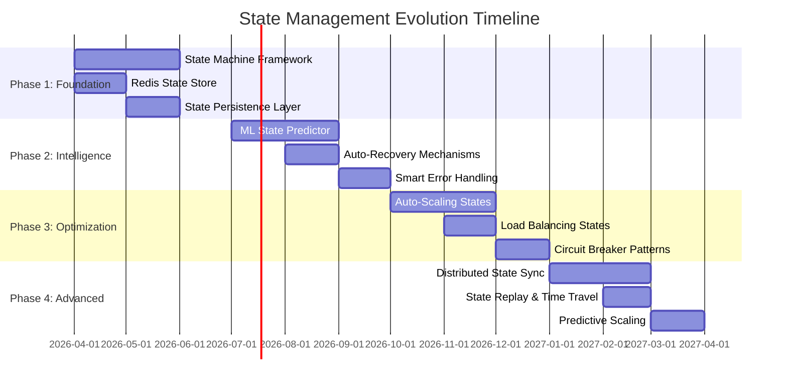
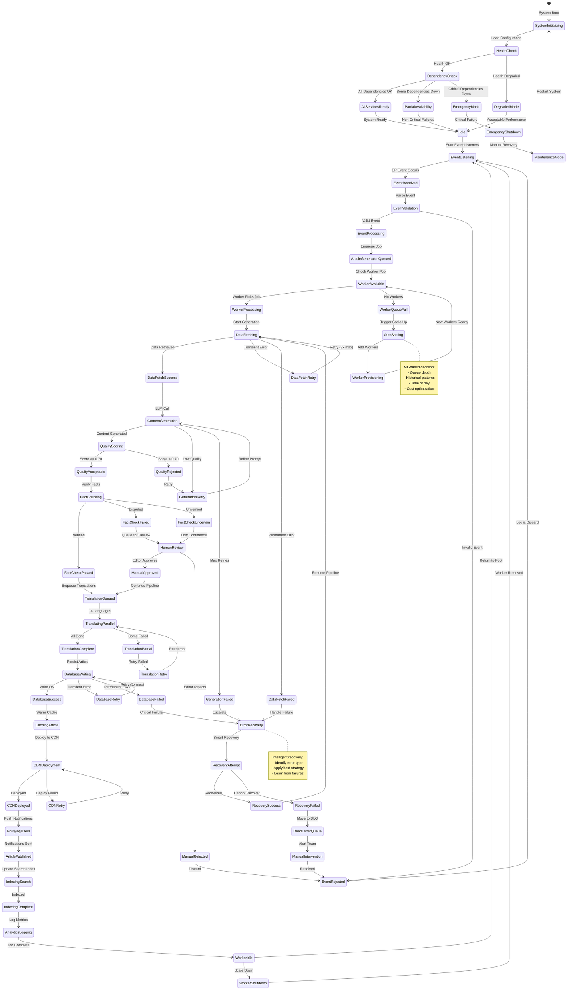
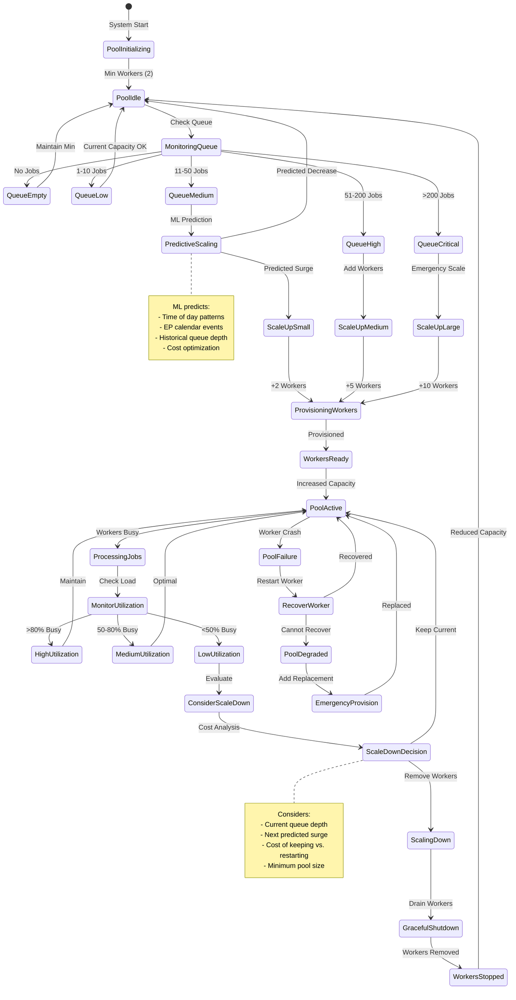
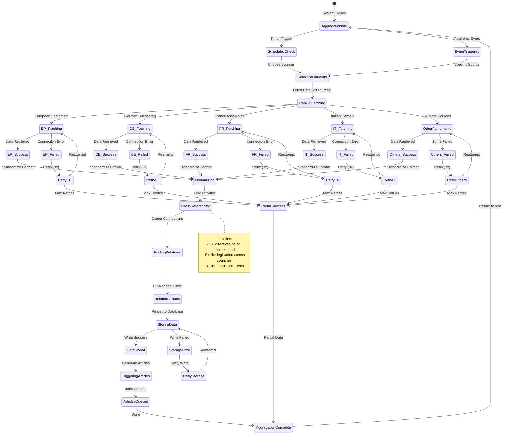
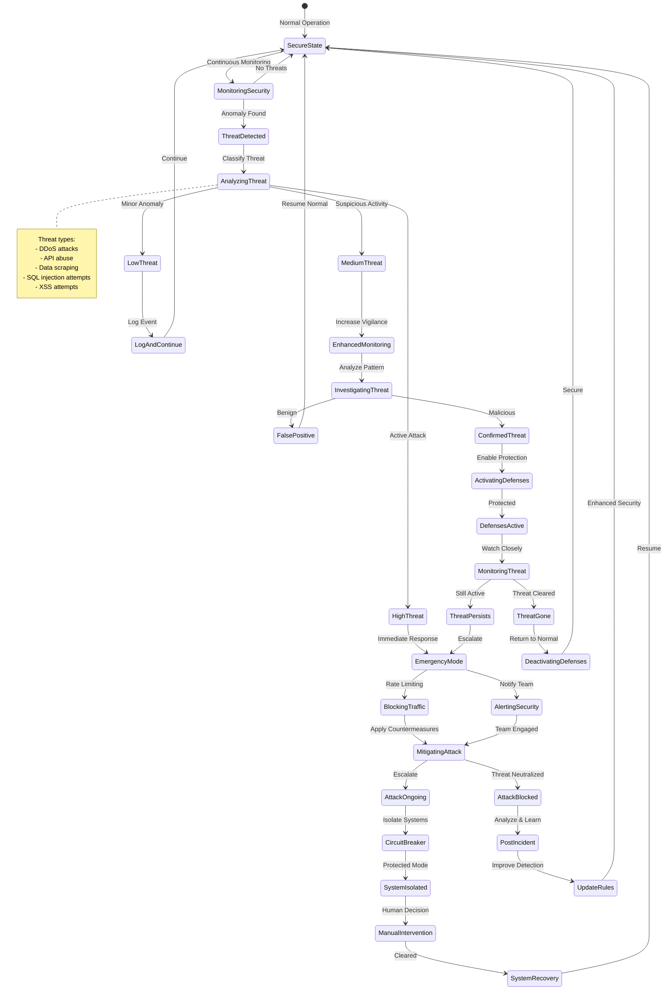
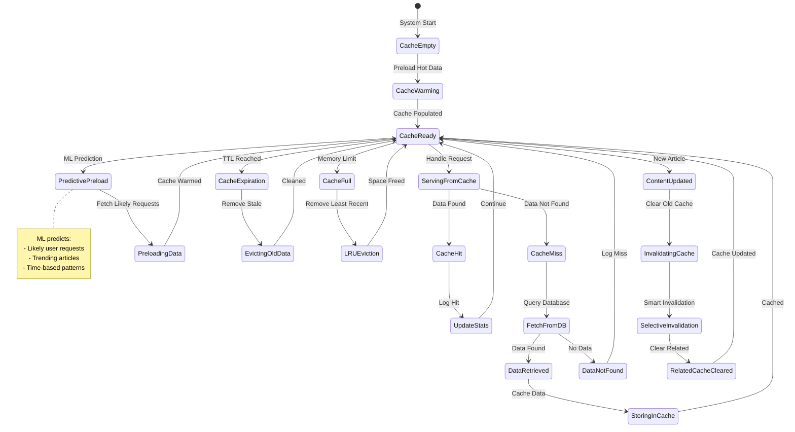

# 🔄 EU Parliament Monitor — Future State Diagrams

  

  <strong>🔀 Advanced Adaptive State Management with ML-Based Transitions</strong> 
  <em>🎯 From Static Build States to Dynamic Real-Time Intelligence (2026-2027)</em>

  
  
  
  

**📋 Document Owner:** Systems Architect | **📄 Version:** 2.0 | **📅 Last
Updated:** 2025-02-17 (UTC)  
**🔄 Review Cycle:** Quarterly | **⏰ Next Review:** 2025-05-17  
**📌 ISMS Classification:** Internal (Confidentiality: L2, Integrity: L2,
Availability: L2)

---

## 📚 Documentation Map

| Document                                           | Focus      | Description                        | Documentation Link                                                                     |
| -------------------------------------------------- | ---------- | ---------------------------------- | -------------------------------------------------------------------------------------- |
| **[Current State Diagram](STATEDIAGRAM.md)**       | 🔄 Current | Current system state transitions   | [View](https://github.com/Hack23/euparliamentmonitor/blob/main/STATEDIAGRAM.md)        |
| **[Future State Diagram](FUTURE_STATEDIAGRAM.md)** | 🔄 Future  | Advanced adaptive state management | **This Document**                                                                      |
| **[Future Architecture](FUTURE_ARCHITECTURE.md)**  | 🚀 Future  | Architectural evolution            | [View](https://github.com/Hack23/euparliamentmonitor/blob/main/FUTURE_ARCHITECTURE.md) |
| **[Future Flowchart](FUTURE_FLOWCHART.md)**        | 🔄 Future  | Enhanced workflows                 | [View](https://github.com/Hack23/euparliamentmonitor/blob/main/FUTURE_FLOWCHART.md)    |

---

## 📋 Executive Summary

This document defines the evolution of EU Parliament Monitor's state management
from **simple build-time states** to **complex real-time adaptive state
machines** with **ML-based state prediction**, **intelligent error recovery**,
and **auto-scaling capabilities**.

### State Management Transformation

| Aspect                | Current (2025)         | Future (2027)              | Enhancement               |
| --------------------- | ---------------------- | -------------------------- | ------------------------- |
| **State Persistence** | None (ephemeral build) | Redis + PostgreSQL         | Persistent state tracking |
| **State Complexity**  | Linear workflow        | Complex state machine      | 50+ states                |
| **Error Recovery**    | Fail and retry         | Intelligent recovery paths | Self-healing              |
| **Predictive States** | None                   | ML-based predictions       | Proactive actions         |
| **Auto-Scaling**      | Fixed resources        | Dynamic scaling states     | Cost optimization         |
| **Monitoring**        | Basic logs             | Real-time state dashboards | Full visibility           |
| **Concurrency**       | Serial execution       | Parallel state machines    | 10x throughput            |

---

## 📅 State Management Evolution Roadmap

---

## 🚀 Future System Lifecycle State Machine

**Complete system lifecycle** with intelligent transitions and recovery paths.

---

## 🎯 Article Generation State Machine

**Detailed state machine** for individual article generation with ML quality
gates.

```mermaid
stateDiagram-v2
    [*] --> JobQueued: Article Request

    JobQueued --> PriorityAssignment: Assign Priority
    PriorityAssignment --> HighPriority: Breaking News (P0)
    PriorityAssignment --> MediumPriority: Important (P1)
    PriorityAssignment --> LowPriority: Regular (P2)

    HighPriority --> WorkerAssignment: Fast Lane
    MediumPriority --> WorkerAssignment: Normal Lane
    LowPriority --> WorkerAssignment: Batch Lane

    WorkerAssignment --> Initializing: Worker Acquired

    Initializing --> FetchingContext: Load Context
    FetchingContext --> ContextReady: Context Loaded
    FetchingContext --> ContextFailed: Load Failed

    ContextFailed --> RetryContext: Retry (3x)
    RetryContext --> FetchingContext: Reattempt
    RetryContext --> Failed: Max Retries

    ContextReady --> SelectingModel: Choose LLM
    SelectingModel --> ModelSelected: Model Ready

    ModelSelected --> GeneratingContent: Call LLM
    GeneratingContent --> ContentGenerated: Content Ready
    GeneratingContent --> GenerationError: LLM Error

    GenerationError --> RetryGeneration: Retry Different Model
    RetryGeneration --> SelectingModel: Try Alternative

    ContentGenerated --> QualityScoring: ML Quality Check

    QualityScoring --> QualityExcellent: Score >= 0.85
    QualityScoring --> QualityGood: Score 0.70-0.84
    QualityScoring --> QualityPoor: Score < 0.70

    QualityPoor --> RefinePrompt: Improve Prompt
    RefinePrompt --> GeneratingContent: Regenerate
    RefinePrompt --> ManualReview: Max Attempts

    QualityGood --> FactChecking: Verify Facts
    QualityExcellent --> FactChecking: Verify Facts

    FactChecking --> ClaimExtraction: Extract Claims
    ClaimExtraction --> ClaimVerification: Verify Each Claim

    ClaimVerification --> AllVerified: 100% Verified
    ClaimVerification --> MostlyVerified: >80% Verified
    ClaimVerification --> SomeDisputed: Has Disputes

    AllVerified --> ReadabilityCheck: Check Readability
    MostlyVerified --> ReadabilityCheck: Acceptable
    SomeDisputed --> ManualReview: Needs Review

    ReadabilityCheck --> ReadabilityOK: Score OK
    ReadabilityCheck --> ReadabilityPoor: Too Complex

    ReadabilityPoor --> SimplifyContent: AI Simplification
    SimplifyContent --> ReadabilityCheck: Re-check

    ReadabilityOK --> SentimentAnalysis: Check Neutrality

    SentimentAnalysis --> NeutralTone: Neutral
    SentimentAnalysis --> BiasedTone: Bias Detected

    BiasedTone --> AdjustTone: Neutralize
    AdjustTone --> SentimentAnalysis: Re-check

    NeutralTone --> ReadyForTranslation: Pre-publication Ready

    ReadyForTranslation --> TranslationInitiated: Start Translations
    TranslationInitiated --> TranslatingAll: Parallel Processing

    TranslatingAll --> AllTranslated: All Complete
    TranslatingAll --> PartialTranslation: Some Failed

    PartialTranslation --> RetryTranslations: Retry Failed
    RetryTranslations --> TranslatingAll: Reattempt

    AllTranslated --> SEOOptimization: Add Metadata

    SEOOptimization --> SEOComplete: SEO Ready

    SEOComplete --> GeneratingEmbeddings: Vector Embeddings
    GeneratingEmbeddings --> EmbeddingsReady: Embeddings Created

    EmbeddingsReady --> SavingToDatabase: Multi-DB Write

    SavingToDatabase --> DatabaseWritten: Write Success
    SavingToDatabase --> DatabaseError: Write Failed

    DatabaseError --> RetryDatabase: Retry Write
    RetryDatabase --> SavingToDatabase: Reattempt
    DatabaseError --> Failed: Critical Error

    DatabaseWritten --> CachingContent: Cache in Redis
    CachingContent --> Cached: Cache Ready

    Cached --> DeployingToCDN: Deploy to Edge
    DeployingToCDN --> CDNDeployed: Deployed

    CDNDeployed --> SendingNotifications: Notify Users
    SendingNotifications --> NotificationsSent: Sent

    NotificationsSent --> IndexingSearch: Index in ES
    IndexingSearch --> SearchIndexed: Indexed

    SearchIndexed --> LoggingAnalytics: Log Metrics
    LoggingAnalytics --> Published: Article Live

    Published --> [*]: Complete

    ManualReview --> ApprovedByEditor: Editor OK
    ManualReview --> RejectedByEditor: Editor Rejects

    ApprovedByEditor --> ReadyForTranslation: Continue
    RejectedByEditor --> Failed: Discard

    Failed --> [*]: Job Failed

    note right of QualityScoring
        ML Model evaluates:
        - Readability
        - Factual density
        - Coherence
        - Grammar
        - Source credibility
    end note

    note right of FactChecking
        Automated verification:
        - Extract claims
        - Cross-reference EP data
        - Calculate confidence
    end note
```

---

## 🔧 Worker Pool State Management

**Dynamic worker scaling** based on queue depth and ML predictions.

---

## 🌐 Multi-Parliament Data Aggregation States

**Complex state machine** managing 28 parliament data sources.

---

## 🔒 Security State Management

**Security-aware states** with threat detection and response.

---

## 🔄 Cache State Management

**Intelligent caching** with predictive invalidation.

---

## 📊 State Transition Metrics

### Key Performance Indicators

| State Category         | Metric                   | Target            | Alert Threshold |
| ---------------------- | ------------------------ | ----------------- | --------------- |
| **Article Generation** | Time to Published state  | <5 min (breaking) | >10 min         |
| **Worker Pool**        | Scale-up latency         | <30 seconds       | >60 seconds     |
| **Error Recovery**     | Recovery success rate    | >90%              | <80%            |
| **Cache**              | Cache hit rate           | >95%              | <90%            |
| **Security**           | Threat response time     | <10 seconds       | >30 seconds     |
| **Database**           | Transaction success rate | >99.9%            | <99.5%          |

---

## 🎯 State Comparison: Current vs. Future

| State Aspect            | Current (2025)        | Future (2027)           | Improvement          |
| ----------------------- | --------------------- | ----------------------- | -------------------- |
| **Total States**        | ~10 (simple workflow) | 50+ (complex machine)   | 5x complexity        |
| **State Persistence**   | None (ephemeral)      | Redis + PostgreSQL      | Persistent tracking  |
| **Error States**        | Single failure state  | Multiple recovery paths | Intelligent recovery |
| **Parallel States**     | None (serial)         | Multiple concurrent     | True parallelism     |
| **Predictive States**   | None                  | ML-based predictions    | Proactive actions    |
| **State Visualization** | Logs only             | Real-time dashboards    | Full visibility      |
| **State Replay**        | Not possible          | Time-travel debugging   | Historical analysis  |

---

## 📚 References

### Current State

- [Current State Diagram](STATEDIAGRAM.md)
- [Current Architecture](ARCHITECTURE.md)

### Future State

- [Future Architecture](FUTURE_ARCHITECTURE.md)
- [Future Flowchart](FUTURE_FLOWCHART.md)
- [Future Data Model](FUTURE_DATA_MODEL.md)

### Technologies

- XState: https://xstate.js.org/
- Redis State Machine: https://redis.io/topics/streams-intro
- Circuit Breaker Pattern: https://martinfowler.com/bliki/CircuitBreaker.html

---

## 📝 Change Log

| Version | Date       | Author            | Changes                               |
| ------- | ---------- | ----------------- | ------------------------------------- |
| 2.0     | 2025-02-17 | Systems Architect | Initial future state diagram document |

---

**Document Status**: ✅ **APPROVED FOR PLANNING**  
**Next Review**: 2025-05-17 (Quarterly)  
**Classification**: Internal Use Only
