# 💼 EU Parliament Monitor — Future SWOT Analysis

  

  <strong>📊 Future Strategic Opportunities Analysis</strong> 
  <em>🎯 Strategic Positioning for Real-Time Intelligence Platform (2026-2027)</em>

  
  
  
  

**📋 Document Owner:** CEO | **📄 Version:** 2.0 | **📅 Last Updated:**
2025-02-17 (UTC)  
**🔄 Review Cycle:** Quarterly | **⏰ Next Review:** 2025-05-17  
**📌 ISMS Classification:** Internal (Confidentiality: L2, Integrity: L2,
Availability: L2)

---

## 📚 Documentation Map

| Document                                          | Focus      | Description                    | Link                                                                                   |
| ------------------------------------------------- | ---------- | ------------------------------ | -------------------------------------------------------------------------------------- |
| **[Current SWOT](SWOT.md)**                       | 💼 Current | Current strategic assessment   | [View](https://github.com/Hack23/euparliamentmonitor/blob/main/SWOT.md)                |
| **[Future SWOT](FUTURE_SWOT.md)**                 | 💼 Future  | Future strategic opportunities | **This Document**                                                                      |
| **[Future Architecture](FUTURE_ARCHITECTURE.md)** | 🚀 Future  | Architectural evolution        | [View](https://github.com/Hack23/euparliamentmonitor/blob/main/FUTURE_ARCHITECTURE.md) |
| **[Future Mindmap](FUTURE_MINDMAP.md)**           | 🧠 Future  | Capability expansion           | [View](https://github.com/Hack23/euparliamentmonitor/blob/main/FUTURE_MINDMAP.md)      |

---

## 📋 Executive Summary

This SWOT analysis evaluates the **future strategic position** of EU Parliament
Monitor post-transformation (2027), assessing the platform as a real-time
European political intelligence service with AI capabilities, multi-parliament
coverage, and API ecosystem.

### Key Findings (Future State 2027)

| Dimension         | Status         | Key Insight                                                                         |
| ----------------- | -------------- | ----------------------------------------------------------------------------------- |
| **Strengths**     | 🟢 Very Strong | AI-powered intelligence, real-time capabilities, comprehensive coverage, robust API |
| **Weaknesses**    | 🟡 Manageable  | High operational costs, complex infrastructure, team scaling requirements           |
| **Opportunities** | 🟢 Excellent   | API monetization, institutional partnerships, EU expansion, media syndication       |
| **Threats**       | 🟡 Moderate    | AI competition, regulatory changes, technical dependencies, cost escalation         |

**Strategic Recommendation**: The transformation significantly strengthens
market position through unique AI+political data combination. Primary focus
should be API ecosystem growth and institutional partnerships while managing
operational costs through optimization.

---

## 📊 Future SWOT Quadrant Chart

```mermaid
quadrantChart
    title Future EU Parliament Monitor — Strategic Position (2027)
    x-axis Low Impact --> High Impact
    y-axis Low Priority --> High Priority

    quadrant-1 Opportunities
    quadrant-2 Strengths
    quadrant-3 Weaknesses
    quadrant-4 Threats

    AI Intelligence Layer: [0.95, 0.95]
    Real-time Capabilities: [0.90, 0.90]
    Multi-Parliament Coverage: [0.85, 0.85]
    GraphQL API Ecosystem: [0.90, 0.88]
    Automated Fact-Checking: [0.88, 0.92]

    High Operational Costs: [0.30, 0.35]
    Complex Infrastructure: [0.35, 0.40]
    Team Scaling Needs: [0.40, 0.45]

    API Monetization: [0.88, 0.85]
    Institutional Partnerships: [0.85, 0.90]
    Media Syndication: [0.80, 0.75]
    EU Expansion: [0.75, 0.80]

    AI Competition: [0.65, 0.55]
    Regulatory Changes: [0.60, 0.50]
    Cost Escalation: [0.70, 0.60]
```

---

## 💪 STRENGTHS (Future State)

### S1: Advanced AI Intelligence Layer 🌟

**Rating**: ⭐⭐⭐⭐⭐ (Critical Strength)

**Description**: Industry-leading AI-powered content generation, fact-checking,
and quality assurance creating unique competitive moat.

**Components**:

- Multi-model LLM integration (GPT-4, Claude-3, local models)
- Automated fact-checking with 90%+ accuracy
- ML quality scoring (average 0.85+)
- Sentiment analysis and bias detection
- Predictive analytics and trend forecasting

**Competitive Advantage**:

- No other European political news platform offers automated fact-checking
- Quality scores exceeding manual journalism standards
- Real-time verification against authoritative EP sources
- Scalable intelligence pipeline (200 articles/day capacity)

**Sustainability**: High - proprietary ML models and training data create
barriers to entry

**Monetization Potential**: API access to AI intelligence layer (fact-check API,
quality scoring API)

---

### S2: Real-Time Event Processing 🚀

**Rating**: ⭐⭐⭐⭐⭐ (Critical Strength)

**Description**: Sub-minute latency from EP event to published multi-language
article, industry-fastest response time.

**Capabilities**:

- WebSocket streaming from EP MCP Server
- Event-driven architecture with <30s latency
- Breaking news generation in 2-5 minutes
- Real-time push notifications to users
- Live dashboard updates

**Competitive Advantage**:

- Faster than traditional media (30min - 2hr lag)
- Faster than other automated systems (15-30min lag)
- First-mover advantage in real-time EP coverage

**Business Impact**:

- Premium feature for API subscribers
- Increased user engagement (5min avg session)
- News aggregator partnerships

---

### S3: Comprehensive Multi-Parliament Coverage 🌍

**Rating**: ⭐⭐⭐⭐ (Major Strength)

**Description**: Unique coverage of EU Parliament + 27 national parliaments with
unified data model and cross-parliament analysis.

**Coverage**:

- European Parliament (complete)
- 27 national parliaments (implementation tracking)
- Cross-border legislative connections
- EU directive implementation monitoring

**Competitive Advantage**:

- No competitor covers all 28 parliaments
- Unique implementation tracking capability
- Cross-parliament analysis and trends
- Unified API for all parliamentary data

**Partnerships**: Opens doors to national government contracts and academic
research collaborations

---

### S4: Robust GraphQL API Ecosystem 🔌

**Rating**: ⭐⭐⭐⭐⭐ (Critical Strength)

**Description**: Developer-friendly, well-documented API ecosystem with 1,000+
registered developers and growing third-party integration network.

**Features**:

- GraphQL (flexible queries) + REST (compatibility)
- Real-time subscriptions via WebSocket
- Comprehensive documentation with interactive explorer
- Multi-tier access (Free, Pro, Enterprise)
- SDKs in 5 languages (JavaScript, Python, Go, Rust, Java)

**Business Model**:

- $5,000/month revenue (Phase 4 target)
- 50% growth rate potential
- Enterprise contracts ($500-5,000/month)
- API marketplace integrations

**Developer Experience**:

- 99.9% uptime SLA
- <200ms response time (P95)
- Rate limiting with clear quotas
- Excellent support and community

---

### S5: Proven Security & Compliance Track Record 🛡️

**Rating**: ⭐⭐⭐⭐ (Major Strength)

**Description**: Comprehensive ISMS implementation with ISO 27001 alignment,
GDPR compliance, and clean security audit history.

**Achievements**:

- Zero security incidents (current track record)
- GDPR compliant by design (data minimization)
- Comprehensive audit trail
- Automated security scanning (SAST, DAST, dependency checks)
- Regular penetration testing

**Future Enhancements**:

- ISO 27001 certification (target: Q4 2026)
- SOC 2 Type II compliance (enterprise customers)
- Bug bounty program (Q2 2027)
- Third-party security audits (quarterly)

**Trust Factor**: Critical for government and institutional customers

---

## ⚠️ WEAKNESSES (Future State)

### W1: High Operational Costs 💰

**Rating**: ⚠️⚠️⚠️ (Significant Weakness)

**Description**: Monthly infrastructure costs of $1,400+ represent significant
increase from current $0 (GitHub Pages free tier).

**Cost Breakdown** (Phase 4):

- AWS infrastructure: $800/month (compute, storage, networking)
- LLM API costs: $300/month (10M tokens, caching optimized)
- CDN (CloudFlare): $100/month (premium tier)
- Monitoring (Datadog): $100/month (APM + logging)
- Other services: $100/month (Sentry, PagerDuty, etc.)

**Risks**:

- Cost escalation if traffic exceeds projections
- LLM API price increases
- Difficulty achieving profitability at current scale

**Mitigation Strategies**:

- Aggressive caching (95%+ hit rate target)
- Token optimization (prompt engineering, caching)
- Auto-scaling with cost limits
- Explore cheaper LLM alternatives for non-critical content
- Reserved instance pricing for predictable workloads

**Break-even Analysis**: Requires $2,000/month revenue (40% margin) = 20
Enterprise API customers or equivalent

---

### W2: Complex Infrastructure Management 🏗️

**Rating**: ⚠️⚠️⚠️ (Significant Weakness)

**Description**: Multi-database architecture (5 databases), complex state
machines, and microservices increase operational complexity.

**Complexity Sources**:

- 5 database technologies (PostgreSQL, MongoDB, Redis, Elasticsearch, Neo4j)
- Distributed transactions and eventual consistency
- Multi-region deployments
- Complex CI/CD pipelines
- State synchronization across databases

**Operational Risks**:

- Longer debugging time (distributed tracing required)
- More failure modes and edge cases
- Requires specialized expertise (database admin, DevOps, ML ops)
- Difficult to onboard new engineers

**Mitigation Strategies**:

- Comprehensive documentation
- Infrastructure as Code (Terraform)
- Automated monitoring and alerting
- Disaster recovery runbooks
- Quarterly infrastructure reviews
- Simplify where possible (consider consolidating databases in Phase 4+)

---

### W3: Team Scaling Requirements 👥

**Rating**: ⚠️⚠️ (Moderate Weakness)

**Description**: Need to grow from 0 to 8 full-time engineers represents
significant hiring challenge and cost ($960K/year).

**Required Roles**:

- 4 Backend Engineers ($480K/year)
- 1 ML Engineer ($120K/year)
- 1 Frontend Engineer ($120K/year)
- 1 DevOps Engineer ($120K/year)
- 1 Developer Relations ($120K/year)

**Hiring Challenges**:

- Competitive AI/ML talent market
- Remote vs. local hiring tradeoffs
- Retaining talent long-term
- Knowledge transfer and documentation
- Team culture and collaboration

**Alternative Approaches**:

- Phased hiring (start with 2-3, scale gradually)
- Fractional specialists (part-time ML consultant)
- Outsource non-core functions (DevOps, testing)
- Open source community contributions
- Automation to reduce headcount needs

---

### W4: Dependency on Third-Party AI Services 🤖

**Rating**: ⚠️⚠️ (Moderate Weakness)

**Description**: Heavy reliance on OpenAI/Anthropic APIs creates vendor lock-in
risk, cost exposure, and potential service disruptions.

**Dependencies**:

- OpenAI (GPT-4 Turbo): 60% of content generation
- Anthropic (Claude-3): 30% of content generation
- Local models (Llama 3): 10% (fallback)

**Risks**:

- API price increases (OpenAI raised prices 2x in 2023)
- Service outages (99.9% uptime = 43min downtime/month)
- Rate limiting during high load
- Model deprecations forcing migrations
- Terms of service changes restricting use cases

**Mitigation Strategies**:

- Multi-model architecture (not locked to single vendor)
- Aggressive response caching (reduce API calls)
- Local model fallback (Llama 3 on-premises)
- Monitor for new cost-effective alternatives
- Negotiate enterprise contracts with volume commitments

---

## 🌟 OPPORTUNITIES (Future State)

### O1: API Monetization & Developer Ecosystem 💎

**Rating**: 🌟🌟🌟🌟🌟 (Exceptional Opportunity)

**Description**: Growing demand for European political data APIs creates
significant revenue opportunity with high margins.

**Market Opportunity**:

- Target market: 10,000+ civic tech developers, researchers, media orgs
- Pricing: Free (hobbyist), $49/month (Pro), $499/month (Enterprise)
- Revenue target: $5,000/month (Phase 4), $50,000/month (2028)

**Customer Segments**:

1. **Media Organizations** ($500-2,000/month):
   - Real-time EP news feed
   - Automated fact-checking API
   - Multi-language content syndication
   - White-label options

2. **Research Institutions** ($100-500/month):
   - Historical parliamentary data
   - Voting pattern analysis
   - Cross-parliament research
   - Academic discounts

3. **Civic Tech Apps** ($50-200/month):
   - Legislative tracking apps
   - Citizen engagement platforms
   - Democracy dashboards

4. **Corporations** ($1,000-5,000/month):
   - Lobbying intelligence
   - Regulatory monitoring
   - Impact assessment
   - Custom integrations

**Go-to-Market**:

- Developer conference sponsorships (FOSDEM, EuroPython)
- Content marketing (technical blog posts)
- Open source community engagement
- Free tier with generous limits (build-grow-convert)

**Competitive Advantage**: No other service combines EP data + AI intelligence +
real-time + multi-parliament

---

### O2: Institutional Partnerships & Contracts 🏛️

**Rating**: 🌟🌟🌟🌟🌟 (Exceptional Opportunity)

**Description**: Direct partnerships with EU institutions, national parliaments,
and government agencies for official data access and funding.

**Partnership Opportunities**:

1. **European Parliament**:
   - Official API partner status
   - Co-branded educational content
   - Funding for citizen engagement initiatives
   - Data quality feedback loop

2. **National Parliaments**:
   - Implementation tracking services ($5K-20K per parliament)
   - Transparency portal development
   - Citizen information services

3. **European Commission**:
   - Digital democracy grants (Horizon Europe)
   - Civic tech funding programs
   - Research collaboration

4. **Academic Institutions**:
   - Research data partnerships
   - Student access programs
   - Joint publications

**Revenue Potential**: $50,000-200,000/year from institutional contracts

**Strategic Value**: Credibility, official data access, sustainable funding,
network effects

---

### O3: Media Syndication & Content Licensing 📰

**Rating**: 🌟🌟🌟🌟 (Major Opportunity)

**Description**: License AI-generated, fact-checked content to news agencies and
media outlets struggling with EP coverage costs.

**Value Proposition for Media**:

- Reduce EP coverage costs (no dedicated Brussels bureau needed)
- 14 language translations included
- Real-time breaking news alerts
- Pre-fact-checked content
- White-label options

**Target Customers**:

- Regional newspapers (lack Brussels resources)
- Online news platforms
- Specialized political newsletters
- Broadcast media (text-to-speech ready)

**Pricing Models**:

- Per-article licensing: $10-50/article
- Subscription: $500-2,000/month (unlimited)
- White-label: $5,000-10,000/month (custom branding)
- Revenue share: 20-30% of article ad revenue

**Market Size**: 1,000+ regional newspapers in EU, 500+ online news sites =
significant TAM

---

### O4: EU Expansion & International Growth 🌍

**Rating**: 🌟🌟🌟🌟 (Major Opportunity)

**Description**: Expand coverage to EU candidate countries, international
parliaments, and non-EU European assemblies.

**Expansion Roadmap**:

**Phase 1**: EU Candidate Countries (2027-2028)

- Albania, North Macedonia, Montenegro, Serbia, Turkey
- Implementation: Adapt scrapers/APIs
- Revenue: Institutional contracts

**Phase 2**: Regional Assemblies (2028-2029)

- Scotland, Catalonia, Bavaria, Flanders, Basque Country
- Use case: Regional autonomy movements
- Revenue: Regional government contracts

**Phase 3**: International Expansion (2029+)

- Council of Europe (47 members)
- OSCE Parliamentary Assembly
- Partner with existing OpenParliament projects

**Strategic Rationale**:

- First-mover advantage in underserved markets
- Leverage existing technology platform
- Network effects (more data = better predictions)
- Diversify revenue streams

---

### O5: AI-Powered Political Intelligence Products 🤖

**Rating**: 🌟🌟🌟🌟 (Major Opportunity)

**Description**: Develop premium AI products leveraging accumulated data and
models (lobbying intelligence, legislative forecasting, impact prediction).

**Product Ideas**:

1. **Legislative Forecasting** ($500-2,000/month):
   - Predict likelihood of directive passage
   - Estimate implementation timeline by country
   - Identify key influencers and blockers
   - Target: Corporations, law firms, consultants

2. **Lobbying Intelligence** ($1,000-5,000/month):
   - Track MEP voting patterns
   - Identify persuadable MEPs
   - Optimize lobbying strategy
   - Target: Corporate affairs, trade associations

3. **Impact Assessment** ($2,000-10,000 per assessment):
   - Predict impact of proposed legislation
   - Multi-country implementation analysis
   - Cost-benefit modeling
   - Target: Large corporations, governments

4. **Trend Analysis Dashboard** ($100-500/month):
   - Topic trending indicators
   - Committee activity heatmaps
   - Sentiment tracking
   - Target: Researchers, consultants, media

**Competitive Advantage**: Unique combination of data + AI + domain expertise

---

## 🚨 THREATS (Future State)

### T1: AI Competition & Commoditization 🤖

**Rating**: 🔴🔴🔴 (Significant Threat)

**Description**: Large language models becoming commoditized and other players
entering automated political news space.

**Threat Scenarios**:

1. **Big Tech Entry** (Google, Meta):
   - Leveraging existing AI capabilities
   - Integrating EP data into Google News/Meta News
   - Free offering (ad-supported)
   - Impact: 70% market share loss risk

2. **Media Organization Adoption**:
   - Reuters, AP, AFP building own automated systems
   - Bloomberg/Politico adding AI capabilities
   - Impact: Loss of syndication revenue

3. **Open Source Alternatives**:
   - Community-built EP monitoring tools
   - Free LLM models (Llama 4, Mistral)
   - Impact: Price pressure on API tiers

**Mitigation Strategies**:

- Focus on unique strengths (fact-checking accuracy, multi-parliament coverage)
- Build proprietary ML models trained on EP-specific data
- Maintain first-mover advantage and brand recognition
- Develop sticky features (personalization, network effects)
- Partner rather than compete with large players

---

### T2: Regulatory & Legal Changes 📜

**Rating**: 🔴🔴 (Moderate Threat)

**Description**: Changes to data access regulations, AI regulations, or content
liability laws impacting operations.

**Regulatory Risks**:

1. **EU AI Act Compliance**:
   - Stricter requirements for "high-risk" AI systems
   - Transparency obligations
   - Potential fines (up to 6% of global revenue)
   - Impact: Compliance costs, feature restrictions

2. **Data Access Restrictions**:
   - Parliament APIs becoming rate-limited or paid
   - Terms of service preventing automated use
   - Impact: Core data access at risk

3. **Content Liability**:
   - AI-generated content liability (DSA, DSM)
   - Fact-checking standards and accountability
   - Impact: Legal risk, insurance costs

**Mitigation Strategies**:

- Proactive compliance monitoring
- Legal counsel specializing in AI/data law
- Conservative interpretation of regulations
- Maintain human oversight options
- Advocate for favorable regulations (industry associations)

---

### T3: Technical Dependencies & Vendor Risk 🔧

**Rating**: 🔴🔴 (Moderate Threat)

**Description**: Critical dependencies on AWS, CloudFlare, OpenAI, and other
third-party services creating single points of failure.

**Dependency Map**:

- AWS (infrastructure): Downtime risk, price increases
- CloudFlare (CDN): DDoS mitigation critical
- OpenAI/Anthropic (LLMs): Cost escalation, availability
- GitHub (hosting, CI/CD): Service disruptions

**Worst-Case Scenarios**:

- AWS outage: 4-8 hours downtime
- OpenAI price 2x: $600/month cost increase
- CloudFlare downtime: Loss of DDoS protection
- GitHub outage: CI/CD blocked

**Mitigation Strategies**:

- Multi-cloud strategy (AWS primary, backup to GCP/Azure)
- Local LLM fallback (Llama 3 on-premises)
- Multiple CDN providers
- Comprehensive business continuity plan
- Regular disaster recovery drills

---

### T4: Cost Escalation & Profitability Challenges 💸

**Rating**: 🔴🔴🔴 (Significant Threat)

**Description**: Infrastructure and LLM costs growing faster than revenue,
threatening financial sustainability.

**Cost Escalation Drivers**:

- Traffic growth (10x = 10x costs without optimization)
- LLM API price increases (historical: +50-100%/year)
- Team salary inflation (AI engineers: +15-20%/year)
- Feature creep (each new feature adds infrastructure cost)

**Profitability Challenge**:

- Break-even: ~$2,000/month revenue (Phase 4)
- Current projection: $5,000/month (2.5x costs)
- Required growth: 5-10x revenue to achieve healthy margins

**Mitigation Strategies**:

- Aggressive cost optimization (caching, prompt engineering)
- Tiered features (premium costs tied to premium revenue)
- Volume discounts negotiation with vendors
- Auto-scaling with strict limits
- Continuous cost monitoring and alerting
- Consider freemium limits to control free tier costs

---

### T5: Public Trust & Misinformation Concerns 🛡️

**Rating**: 🔴🔴 (Moderate Threat)

**Description**: AI-generated content facing skepticism, potential for errors
undermining credibility, and association with "fake news" concerns.

**Trust Challenges**:

- AI-generated content stigma
- Fact-checking errors (even at 90% accuracy = 10% error rate)
- Hallucinations or misrepresentations
- Rapid corrections appearing as inconsistency

**Reputational Risks**:

- Single high-profile error damaging credibility
- Media criticism of automated journalism
- Academic skepticism
- Regulatory scrutiny

**Mitigation Strategies**:

- Radical transparency about AI use and limitations
- Clear labeling of AI-generated vs. human content
- Public fact-check methodology documentation
- Corrections policy and visible track record
- Independent audits of accuracy
- Human editorial oversight for sensitive topics
- Community feedback mechanisms

---

## 📊 Strategic Priority Matrix

### High Priority Strengths to Leverage

1. AI Intelligence Layer → Develop premium AI products
2. Real-time Capabilities → Media partnerships
3. GraphQL API → Developer ecosystem growth

### High Priority Weaknesses to Address

1. Operational Costs → Aggressive optimization, monetization
2. Complex Infrastructure → Simplification, documentation
3. Team Scaling → Phased hiring, automation

### High Priority Opportunities to Pursue

1. API Monetization → Primary revenue focus
2. Institutional Partnerships → Credibility + funding
3. Media Syndication → Near-term revenue

### High Priority Threats to Mitigate

1. AI Competition → Unique positioning, partnerships
2. Cost Escalation → Cost controls, margins
3. Public Trust → Transparency, accuracy

---

## 🎯 Strategic Recommendations

### Immediate Actions (2026)

1. **Launch API Ecosystem** with generous free tier to build developer community
2. **Secure 2-3 Institutional Partnerships** for credibility and funding
3. **Implement Aggressive Cost Controls** to ensure profitability path
4. **Hire Core Team** (2 backend engineers + 1 ML engineer) conservatively

### Medium-Term Actions (2027)

1. **Scale API Revenue** to $5K/month through developer relations
2. **Launch Media Syndication** product for regional newspapers
3. **Achieve ISO 27001 Certification** for enterprise credibility
4. **Expand to 28 Parliaments** with EU + all nationals

### Long-Term Vision (2028+)

1. **Premium AI Intelligence Products** (forecasting, lobbying, impact
   assessment)
2. **International Expansion** (candidate countries, regional assemblies)
3. **Platform Ecosystem** with third-party integrations and marketplace
4. **Financial Sustainability** with $50K+/month revenue and healthy margins

---

## 📚 References

### Current State

- [Current SWOT Analysis](SWOT.md)
- [Current Architecture](ARCHITECTURE.md)

### Future State

- [Future Architecture](FUTURE_ARCHITECTURE.md)
- [Future Data Model](FUTURE_DATA_MODEL.md)
- [Future Mindmap](FUTURE_MINDMAP.md)

### External

- EU AI Act Compliance Guide
- API Monetization Best Practices
- Media Partnership Case Studies

---

## 📝 Change Log

| Version | Date       | Author | Changes                               |
| ------- | ---------- | ------ | ------------------------------------- |
| 2.0     | 2025-02-17 | CEO    | Initial future SWOT analysis document |

---

**Document Status**: ✅ **APPROVED FOR PLANNING**  
**Next Review**: 2025-05-17 (Quarterly)  
**Classification**: Internal Use Only

---

_This SWOT analysis provides strategic guidance for EU Parliament Monitor's
transformation. Regular quarterly reviews recommended to adapt to changing
market conditions._
