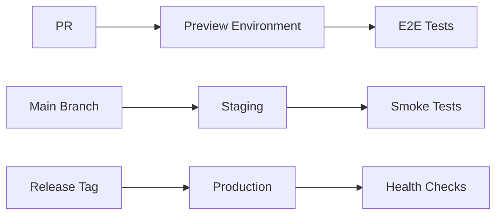

<p align="center">
  
</p>

<h1 align="center">🚀 EU Parliament Monitor — Future CI/CD Workflows</h1>

<p align="center">
  <strong>Planned Workflow Enhancements & Roadmap</strong><br>
  <em>Evolution towards Advanced Automation & Security</em>
</p>

<p align="center">
  <a href="#"></a>
  <a href="#"></a>
  <a href="#"></a>
  <a href="#"></a>
</p>

**📋 Document Owner:** CEO | **📄 Version:** 1.0 | **📅 Last Updated:** 2026-02-18 (UTC)  
**🔄 Review Cycle:** Quarterly | **⏰ Next Review:** 2026-05-18

---

## 📋 Executive Summary

This document outlines planned enhancements to the EU Parliament Monitor CI/CD workflows, aligned with the [Future Security Architecture](FUTURE_SECURITY_ARCHITECTURE.md) and [Hack23 ISMS continuous improvement principles](https://github.com/Hack23/ISMS-PUBLIC/blob/main/Secure_Development_Policy.md).

### Enhancement Principles

1. **Security First**: Every enhancement increases security posture
2. **Automation Everywhere**: Reduce manual intervention
3. **Evidence-Based**: All changes backed by metrics
4. **ISMS Aligned**: Compliance with Hack23 ISMS policies
5. **Performance Optimized**: Faster feedback cycles

### Roadmap Overview

| Phase | Timeline | Focus | Key Deliverables |
|-------|----------|-------|------------------|
| **Phase 1** | Q2 2026 | Security Hardening | SHA-pinning, FOSSA, knip, advanced scanning |
| **Phase 2** | Q3 2026 | Performance & Quality | Load testing, mutation testing, E2E expansion |
| **Phase 3** | Q4 2026 | Advanced Automation | Multi-environment, canary deployments |

---

## 🔐 Phase 1: Security Hardening (Q2 2026)

### 1.1 Complete SHA-Pinning Migration

**Current State:** ~90% of actions are SHA-pinned  
**Target:** 100% SHA-pinned actions  
**Timeline:** Q2 2026 Week 1-2

#### Implementation

```yaml
# BEFORE (e2e.yml)
- uses: actions/checkout@v6
- uses: actions/setup-node@v6

# AFTER
- uses: actions/checkout@de0fac2e4500dabe0009e67214ff5f5447ce83dd # v6.0.2
- uses: actions/setup-node@6044e13b5dc448c55e2357c09f80417699197238 # v6.2.0
```

**Benefits:**
- ✅ Protection against compromised action versions
- ✅ Reproducible builds
- ✅ Supply chain security

**ISMS Evidence:** [Supply Chain Security Policy §4.4](https://github.com/Hack23/ISMS-PUBLIC/blob/main/Secure_Development_Policy.md#44-supply-chain-security)

---

### 1.2 Add FOSSA License Compliance

**Purpose:** Automated license compliance scanning  
**Timeline:** Q2 2026 Week 3-4

#### New Workflow: `fossa.yml`

```yaml
name: FOSSA License Compliance

on:
  pull_request:
  push:
    branches: [main]
  schedule:
    - cron: '0 6 * * 1'  # Weekly Monday 06:00 UTC

permissions:
  contents: read
  pull-requests: write

jobs:
  fossa:
    runs-on: ubuntu-latest
    steps:
      - uses: actions/checkout@<SHA>
      
      - name: Run FOSSA Scan
        uses: fossas/fossa-action@<SHA>
        with:
          api-key: ${{ secrets.FOSSA_API_KEY }}
          
      - name: Check License Compliance
        run: fossa test --timeout 600
```

**Benefits:**
- ✅ Automated license compliance
- ✅ Block GPL/AGPL licenses
- ✅ Supply chain transparency

**Badge:** 

---

### 1.3 Add Knip Validation

**Purpose:** Detect unused dependencies and exports  
**Timeline:** Q2 2026 Week 3-4

#### Integration into test-and-report.yml

```yaml
- name: Run knip
  run: npx knip --production --strict
```

**Benefits:**
- ✅ Reduce bundle size
- ✅ Faster builds
- ✅ Less attack surface

**ISMS Evidence:** Code quality standards

---

### 1.4 Enhanced Security Scanning

**Purpose:** Multi-tool SAST/DAST coverage  
**Timeline:** Q2 2026 Week 5-8

#### Additional Security Tools

| Tool | Purpose | Integration |
|------|---------|-------------|
| **Semgrep** | Additional SAST rules | New workflow |
| **Snyk** | Vulnerability database | PR checks |
| **OWASP ZAP** | DAST scanning | Weekly |
| **GitLeaks** | Secret scanning | Pre-commit + CI |

#### New Workflow: `advanced-security.yml`

```yaml
name: Advanced Security Scanning

on:
  pull_request:
  schedule:
    - cron: '0 2 * * 0'  # Weekly Sunday 02:00 UTC

jobs:
  semgrep:
    runs-on: ubuntu-latest
    steps:
      - uses: actions/checkout@<SHA>
      - uses: returntocorp/semgrep-action@<SHA>
        with:
          config: p/security-audit p/javascript

  snyk:
    runs-on: ubuntu-latest
    steps:
      - uses: actions/checkout@<SHA>
      - uses: snyk/actions/node@<SHA>
        env:
          SNYK_TOKEN: ${{ secrets.SNYK_TOKEN }}
```

**Benefits:**
- ✅ Multiple security perspectives
- ✅ Higher vulnerability detection rate
- ✅ Industry best practices

---

## ⚡ Phase 2: Performance & Quality (Q3 2026)

### 2.1 Load Testing & Performance

**Purpose:** Validate performance under load  
**Timeline:** Q3 2026 Week 1-4

#### New Workflow: `performance.yml`

```yaml
name: Performance Testing

on:
  workflow_dispatch:
  schedule:
    - cron: '0 3 * * 0'  # Weekly Sunday 03:00 UTC

jobs:
  lighthouse:
    runs-on: ubuntu-latest
    steps:
      - uses: actions/checkout@<SHA>
      
      - name: Run Lighthouse CI
        uses: treosh/lighthouse-ci-action@<SHA>
        with:
          urls: |
            https://hack23.github.io/euparliamentmonitor/
            https://hack23.github.io/euparliamentmonitor/index-en.html
          uploadArtifacts: true
          temporaryPublicStorage: true

  k6-load-test:
    runs-on: ubuntu-latest
    steps:
      - uses: actions/checkout@<SHA>
      
      - name: Run k6 load test
        uses: grafana/k6-action@<SHA>
        with:
          filename: test/performance/load-test.js
```

**Metrics:**
- Page load time: <1s
- Lighthouse score: >95
- Concurrent users: 1000+

**Benefits:**
- ✅ Performance regression detection
- ✅ User experience validation
- ✅ Capacity planning data

---

### 2.2 Mutation Testing

**Purpose:** Validate test quality  
**Timeline:** Q3 2026 Week 5-8

#### Integration with Stryker

```yaml
- name: Run mutation testing
  run: npx stryker run --concurrency 4
  
- name: Upload mutation report
  uses: actions/upload-artifact@<SHA>
  with:
    name: mutation-report
    path: reports/mutation/
```

**Target:** ≥80% mutation score

**Benefits:**
- ✅ Identify weak tests
- ✅ Improve test quality
- ✅ Higher confidence in coverage

---

### 2.3 Expanded E2E Testing

**Purpose:** Comprehensive cross-browser testing  
**Timeline:** Q3 2026 Week 9-12

#### Enhanced E2E Configuration

```javascript
// playwright.config.js
export default defineConfig({
  projects: [
    { name: 'chromium', use: { ...devices['Desktop Chrome'] } },
    { name: 'firefox', use: { ...devices['Desktop Firefox'] } },
    { name: 'webkit', use: { ...devices['Desktop Safari'] } },
    { name: 'mobile-chrome', use: { ...devices['Pixel 5'] } },
    { name: 'mobile-safari', use: { ...devices['iPhone 13'] } },
  ],
  reporter: [
    ['html'],
    ['junit', { outputFile: 'junit.xml' }],
    ['json', { outputFile: 'test-results.json' }],
  ],
});
```

**Coverage:**
- 5 browsers/devices
- Visual regression testing
- Network condition simulation
- Geolocation testing

---

## 🚀 Phase 3: Advanced Automation (Q4 2026)

### 3.1 Multi-Environment Deployments

**Purpose:** Staging, production, and preview environments  
**Timeline:** Q4 2026 Week 1-6

#### Environment Strategy



#### New Workflow: `deploy-preview.yml`

```yaml
name: Deploy Preview Environment

on:
  pull_request:
    types: [opened, synchronize]

jobs:
  deploy-preview:
    runs-on: ubuntu-latest
    steps:
      - uses: actions/checkout@<SHA>
      
      - name: Deploy to Vercel Preview
        uses: amondnet/vercel-action@<SHA>
        with:
          vercel-token: ${{ secrets.VERCEL_TOKEN }}
          vercel-org-id: ${{ secrets.VERCEL_ORG_ID }}
          vercel-project-id: ${{ secrets.VERCEL_PROJECT_ID }}
          
      - name: Comment PR with preview URL
        uses: actions/github-script@<SHA>
        with:
          script: |
            github.rest.issues.createComment({
              issue_number: context.issue.number,
              owner: context.repo.owner,
              repo: context.repo.repo,
              body: '🚀 Preview deployed: ${{ steps.deploy.outputs.url }}'
            })
```

**Environments:**
- **Preview:** Per-PR isolated environment
- **Staging:** Main branch continuous deployment
- **Production:** Release tag deployment

---

### 3.2 Canary Deployments

**Purpose:** Gradual rollout with automatic rollback  
**Timeline:** Q4 2026 Week 7-10

#### Deployment Strategy

```yaml
name: Canary Deployment

on:
  release:
    types: [published]

jobs:
  canary-deploy:
    runs-on: ubuntu-latest
    steps:
      - name: Deploy 10% traffic
        run: ./scripts/deploy-canary.sh 10
        
      - name: Monitor metrics (5 min)
        run: ./scripts/monitor-health.sh --duration 300
        
      - name: Evaluate canary
        run: |
          if ./scripts/evaluate-metrics.sh; then
            echo "✅ Canary successful, proceeding"
          else
            echo "❌ Canary failed, rolling back"
            ./scripts/rollback.sh
            exit 1
          fi
          
      - name: Gradual rollout
        run: |
          ./scripts/deploy-canary.sh 25
          sleep 300
          ./scripts/deploy-canary.sh 50
          sleep 300
          ./scripts/deploy-canary.sh 100
```

**Metrics Monitored:**
- Error rate
- Response time (P95, P99)
- CPU/Memory usage
- User engagement

---

### 3.3 Automated Rollback

**Purpose:** Instant rollback on failure detection  
**Timeline:** Q4 2026 Week 11-12

#### Health Check Integration

```yaml
- name: Deployment health check
  run: |
    for i in {1..10}; do
      if curl -f https://euparliamentmonitor.com/health; then
        echo "✅ Health check $i passed"
      else
        echo "❌ Health check $i failed"
        ./scripts/rollback.sh
        exit 1
      fi
      sleep 30
    done
```

**Rollback Triggers:**
- Health check failure
- Error rate spike (>1%)
- Response time degradation (>2x baseline)
- Manual trigger

---

## 📊 Success Metrics

### Phase 1 Metrics (Q2 2026)

| Metric | Baseline | Target | Measurement |
|--------|----------|--------|-------------|
| **SHA-Pinned Actions** | 90% | 100% | Workflow audit |
| **License Compliance** | Manual | Automated | FOSSA reports |
| **Unused Dependencies** | Unknown | 0 | Knip reports |
| **Security Tools** | 2 | 5 | Tool count |

### Phase 2 Metrics (Q3 2026)

| Metric | Baseline | Target | Measurement |
|--------|----------|--------|-------------|
| **Page Load Time** | ~1.5s | <1s | Lighthouse |
| **Lighthouse Score** | 85 | >95 | Lighthouse |
| **Mutation Score** | Unknown | ≥80% | Stryker |
| **Browser Coverage** | 1 | 5 | Playwright |

### Phase 3 Metrics (Q4 2026)

| Metric | Baseline | Target | Measurement |
|--------|----------|--------|-------------|
| **Deployment Frequency** | Weekly | Daily | GitHub insights |
| **Mean Time to Deploy** | 15 min | <5 min | Workflow duration |
| **Failed Deployment Rate** | 0% | <1% | Success rate |
| **Rollback Time** | Manual | <2 min | Automated |

---

## 🔒 ISMS Alignment

### Policy Compliance

| Phase | ISMS Policy | Implementation |
|-------|-------------|----------------|
| **Phase 1** | §4.4 Supply Chain Security | SHA-pinning, FOSSA, license compliance |
| **Phase 1** | §4.3 Security Scanning | Semgrep, Snyk, OWASP ZAP, GitLeaks |
| **Phase 2** | §3.3 Testing Requirements | Mutation testing, expanded E2E |
| **Phase 2** | §5.2 Performance Standards | Load testing, Lighthouse |
| **Phase 3** | §4.1 CI/CD Security | Multi-environment, canary deployment |

### Compliance Frameworks

| Framework | Control | Phase | Implementation |
|-----------|---------|-------|----------------|
| **ISO 27001** | A.12.1.2 Change Management | Phase 3 | Canary deployment |
| **ISO 27001** | A.14.2.8 System Security Testing | Phase 2 | Mutation testing |
| **NIST CSF 2.0** | PR.IP-1 Baseline Configuration | Phase 3 | Multi-environment |
| **CIS Controls** | 16.6 Application Testing | Phase 2 | Performance testing |

---

## 💰 Resource Requirements

### Infrastructure Costs

| Phase | Service | Monthly Cost | Annual Cost |
|-------|---------|--------------|-------------|
| **Phase 1** | FOSSA Pro | $299 | $3,588 |
| **Phase 1** | Snyk Team | $98 | $1,176 |
| **Phase 2** | Lighthouse CI | Free | $0 |
| **Phase 2** | k6 Cloud | $49 | $588 |
| **Phase 3** | Vercel Pro | $20 | $240 |
| **Total** | | **$466/mo** | **$5,592/yr** |

### Time Investment

| Phase | Engineering Time | Timeline |
|-------|------------------|----------|
| **Phase 1** | 40 hours | 2 weeks |
| **Phase 2** | 80 hours | 4 weeks |
| **Phase 3** | 120 hours | 6 weeks |
| **Total** | **240 hours** | **12 weeks** |

---

## 🎯 Implementation Plan

### Phase 1: Security Hardening (Q2 2026)

**Week 1-2:**
- [ ] Complete SHA-pinning migration for all workflows
- [ ] Test all workflows with SHA-pinned actions
- [ ] Document action versions

**Week 3-4:**
- [ ] Set up FOSSA account and integration
- [ ] Add knip to test-and-report workflow
- [ ] Configure allowed license list

**Week 5-8:**
- [ ] Integrate Semgrep security rules
- [ ] Set up Snyk scanning
- [ ] Add OWASP ZAP weekly scans
- [ ] Configure GitLeaks pre-commit hooks

### Phase 2: Performance & Quality (Q3 2026)

**Week 1-4:**
- [ ] Set up Lighthouse CI
- [ ] Create k6 load test scripts
- [ ] Configure performance budgets
- [ ] Automate performance reporting

**Week 5-8:**
- [ ] Integrate Stryker mutation testing
- [ ] Configure mutation testing thresholds
- [ ] Add mutation reports to release docs

**Week 9-12:**
- [ ] Enable multi-browser Playwright testing
- [ ] Add visual regression testing
- [ ] Expand E2E test coverage

### Phase 3: Advanced Automation (Q4 2026)

**Week 1-6:**
- [ ] Set up preview environments (Vercel)
- [ ] Configure staging environment
- [ ] Automate preview deployments per PR

**Week 7-10:**
- [ ] Implement canary deployment scripts
- [ ] Set up health monitoring
- [ ] Configure gradual rollout

**Week 11-12:**
- [ ] Implement automated rollback
- [ ] Create runbooks for failure scenarios
- [ ] Document deployment procedures

---

## 📚 Related Documentation

| Document | Focus | Link |
|----------|-------|------|
| ⚙️ Current Workflows | Present state documentation | [WORKFLOW.md](WORKFLOW.md) |
| 🔐 Security Architecture | Current security implementation | [SECURITY_ARCHITECTURE.md](SECURITY_ARCHITECTURE.md) |
| 🚀 Future Security | Planned security enhancements | [FUTURE_SECURITY_ARCHITECTURE.md](FUTURE_SECURITY_ARCHITECTURE.md) |
| 📈 Security Flowcharts | Process flows | [FLOWCHART.md](FLOWCHART.md) |
| 🛡️ ISMS Policy | Policy framework | [Hack23 ISMS-PUBLIC](https://github.com/Hack23/ISMS-PUBLIC) |

---

## 🔄 Review and Updates

This document will be reviewed quarterly to assess progress and adjust priorities based on:
- Security threat landscape changes
- Technology evolution
- Business priorities
- Resource availability
- Compliance requirements

**Next Review:** 2026-05-18

---

**📞 Questions?** Contact: [DevOps Team](mailto:devops@hack23.com)  
**💡 Suggestions?** Open an issue: [GitHub Issues](https://github.com/Hack23/euparliamentmonitor/issues)

---

*Last updated: 2026-02-18 by DevOps Engineer*
