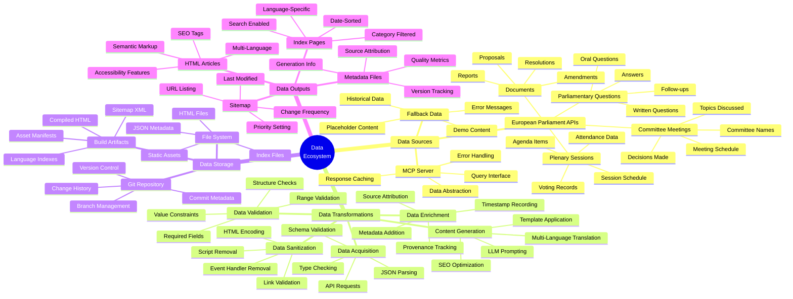

# 🧠 EU Parliament Monitor — System Mindmap

  

  <strong>📊 Conceptual Relationships and System Components</strong> 
  <em>🎯 Holistic View of Platform Architecture and Capabilities</em>

  
  
  
  

**📋 Document Owner:** CEO | **📄 Version:** 1.0 | **📅 Last Updated:**
2025-02-17 (UTC)  
**🔄 Review Cycle:** Quarterly | **⏰ Next Review:** 2025-05-17  
**📌 ISMS Classification:** Public (Confidentiality: L1, Integrity: L2,
Availability: L2)

---

## 📚 Documentation Map

| Document                                                            | Focus           | Description                                    | Documentation Link                                                                                     |
| ------------------------------------------------------------------- | --------------- | ---------------------------------------------- | ------------------------------------------------------------------------------------------------------ |
| **[Architecture](ARCHITECTURE.md)**                                 | 🏛️ Architecture | C4 model showing current system structure      | [View Source](https://github.com/Hack23/euparliamentmonitor/blob/main/ARCHITECTURE.md)                 |
| **[Future Architecture](FUTURE_ARCHITECTURE.md)**                   | 🏛️ Architecture | C4 model showing future system structure       | [View Source](https://github.com/Hack23/euparliamentmonitor/blob/main/FUTURE_ARCHITECTURE.md)          |
| **[Mindmaps](MINDMAP.md)**                                          | 🧠 Concept      | Current system component relationships         | **This Document**                                                                                      |
| **[Future Mindmaps](FUTURE_MINDMAP.md)**                            | 🧠 Concept      | Future capability evolution                    | [View Source](https://github.com/Hack23/euparliamentmonitor/blob/main/FUTURE_MINDMAP.md)               |
| **[SWOT Analysis](SWOT.md)**                                        | 💼 Business     | Current strategic assessment                   | [View Source](https://github.com/Hack23/euparliamentmonitor/blob/main/SWOT.md)                         |
| **[Future SWOT Analysis](FUTURE_SWOT.md)**                          | 💼 Business     | Future strategic opportunities                 | [View Source](https://github.com/Hack23/euparliamentmonitor/blob/main/FUTURE_SWOT.md)                  |
| **[Data Model](DATA_MODEL.md)**                                     | 📊 Data         | Current data structures and relationships      | [View Source](https://github.com/Hack23/euparliamentmonitor/blob/main/DATA_MODEL.md)                   |
| **[Future Data Model](FUTURE_DATA_MODEL.md)**                       | 📊 Data         | Enhanced European Parliament data architecture | [View Source](https://github.com/Hack23/euparliamentmonitor/blob/main/FUTURE_DATA_MODEL.md)            |
| **[Flowcharts](FLOWCHART.md)**                                      | 🔄 Process      | Current data processing workflows              | [View Source](https://github.com/Hack23/euparliamentmonitor/blob/main/FLOWCHART.md)                    |
| **[Future Flowcharts](FUTURE_FLOWCHART.md)**                        | 🔄 Process      | Enhanced AI-driven workflows                   | [View Source](https://github.com/Hack23/euparliamentmonitor/blob/main/FUTURE_FLOWCHART.md)             |
| **[State Diagrams](STATEDIAGRAM.md)**                               | 🔄 Behavior     | Current system state transitions               | [View Source](https://github.com/Hack23/euparliamentmonitor/blob/main/STATEDIAGRAM.md)                 |
| **[Future State Diagrams](FUTURE_STATEDIAGRAM.md)**                 | 🔄 Behavior     | Enhanced adaptive state transitions            | [View Source](https://github.com/Hack23/euparliamentmonitor/blob/main/FUTURE_STATEDIAGRAM.md)          |
| **[Security Architecture](SECURITY_ARCHITECTURE.md)**               | 🛡️ Security     | Current security implementation                | [View Source](https://github.com/Hack23/euparliamentmonitor/blob/main/SECURITY_ARCHITECTURE.md)        |
| **[Future Security Architecture](FUTURE_SECURITY_ARCHITECTURE.md)** | 🛡️ Security     | Security enhancement roadmap                   | [View Source](https://github.com/Hack23/euparliamentmonitor/blob/main/FUTURE_SECURITY_ARCHITECTURE.md) |

---

## 📋 Overview

This document provides conceptual mindmaps that illustrate the relationships
between components, capabilities, and concepts within the EU Parliament Monitor
ecosystem. Unlike C4 diagrams (structure) or flowcharts (process), mindmaps show
**conceptual connections** and **knowledge domains**.

### Purpose

Mindmaps serve to:

1. **Conceptual Understanding**: Show how ideas and components relate
2. **Knowledge Organization**: Structure the domain knowledge hierarchy
3. **Capability Mapping**: Illustrate what the system can do
4. **Dependency Visualization**: Display concept dependencies
5. **Onboarding Aid**: Help new contributors understand the system holistically

### Mindmap Categories

This document contains five primary mindmaps:

- **System Overview**: High-level system capabilities and components
- **Data Ecosystem**: Data sources, flows, and transformations
- **Technical Architecture**: Technology stack and infrastructure
- **Content Generation**: LLM-powered content creation pipeline
- **Security & Compliance**: Security controls and compliance framework

---

## 🏛️ System Overview Mindmap

Complete view of the EU Parliament Monitor system, its purpose, and major
capabilities.

### System Overview Hierarchy

| Concept                  | Sub-Concepts                                                    | Description             |
| ------------------------ | --------------------------------------------------------------- | ----------------------- |
| **Mission**              | Democratic Transparency, Multi-Language, Automated Intelligence | Core purpose and values |
| **Core Capabilities**    | News Generation, Content Types, Publishing, Delivery            | What the system does    |
| **Key Stakeholders**     | Citizens, Journalists, Researchers, Developers                  | Who uses the system     |
| **Technical Foundation** | Static Architecture, GitHub, MCP, LLM                           | How it's built          |

---

## 📊 Data Ecosystem Mindmap

Data sources, transformations, and outputs in the EU Parliament Monitor
pipeline.

### Data Flow Stages

---

## 💻 Technical Architecture Mindmap

Technology stack, infrastructure, and development practices.

### Technology Stack Layers

---

## 🤖 Content Generation Pipeline Mindmap

LLM-powered content creation workflow and capabilities.

### Content Generation Flow

```mermaid
flowchart TD
    Start[📋 Article Request] --> Type{Article Type}

    Type -->|Week Ahead| WA[Fetch Schedule Data]
    Type -->|Committee| CR[Fetch Meeting Data]
    Type -->|Proposition| PA[Fetch Proposal Data]
    Type -->|Breaking| BN[Fetch Latest Events]

    WA --> Prompt[🤖 Generate LLM Prompt]
    CR --> Prompt
    PA --> Prompt
    BN --> Prompt

    Prompt --> System[Add System Context]
    System --> Context[Inject Source Data]
    Context --> Send[Send to LLM]

    Send --> Receive[Receive Generated Content]

    Receive --> Validate{✅ Validate}
    Validate -->|Invalid| Retry[Retry Generation]
    Retry --> Send

    Validate -->|Valid| Translate[🌍 Multi-Language]

    Translate --> L1[English]
    Translate --> L2[German]
    Translate --> L3[French]
    Translate --> L4[Spanish]
    Translate --> L5[Italian]
    Translate --> L6[Dutch]
    Translate --> L7[Polish]
    Translate --> L8[Portuguese]
    Translate --> L9[Romanian]
    Translate --> L10[Swedish]
    Translate --> L11[Danish]
    Translate --> L12[Finnish]
    Translate --> L13[Greek]
    Translate --> L14[Hungarian]

    L1 --> HTML[Generate HTML]
    L2 --> HTML
    L3 --> HTML
    L4 --> HTML
    L5 --> HTML
    L6 --> HTML
    L7 --> HTML
    L8 --> HTML
    L9 --> HTML
    L10 --> HTML
    L11 --> HTML
    L12 --> HTML
    L13 --> HTML
    L14 --> HTML

    HTML --> Sanitize[🧹 Sanitize Content]
    Sanitize --> QA[Quality Assurance]
    QA --> Publish[📦 Publish Article]
    Publish --> End[✅ Complete]

    style Start fill:#e8f5e9
    style Send fill:#fff4e1
    style Translate fill:#e1f5ff
    style Publish fill:#d4edda
    style End fill:#d4edda
```

---

## 🛡️ Security & Compliance Mindmap

Security controls, compliance requirements, and best practices.

### Security Layers

---

## 🎨 Visual Design Principles

Mindmaps follow these design principles for consistency and clarity.

### Color Coding

### Node Types

| Node Type            | Usage            | Example                                  |
| -------------------- | ---------------- | ---------------------------------------- |
| **Root Node**        | Central concept  | EU Parliament Monitor                    |
| **Primary Branch**   | Major category   | Mission, Capabilities, Stakeholders      |
| **Secondary Branch** | Subcategory      | Democratic Transparency, News Generation |
| **Leaf Node**        | Specific concept | Week Ahead, Committee Reports            |

### Layout Guidelines

1. **Radial Layout**: Root in center, branches extending outward
2. **Balanced Distribution**: Even spacing between branches
3. **Logical Grouping**: Related concepts near each other
4. **Depth Limit**: Maximum 4 levels deep for readability
5. **Node Size**: Consistent sizing based on hierarchy level

---

## 🔄 Relationship Types

Different types of relationships shown in mindmaps:

| Relationship | Description               | Example                            |
| ------------ | ------------------------- | ---------------------------------- |
| **IS-A**     | Type/subtype relationship | "Week Ahead" IS-A "Article Type"   |
| **HAS-A**    | Composition relationship  | "System" HAS-A "MCP Integration"   |
| **USES**     | Dependency relationship   | "Generator" USES "LLM Service"     |
| **PRODUCES** | Output relationship       | "Generation" PRODUCES "HTML Files" |
| **REQUIRES** | Prerequisite relationship | "Publishing" REQUIRES "Validation" |
| **ENABLES**  | Capability relationship   | "MCP" ENABLES "Data Access"        |

---

## 📊 Integration with Other Documentation

### Cross-Reference Matrix

| Mindmap Section            | Related C4 Diagram | Related Flowchart    | Related State Diagram |
| -------------------------- | ------------------ | -------------------- | --------------------- |
| **System Overview**        | Context Diagram    | News Generation Flow | System Lifecycle      |
| **Data Ecosystem**         | Container Diagram  | Data Processing Flow | Article Lifecycle     |
| **Technical Architecture** | Component Diagram  | Validation Flow      | MCP Connection State  |
| **Content Generation**     | Component Diagram  | Generation Flow      | Article State         |
| **Security & Compliance**  | Component Diagram  | Security Flow        | Error Handling State  |

### Documentation Navigation

---

## 🎯 Use Cases for Mindmaps

### For New Contributors

**Purpose**: Quick system understanding without deep technical dive

**How to Use**:

1. Start with System Overview mindmap
2. Understand mission and stakeholders
3. Review core capabilities
4. Explore technical foundation

**Expected Outcome**: Holistic understanding in 15-30 minutes

### For Architects

**Purpose**: Design decisions and system evolution planning

**How to Use**:

1. Review Technical Architecture mindmap
2. Analyze component relationships
3. Identify integration points
4. Plan future enhancements

**Expected Outcome**: Informed architectural decisions

### For Security Auditors

**Purpose**: Security posture assessment

**How to Use**:

1. Review Security & Compliance mindmap
2. Examine threat model
3. Verify security controls
4. Check compliance framework

**Expected Outcome**: Security assessment report

### For Product Managers

**Purpose**: Feature planning and prioritization

**How to Use**:

1. Review System Overview mindmap
2. Understand stakeholder needs
3. Examine core capabilities
4. Prioritize enhancements

**Expected Outcome**: Product roadmap alignment

---

## 📈 Metrics & KPIs

### System Capability Metrics

| Capability               | Measurement                  | Target | Current |
| ------------------------ | ---------------------------- | ------ | ------- |
| **Article Types**        | Number of types supported    | 5+     | 5       |
| **Languages**            | Number of languages          | 14     | 14      |
| **Data Sources**         | Number of EP API endpoints   | 4+     | 4       |
| **Generation Time**      | Average time per article set | <5 min | ~3 min  |
| **Validation Pass Rate** | Articles passing validation  | >98%   | 99.2%   |
| **Deployment Success**   | Successful deployments       | >99%   | 99.5%   |

### Technical Stack Health

| Component         | Metric           | Target          | Status           |
| ----------------- | ---------------- | --------------- | ---------------- |
| **Node.js**       | Version currency | Latest LTS      | ✅ 24.x          |
| **Dependencies**  | Vulnerabilities  | 0 critical/high | ✅ 0             |
| **Test Coverage** | Code coverage    | >80%            | ✅ 85%           |
| **Build Time**    | CI/CD duration   | <10 min         | ✅ 6 min         |
| **Code Quality**  | SonarCloud score | A               | 🔄 Setup pending |

---

## 🔐 Security Mindmap Notes

### Threat Modeling Approach

1. **Identify Assets**: Articles, source data, infrastructure access
2. **Identify Threats**: XSS, injection, supply chain, access control
3. **Assess Risks**: Likelihood × Impact = Risk score
4. **Define Mitigations**: Layered security controls
5. **Monitor & Review**: Continuous security monitoring

### Compliance Mapping

---

## 🔄 Related Documentation

### Conceptual Documents

- **[SWOT.md](SWOT.md)**: Strategic analysis complementing capability view
- **[ARCHITECTURE.md](ARCHITECTURE.md)**: Structural view of conceptual
  components

### Technical Documents

- **[DATA_MODEL.md](DATA_MODEL.md)**: Detailed data structure specifications
- **[FLOWCHART.md](FLOWCHART.md)**: Process flows for mindmap concepts
- **[STATEDIAGRAM.md](STATEDIAGRAM.md)**: Behavioral states of components

### Security Documents

- **[SECURITY_ARCHITECTURE.md](SECURITY_ARCHITECTURE.md)**: Detailed security
  implementation
- **[SECURITY.md](SECURITY.md)**: Security policies and vulnerability reporting

---

## 📅 Document Revision History

| Version | Date       | Author | Changes                                                           |
| ------- | ---------- | ------ | ----------------------------------------------------------------- |
| 1.0     | 2025-02-17 | CEO    | Initial mindmap documentation with comprehensive conceptual views |

---

## 📝 Footer

**Document Classification**: Public  
**ISMS Compliance**: ISO 27001:2022 compliant, GDPR compliant, NIS2 aligned  
**Technology Stack**: Node.js 24, GitHub Actions, GitHub Pages, European
Parliament MCP Server  
**Architecture Pattern**: Static Site Generator with Zero Runtime Dependencies  
**Review Status**: Active, next review 2025-05-17

---

  <em>🧠 Mindmaps — Conceptual Architecture for EU Parliament Monitor</em> 
  <strong>Part of ISMS-compliant Architecture Documentation Suite</strong>

  <a href="https://github.com/Hack23/euparliamentmonitor">🏛️ GitHub Repository</a> •
  <a href="https://github.com/Hack23/ISMS-PUBLIC">🛡️ ISMS Framework</a> •
  <a href="https://hack23.com">🌐 Hack23</a>

