<p align="center">
  
</p>

<h1 align="center">🛡️ EU Parliament Monitor — Security Architecture</h1>

<p align="center">
  <strong>🔐 Security-by-Design for European Parliament Intelligence</strong><br>
  <em>🎯 Comprehensive Security Framework for Multi-Language News Platform</em>
</p>

<p align="center">
  <a href="#"></a>
  <a href="#"></a>
  <a href="#"></a>
  <a href="#"></a>
</p>

**📋 Document Owner:** CEO | **📄 Version:** 1.0 | **📅 Last Updated:** 2025-02-17 (UTC)  
**🔄 Review Cycle:** Annual | **⏰ Next Review:** 2026-02-17

---

## 🎯 Executive Summary

EU Parliament Monitor is a static website generator that creates multi-language news articles about European Parliament activities. The system operates as an automated intelligence platform, generating news content through GitHub Actions workflows with minimal attack surface and public data transparency.

### System Purpose

The platform automatically generates and publishes news articles covering:
- **Week Ahead**: Preview of upcoming parliamentary events
- **Committee Reports**: Analysis of committee activities
- **Propositions**: Legislative proposals analysis
- **Motions**: Parliamentary motions analysis
- **Breaking News**: Rapid-response coverage

### Security Classification

Per [Hack23 ISMS Classification Framework](https://github.com/Hack23/ISMS-PUBLIC/blob/main/CLASSIFICATION.md):

| Dimension | Level | Rationale |
|-----------|-------|-----------|
| **Confidentiality** | Public (Level 1) | All data from European Parliament open data sources, no private information |
| **Integrity** | Medium (Level 2) | News accuracy critical for democratic transparency, incorrect information could mislead public |
| **Availability** | Medium (Level 2) | Daily updates expected, but 24-hour outages acceptable |
| **RTO** | 24 hours | Manual workflow trigger available, automated recovery via GitHub Actions |
| **RPO** | 1 day | Daily generation schedule, previous day's content acceptable |

### Security Posture Overview

**Defense Strategy**: Defense-in-depth with minimal attack surface
- ✅ **Static Content**: No server-side execution, no databases
- ✅ **GitHub-Hosted**: GitHub Pages infrastructure security
- ✅ **Minimal Dependencies**: 17 devDependencies, zero production dependencies, automated updates
- ✅ **Automated Security**: CodeQL, Dependabot, npm audit
- ✅ **Supply Chain Security**: SHA-pinned GitHub Actions, SBOM generation
- ✅ **Ephemeral Execution**: GitHub-hosted runners, no persistent infrastructure

### Compliance Status

| Framework | Status | Evidence |
|-----------|--------|----------|
| **ISO 27001** | ✅ Compliant | Architecture documentation, access control, vulnerability management |
| **GDPR** | ✅ Compliant | No PII collected, data protection by design |
| **NIS2** | ✅ Compliant | Static site architecture, minimal attack surface, incident response |
| **EU CRA** | ✅ Aligned | SBOM generation, vulnerability disclosure, security updates |

### Related Documents

| Document | Focus | Link |
|----------|-------|------|
| 🔐 Security Architecture | Current State | This document |
| 🚀 Future Security Architecture | Roadmap | [FUTURE_SECURITY_ARCHITECTURE.md](FUTURE_SECURITY_ARCHITECTURE.md) |
| 📊 Data Model | Data Structures | [DATA_MODEL.md](DATA_MODEL.md) |
| 📈 Security Flow | Process Flows | [FLOWCHART.md](FLOWCHART.md) |
| 🎯 Threat Model | Risk Analysis | [#-threat-model](#-threat-model) |
| 🛡️ ISMS Secure Development | Policy Framework | [ISMS-PUBLIC](https://github.com/Hack23/ISMS-PUBLIC/blob/main/Secure_Development_Policy.md) |

---

## 📑 Table of Contents

- [🏗️ System Context (C4 Level 1)](#-system-context-c4-level-1)
- [📦 Container Architecture (C4 Level 2)](#-container-architecture-c4-level-2)
- [🔧 Component Architecture (C4 Level 3)](#-component-architecture-c4-level-3)
- [🔒 Security Controls](#-security-controls)
  - [Authentication & Authorization](#authentication--authorization)
  - [Data Protection](#data-protection)
  - [Network Security](#network-security)
  - [Application Security](#application-security)
  - [Infrastructure Security](#infrastructure-security)
- [🎯 Threat Model](#-threat-model)
- [✅ Compliance Matrix](#-compliance-matrix)
- [🔍 Security Operations](#-security-operations)
- [📊 Security Metrics](#-security-metrics)

---

## 🏗️ System Context (C4 Level 1)

The EU Parliament Monitor operates as a static content generation platform within the GitHub ecosystem, interfacing with the European Parliament MCP Server for data access.

```mermaid
graph TB
    subgraph "External Actors"
        User[👥 EU Citizens & Researchers]
        EP_API[🏛️ European Parliament<br/>Open Data API]
    end
    
    subgraph "GitHub Infrastructure"
        GHA[⚙️ GitHub Actions<br/>Automated Workflows]
        GHP[🌐 GitHub Pages<br/>Static Hosting]
        GH_SECURITY[🔒 GitHub Security<br/>CodeQL, Dependabot, Secrets]
    end
    
    subgraph "EU Parliament Monitor"
        EuPM[📰 EU Parliament Monitor<br/>Static Website Generator]
        EPMCP[🔌 European Parliament<br/>MCP Server Client]
    end
    
    User -->|Browse News<br/>HTTPS| GHP
    GHP -->|Serve Static<br/>HTML/CSS/JS| User
    
    GHA -->|Trigger Daily<br/>06:00 UTC| EuPM
    GHA -->|Monitor Security| GH_SECURITY
    
    EuPM -->|Connect via<br/>stdio/localhost| EPMCP
    EPMCP -->|Query Parliamentary<br/>Data| EP_API
    EP_API -->|Return JSON<br/>Public Data| EPMCP
    
    EuPM -->|Generate<br/>Articles| GHP
    GH_SECURITY -->|Scan Code<br/>Dependencies| EuPM
    
    style User fill:#e1f5ff
    style EP_API fill:#fff4e1
    style GHA fill:#f0f0f0
    style GHP fill:#f0f0f0
    style GH_SECURITY fill:#ffe1e1
    style EuPM fill:#e8f5e9
    style EPMCP fill:#e8f5e9
```



### Trust Boundaries

1. **GitHub Infrastructure Boundary**: Trusted GitHub Actions runners and Pages hosting
2. **MCP Communication Boundary**: localhost/stdio communication between generator and MCP server
3. **External Data Boundary**: European Parliament Open Data API (untrusted input)
4. **User Access Boundary**: Public internet users accessing static content

### Data Flow


---

## 📦 Container Architecture (C4 Level 2)

The system consists of stateless containers executing in GitHub Actions with no persistent infrastructure.

```mermaid
graph TB
    subgraph "GitHub Actions Runner (Ubuntu Latest)"
        subgraph "News Generation Container"
            CLI[📝 generate-news-enhanced.js<br/>Node.js CLI Script]
            TEMPLATE[🎨 article-template.js<br/>HTML Generator]
            CLIENT[🔌 ep-mcp-client.js<br/>MCP Client Library]
        end
        
        subgraph "Index Generation Container"
            IDX[📋 generate-news-indexes.js<br/>Index Generator]
        end
        
        subgraph "Sitemap Generation Container"
            SITE[🗺️ generate-sitemap.js<br/>Sitemap Generator]
        end
        
        subgraph "European Parliament MCP Server"
            MCP[🏛️ MCP Server Process<br/>stdio Communication]
        end
        
        subgraph "Validation Container"
            HTML[✅ htmlhint<br/>HTML Validator]
            LINT[🔍 ESLint<br/>Code Quality]
            TEST[🧪 Vitest<br/>Test Suite]
        end
    end
    
    subgraph "GitHub Infrastructure"
        REPO[📚 Git Repository<br/>news/, *.html, sitemap.xml]
        PAGES[🌐 GitHub Pages<br/>Static Hosting]
        SECRETS[🔐 GitHub Secrets<br/>Tokens, Variables]
    end
    
    subgraph "External Services"
        EP_API[🏛️ European Parliament API<br/>data.europarl.europa.eu]
    end
    
    CLI -->|Initialize| CLIENT
    CLIENT -->|Spawn Process| MCP
    MCP -->|HTTPS| EP_API
    EP_API -->|JSON Response| MCP
    MCP -->|Structured Data| CLIENT
    CLIENT -->|Parliamentary Data| CLI
    CLI -->|Generate HTML| TEMPLATE
    TEMPLATE -->|Write Files| REPO
    
    IDX -->|Read Articles| REPO
    IDX -->|Generate Indexes| REPO
    
    SITE -->|Scan Files| REPO
    SITE -->|Generate sitemap.xml| REPO
    
    HTML -->|Validate| REPO
    LINT -->|Check Quality| CLI
    TEST -->|Run Tests| CLI
    
    REPO -->|Deploy| PAGES
    SECRETS -->|Provide Tokens| CLI
    
    style CLI fill:#e8f5e9
    style TEMPLATE fill:#e8f5e9
    style CLIENT fill:#e8f5e9
    style IDX fill:#e8f5e9
    style SITE fill:#e8f5e9
    style MCP fill:#fff4e1
    style HTML fill:#e1f5ff
    style LINT fill:#e1f5ff
    style TEST fill:#e1f5ff
    style REPO fill:#f0f0f0
    style PAGES fill:#f0f0f0
    style SECRETS fill:#ffe1e1
    style EP_API fill:#fff4e1
```



### Container Security Characteristics

| Container | Runtime | Privileges | Network Access | Persistence |
|-----------|---------|-----------|----------------|-------------|
| News Generation | Node.js 24 | Read/Write repo | Localhost only | None (ephemeral) |
| Index Generation | Node.js 24 | Read/Write repo | None | None (ephemeral) |
| Sitemap Generation | Node.js 24 | Read/Write repo | None | None (ephemeral) |
| MCP Server | Node.js 24 | Read-only | HTTPS to EP API | None (ephemeral) |
| Validation | Node.js 24 | Read-only | None | None (ephemeral) |

---

## 🔧 Component Architecture (C4 Level 3)

Detailed component-level architecture showing internal structure and security boundaries.


### Component Security Responsibilities

| Component | Security Function | Controls |
|-----------|-------------------|----------|
| Connection Manager | MCP server connection security | Retry limits, timeout enforcement, error handling |
| Request Handler | JSON-RPC protocol integrity | Schema validation, request ID tracking |
| Response Parser | Input validation & sanitization | Data type checking, XSS prevention |
| HTML Builder | Output encoding | HTML entity encoding, CSP compliance |
| Error Handler | Fail-secure behavior | Fallback content, no sensitive data exposure |
| HTML Validator | Content integrity | htmlhint rules, standards compliance |
| Security Scanner | SAST detection | eslint-plugin-security, sonarjs rules |

---

## 🔒 Security Controls

### Authentication & Authorization

#### GitHub Actions Authentication


**Controls:**
- ✅ **Minimal Permissions**: `contents: write` only, no admin/secrets access
- ✅ **Auto-expiring Tokens**: GITHUB_TOKEN valid only for job duration
- ✅ **SHA-pinned Actions**: All actions pinned to commit SHA for supply chain security
- ✅ **Branch Protection**: Required reviews, status checks before merge
- ✅ **No Persistent Credentials**: Tokens destroyed after job completion

**ISMS Alignment:**
- [Access Control Policy](https://github.com/Hack23/ISMS-PUBLIC/blob/main/Access_Control_Policy.md) - Least privilege
- [Secure Development Policy](https://github.com/Hack23/ISMS-PUBLIC/blob/main/Secure_Development_Policy.md) - CI/CD security

#### Static Site Access Control

**Control Implementation:**
- ❌ **No Authentication Required**: Public content by design
- ✅ **Read-Only Access**: Users cannot modify content
- ✅ **HTTPS Enforcement**: GitHub Pages forces HTTPS
- ✅ **No Server-Side Execution**: No authentication bypass risks

**Security Rationale:**
- All content is public information from European Parliament
- No PII or sensitive data
- Read-only static files eliminate authentication attack surface

### Data Protection

#### Input Validation & Sanitization


**Validation Controls:**
1. **Schema Validation**: MCP response structure validation
2. **Type Checking**: Enforce expected data types (string, number, date)
3. **Range Checking**: Validate date ranges, text lengths
4. **Encoding Enforcement**: UTF-8 only, reject invalid encodings

**Sanitization Controls:**
1. **HTML Entity Encoding**: Convert `<`, `>`, `&`, `"`, `'` to entities
2. **Script Tag Removal**: Strip all `<script>` tags from input
3. **Event Handler Removal**: Remove `onclick`, `onerror`, etc.
4. **URL Validation**: Validate and sanitize all href/src attributes

**ISMS Alignment:**
- [Secure Development Policy](https://github.com/Hack23/ISMS-PUBLIC/blob/main/Secure_Development_Policy.md) - Input validation requirements

#### Data Classification & Handling

| Data Type | Classification | Storage | Encryption | Retention |
|-----------|---------------|---------|------------|-----------|
| News Articles | Public | Git repository | At-rest (GitHub) | Indefinite |
| EP API Responses | Public | Ephemeral (runtime only) | In-transit (TLS 1.3) | None |
| Generation Metadata | Public | Git repository | At-rest (GitHub) | Indefinite |
| GitHub Tokens | Secret | GitHub Secrets | Encrypted | Auto-rotate |
| MCP Communication | Internal | Localhost only | N/A (local) | None |

**ISMS Alignment:**
- [Classification Framework](https://github.com/Hack23/ISMS-PUBLIC/blob/main/CLASSIFICATION.md) - Public data (Level 1)
- [Cryptography Policy](https://github.com/Hack23/ISMS-PUBLIC/blob/main/Cryptography_Policy.md) - TLS standards

#### No PII Collection

**Control Implementation:**
- ✅ **No User Tracking**: No cookies, no analytics, no tracking scripts
- ✅ **No Form Inputs**: No data collection forms
- ✅ **No User Accounts**: No registration or login
- ✅ **Static Content Only**: No server-side processing of user data
- ✅ **No Third-Party Scripts**: No external JavaScript libraries

**GDPR Compliance:**
- Article 25 (Data Protection by Design): No PII by design
- Article 32 (Security of Processing): Public data only, no processing of personal data
- No Data Protection Impact Assessment (DPIA) required

### Network Security

#### Network Architecture

```mermaid
graph TB
    subgraph "External Network"
        direction TB
        USERS[🌍 Internet Users<br/>Public Access]
        EP_NET[🏛️ European Parliament<br/>data.europarl.europa.eu]
    end
    
    subgraph "GitHub Infrastructure"
        direction TB
        GH_CDN[🌐 GitHub Pages CDN<br/>HTTPS Only]
        GH_RUNNER[⚙️ GitHub Actions Runner<br/>Ephemeral VM]
    end
    
    subgraph "Application Layer"
        direction TB
        STATIC[📄 Static HTML/CSS/JS<br/>Read-Only Files]
        MCP[🔌 MCP Server<br/>localhost:random_port]
    end
    
    USERS -->|HTTPS 443<br/>TLS 1.3| GH_CDN
    GH_CDN -->|Serve| STATIC
    
    GH_RUNNER -->|HTTPS 443<br/>TLS 1.3| EP_NET
    GH_RUNNER -->|localhost<br/>stdio/pipe| MCP
    MCP -->|HTTPS 443| EP_NET
    
    style USERS fill:#e1f5ff
    style EP_NET fill:#fff4e1
    style GH_CDN fill:#f0f0f0
    style GH_RUNNER fill:#f0f0f0
    style STATIC fill:#e8f5e9
    style MCP fill:#e8f5e9
```



**Network Security Controls:**

1. **HTTPS Enforcement**
   - GitHub Pages enforces HTTPS for all connections
   - TLS 1.3 with strong cipher suites
   - Automatic HSTS header: `max-age=31536000`

2. **Localhost-Only MCP Communication**
   - MCP server binds to localhost only
   - stdio/pipe communication (no network sockets)
   - Process isolation within GitHub Actions runner

3. **No Exposed Ports**
   - Static site: No server ports
   - MCP server: Not exposed externally
   - GitHub Actions: Ephemeral runners, no persistent infrastructure

4. **Outbound Restrictions**
   - Only HTTPS to European Parliament API
   - No other external connections
   - DNS: GitHub-managed

**ISMS Alignment:**
- [Network Security Policy](https://github.com/Hack23/ISMS-PUBLIC/blob/main/Network_Security_Policy.md) - Network segmentation, TLS requirements

#### Content Security Policy

**CSP Header Configuration:**
```http
Content-Security-Policy: 
  default-src 'self';
  script-src 'self' 'unsafe-inline';
  style-src 'self' 'unsafe-inline';
  img-src 'self' data: https:;
  font-src 'self';
  connect-src 'self';
  frame-ancestors 'none';
  base-uri 'self';
  form-action 'none';
```

**Security Headers:**
- `X-Content-Type-Options: nosniff` - Prevent MIME sniffing
- `X-Frame-Options: DENY` - Prevent clickjacking
- `Referrer-Policy: strict-origin-when-cross-origin` - Privacy protection

**Note**: GitHub Pages provides default security headers. Future enhancement: Custom CSP via meta tags.

### Application Security

#### XSS Prevention

**Multi-Layer XSS Defense:**


**XSS Controls:**
1. **Input Validation**: Reject invalid data at API boundary
2. **HTML Sanitization**: Remove dangerous tags (`<script>`, `<iframe>`, etc.)
3. **Entity Encoding**: Convert special characters to HTML entities
4. **Context-Aware Encoding**: Different encoding for HTML vs attributes vs URLs
5. **CSP**: Block inline scripts, restrict sources
6. **No JavaScript Execution**: Generated articles contain no JavaScript

**Testing:**
- ESLint security plugin detects XSS patterns
- htmlhint validates HTML structure
- Unit tests validate sanitization functions
- Integration tests verify end-to-end XSS prevention

#### Dependency Security

**Supply Chain Security Controls:**


**Dependency Security:**
- **Minimal Dependencies**: 17 devDependencies, zero production dependencies
- **Dependabot**: Weekly scans, auto-generate PRs for updates
- **npm audit**: CI validation, fail on moderate+ vulnerabilities
- **Version Locking**: package-lock.json ensures reproducible builds
- **SHA Pinning**: GitHub Actions pinned to commit SHA

**Current Dependencies:**
- All devDependencies (17 packages, no production runtime dependencies)
- Latest versions with security patches
- No known vulnerabilities (npm audit clean)

**ISMS Alignment:**
- [Vulnerability Management](https://github.com/Hack23/ISMS-PUBLIC/blob/main/Vulnerability_Management.md) - Dependency scanning
- [Secure Development Policy](https://github.com/Hack23/ISMS-PUBLIC/blob/main/Secure_Development_Policy.md) - SBOM requirements

### Infrastructure Security

#### GitHub Actions Security

**Workflow Security Controls:**


**Infrastructure Controls:**

1. **Ephemeral Runners**
   - GitHub-hosted runners (Ubuntu latest)
   - Destroyed after each job
   - No persistent state or credentials
   - Clean environment for each execution

2. **Secrets Management**
   - GITHUB_TOKEN: Auto-generated, auto-expiring
   - No custom secrets required for current operation
   - Future: COPILOT_MCP_GITHUB_PERSONAL_ACCESS_TOKEN for org access

3. **Workflow Permissions**
   - `contents: write` - Repository read/write only
   - No secrets, issues, or admin access
   - Token scope limited to repository

4. **Supply Chain Security**
   - All GitHub Actions SHA-pinned
   - Dependabot monitors action updates
   - SBOM generation for releases

**ISMS Alignment:**
- [Secure Development Policy](https://github.com/Hack23/ISMS-PUBLIC/blob/main/Secure_Development_Policy.md) - CI/CD security
- [Access Control Policy](https://github.com/Hack23/ISMS-PUBLIC/blob/main/Access_Control_Policy.md) - Least privilege

#### GitHub Pages Security

**Hosting Security:**
- ✅ **HTTPS Enforcement**: Automatic HTTPS redirect
- ✅ **TLS 1.3**: Modern protocol with strong ciphers
- ✅ **DDoS Protection**: GitHub's CDN infrastructure
- ✅ **Automatic Patching**: GitHub manages server updates
- ✅ **No Server Configuration**: Zero server attack surface

**Static Site Security:**
- ✅ **No Databases**: No SQL injection risk
- ✅ **No Server-Side Code**: No RCE vulnerabilities
- ✅ **Read-Only Files**: Users cannot modify content
- ✅ **No User Input**: No injection attack vectors
- ✅ **No Sessions**: No session hijacking risk

---

## 🎯 Threat Model

### Assets

| Asset | Value | Confidentiality | Integrity | Availability |
|-------|-------|-----------------|-----------|--------------|
| Generated News Articles | High | Public | High | Medium |
| European Parliament Data Accuracy | High | Public | High | Medium |
| Website Availability | Medium | N/A | N/A | Medium |
| Repository Code | Medium | Public | High | Medium |
| Git History | Medium | Public | High | Low |

### Threat Analysis (STRIDE)

#### Threat 1: Cross-Site Scripting (XSS) via Parliamentary Data

**Category**: Injection (STRIDE: Tampering)

**Scenario**: Malicious actor injects JavaScript via European Parliament API responses, executed in user browsers.

**Attack Vector**:
1. Attacker compromises EP API or performs MITM
2. Injects malicious `<script>` tags in session titles or descriptions
3. News generator includes malicious script in HTML
4. User browsers execute script, potentially stealing session data or redirecting users

**Likelihood**: Low (EP API is authoritative source, HTTPS prevents MITM)

**Impact**: High (could compromise user trust, redirect to malicious sites)

**Controls**:
- ✅ **Input Validation**: Schema validation on MCP responses
- ✅ **HTML Sanitization**: Strip all `<script>` tags from input
- ✅ **Entity Encoding**: Convert HTML special characters to entities
- ✅ **CSP**: Content Security Policy blocks inline scripts
- ✅ **No JavaScript**: Generated articles contain no JavaScript execution
- ✅ **Testing**: ESLint security plugin, XSS test cases

**Residual Risk**: **Low** - Multiple defense layers make successful XSS extremely difficult

**MITRE ATT&CK Mapping**: T1189 (Drive-by Compromise)

---

#### Threat 2: Supply Chain Attack via npm Dependencies

**Category**: Elevation of Privilege (STRIDE: Elevation of Privilege)

**Scenario**: Malicious code injected into npm dependency, executed during news generation.

**Attack Vector**:
1. Attacker compromises npm package used by project
2. Malicious code injected into package update
3. Dependabot creates PR with compromised package
4. PR merged without detecting malicious code
5. GitHub Actions executes malicious code with write access to repository

**Likelihood**: Low (minimal dependencies, Dependabot alerts, code review)

**Impact**: High (could compromise repository, inject malicious content)

**Controls**:
- ✅ **Minimal Dependencies**: Only 14 devDependencies, zero production dependencies
- ✅ **Dependabot**: Automated vulnerability scanning, weekly updates
- ✅ **npm audit**: CI validation fails on moderate+ vulnerabilities
- ✅ **Code Review**: All PRs require review before merge
- ✅ **Version Locking**: package-lock.json prevents unexpected updates
- ✅ **SBOM**: Software Bill of Materials for releases
- ✅ **SHA Pinning**: GitHub Actions pinned to commit SHA

**Residual Risk**: **Low** - Multiple validation layers and minimal attack surface

**MITRE ATT&CK Mapping**: T1195.002 (Supply Chain Compromise: Compromise Software Supply Chain)

---

#### Threat 3: Data Integrity - Incorrect News Generation

**Category**: Information Disclosure / Tampering (STRIDE: Tampering)

**Scenario**: Incorrect or misleading news articles generated due to API changes, bugs, or data corruption.

**Attack Vector**:
1. European Parliament API changes data format
2. MCP client fails to validate new format
3. News generator produces incorrect articles
4. Public consumes misleading information about parliamentary activities

**Likelihood**: Medium (APIs evolve, schema drift possible)

**Impact**: High (misinformation damages credibility, public trust)

**Controls**:
- ✅ **Schema Validation**: Strict JSON schema validation on MCP responses
- ✅ **Type Checking**: Enforce expected data types
- ✅ **Fallback Content**: Graceful degradation to placeholder content
- ✅ **Error Logging**: All validation failures logged for investigation
- ✅ **Manual Review**: Generated content should be spot-checked (future)
- ⚠️ **Automated Testing**: Integration tests validate MCP client (current)
- 🔮 **Digital Signatures**: Future enhancement for content verification

**Residual Risk**: **Medium** - Schema validation reduces risk, but manual review not automated

**MITRE ATT&CK Mapping**: T1565.001 (Data Manipulation: Stored Data Manipulation)

---

#### Threat 4: Denial of Service - GitHub Actions Downtime

**Category**: Denial of Service (STRIDE: Denial of Service)

**Scenario**: GitHub Actions unavailable, preventing news generation.

**Attack Vector**:
1. GitHub Actions experiences downtime (service interruption)
2. Scheduled workflow fails to execute
3. News articles not generated for extended period
4. Website becomes stale, missing recent parliamentary activities

**Likelihood**: Low (GitHub has high availability SLA)

**Impact**: Medium (24-hour RTO acceptable per classification)

**Controls**:
- ✅ **Manual Trigger**: workflow_dispatch allows manual execution
- ✅ **Cached Content**: Previous articles remain available
- ✅ **Monitoring**: GitHub Actions status visible
- ✅ **RTO/RPO Alignment**: 24-hour RTO, 1-day RPO acceptable
- 🔮 **Alternative Hosting**: Future multi-region deployment
- 🔮 **Uptime Monitoring**: Future Pingdom/StatusCake integration

**Residual Risk**: **Low** - GitHub's infrastructure is highly reliable, manual trigger available

**MITRE ATT&CK Mapping**: T1499 (Endpoint Denial of Service)

---

#### Threat 5: Repository Compromise - Unauthorized Code Changes

**Category**: Tampering / Elevation of Privilege (STRIDE: Tampering, Elevation of Privilege)

**Scenario**: Attacker gains unauthorized access to repository, injects malicious code.

**Attack Vector**:
1. Attacker compromises developer account (phishing, credential theft)
2. Pushes malicious code to repository
3. Malicious code bypasses code review (social engineering)
4. GitHub Actions executes malicious code with repository write access
5. Malicious content injected into generated articles

**Likelihood**: Low (GitHub account security, branch protection, code review)

**Impact**: High (could compromise website integrity, user trust)

**Controls**:
- ✅ **Branch Protection**: Required reviews, status checks before merge
- ✅ **Code Review**: All changes reviewed by maintainers
- ✅ **CodeQL**: Automated SAST scanning detects common vulnerabilities
- ✅ **ESLint Security**: Static analysis for security issues
- ✅ **MFA Required**: GitHub organization requires MFA for all members
- ✅ **Audit Logs**: Git history provides immutable audit trail
- ✅ **Revert Capability**: Easy rollback via git revert

**Residual Risk**: **Low** - Multiple security layers prevent and detect unauthorized changes

**MITRE ATT&CK Mapping**: T1078 (Valid Accounts), T1190 (Exploit Public-Facing Application)

---

#### Threat 6: MCP Server Compromise - Malicious MCP Server

**Category**: Spoofing / Tampering (STRIDE: Spoofing, Tampering)

**Scenario**: Malicious MCP server provides false data or attempts to compromise news generator.

**Attack Vector**:
1. Attacker replaces legitimate MCP server with malicious version
2. Malicious server returns crafted responses
3. News generator processes malicious data
4. Articles contain injected content or malicious links

**Likelihood**: Very Low (MCP server runs locally, no external MCP server connections)

**Impact**: High (could inject malicious content, compromise integrity)

**Controls**:
- ✅ **Localhost Only**: MCP server runs on localhost, not exposed externally
- ✅ **Process Isolation**: MCP server spawned by news generator, not pre-existing process
- ✅ **Input Validation**: All MCP responses validated against schema
- ✅ **Ephemeral Execution**: MCP server destroyed after news generation
- ✅ **No Persistent State**: MCP server has no persistence between runs
- 🔮 **Mutual TLS**: Future enhancement for authenticated MCP communication
- 🔮 **Response Signatures**: Future cryptographic verification of MCP responses

**Residual Risk**: **Very Low** - MCP server process isolation and input validation prevent compromise

**MITRE ATT&CK Mapping**: T1557 (Adversary-in-the-Middle)

---

### Threat Summary Matrix

| Threat | Category | Likelihood | Impact | Residual Risk | Priority |
|--------|----------|------------|--------|---------------|----------|
| XSS via Parliamentary Data | Injection | Low | High | Low | P3 |
| Supply Chain Attack | Privilege Escalation | Low | High | Low | P2 |
| Data Integrity Issues | Tampering | Medium | High | Medium | P1 |
| GitHub Actions Downtime | Denial of Service | Low | Medium | Low | P4 |
| Repository Compromise | Tampering | Low | High | Low | P2 |
| MCP Server Compromise | Spoofing | Very Low | High | Very Low | P5 |

**Priority Key:**
- P1: High priority - requires additional controls
- P2: Medium priority - monitor and review
- P3: Low priority - current controls sufficient
- P4-P5: Very low priority - accept risk

**Risk Treatment Plan:**
- **P1 (Data Integrity)**: Implement automated content verification (Q3 2026)
- **P2 (Supply Chain, Repository)**: Continue current controls, annual review
- **P3-P5**: Accept residual risk, monitor for changes

---

## ✅ Compliance Matrix

### ISO 27001 Controls Mapping

| Control | Requirement | Implementation | Status | Evidence |
|---------|-------------|----------------|--------|----------|
| **A.5.1** | Information Security Policies | ISMS-PUBLIC policy reference | ✅ | This document, ISMS-PUBLIC repo |
| **A.5.2** | Information Security Roles | CEO as document owner | ✅ | Document header |
| **A.8.1** | Asset Management | Asset inventory in threat model | ✅ | Threat Model section |
| **A.8.2** | Information Classification | Public data classification | ✅ | Executive Summary, Classification Framework |
| **A.8.3** | Media Handling | Git-based version control | ✅ | GitHub repository |
| **A.9.1** | Access Control Policy | Minimal GitHub Actions permissions | ✅ | Authentication & Authorization section |
| **A.9.2** | User Access Management | GitHub account MFA | ✅ | GitHub organization settings |
| **A.9.3** | User Responsibilities | Code review requirements | ✅ | Branch protection rules |
| **A.9.4** | System Access Control | GITHUB_TOKEN auto-expiry | ✅ | GitHub Actions configuration |
| **A.10.1** | Cryptographic Controls | TLS 1.3, GitHub Pages HTTPS | ✅ | Network Security section |
| **A.12.1** | Operational Procedures | CI/CD workflows documented | ✅ | .github/workflows/ |
| **A.12.2** | Protection from Malware | CodeQL, ESLint security | ✅ | Application Security section |
| **A.12.3** | Backup | Git version control | ✅ | GitHub repository |
| **A.12.4** | Logging & Monitoring | GitHub Actions logs | ✅ | GitHub Actions audit logs |
| **A.12.6** | Vulnerability Management | Dependabot, npm audit | ✅ | Dependency Security section |
| **A.13.1** | Network Security Management | HTTPS only, localhost MCP | ✅ | Network Security section |
| **A.13.2** | Information Transfer | TLS 1.3 in transit | ✅ | Network Security section |
| **A.14.1** | Security in Development | SAST, dependency scanning | ✅ | Application Security section |
| **A.14.2** | Secure Development Process | Code review, branch protection | ✅ | Security Operations section |
| **A.14.3** | Test Data | No production data in tests | ✅ | test/fixtures/ uses mock data |
| **A.16.1** | Incident Management | GitHub Issues for incidents | ✅ | CONTRIBUTING.md |
| **A.17.1** | Business Continuity | Manual trigger, cached content | ✅ | Infrastructure Security section |
| **A.18.1** | Compliance | This document | ✅ | Compliance Matrix section |

**Overall ISO 27001 Compliance**: ✅ **Compliant** (23/23 applicable controls implemented)

### GDPR Compliance

| Article | Requirement | Implementation | Status | Evidence |
|---------|-------------|----------------|--------|----------|
| **Art. 5** | Principles of Processing | No PII collected | ✅ | No tracking, no forms, static site |
| **Art. 25** | Data Protection by Design | Security by design architecture | ✅ | Executive Summary, no PII by design |
| **Art. 30** | Records of Processing | No processing of personal data | ✅ | Static site, no user data |
| **Art. 32** | Security of Processing | Defense-in-depth controls | ✅ | Security Controls section |
| **Art. 33** | Breach Notification | Incident response via GitHub Issues | ✅ | CONTRIBUTING.md |
| **Art. 35** | DPIA | Not required (no PII) | ✅ | N/A - no high-risk processing |

**GDPR Compliance**: ✅ **Compliant** - No personal data processing, data protection by design

**DPIA Required**: ❌ No - Static website with no PII collection

### NIS2 Directive Compliance

| Article | Requirement | Implementation | Status | Evidence |
|---------|-------------|----------------|--------|----------|
| **Art. 20** | Cybersecurity Risk Management | Threat modeling, risk assessment | ✅ | Threat Model section |
| **Art. 21** | Cybersecurity Measures | Defense-in-depth controls | ✅ | Security Controls section |
| **Art. 21(2)(a)** | Risk Analysis & Security Policies | ISMS-PUBLIC policy framework | ✅ | ISMS alignment throughout |
| **Art. 21(2)(b)** | Incident Handling | GitHub Issues, audit logs | ✅ | Security Operations section |
| **Art. 21(2)(c)** | Business Continuity | RTO/RPO defined, manual trigger | ✅ | Executive Summary |
| **Art. 21(2)(d)** | Supply Chain Security | Dependabot, SHA-pinned actions | ✅ | Dependency Security section |
| **Art. 21(2)(e)** | Effectiveness of Measures | Annual review, monitoring | ✅ | Document header (annual review) |
| **Art. 23** | Incident Reporting | 24-hour reporting to CSIRT | ⚠️ | Future implementation |

**NIS2 Compliance**: ✅ **Compliant** - 7/8 requirements implemented
**Gap**: Automated CSIRT reporting (future enhancement)

### EU Cyber Resilience Act (CRA) Alignment

| Requirement | Implementation | Status | Evidence |
|-------------|----------------|--------|----------|
| **SBOM** | Generated for releases | ✅ | .github/workflows/release.yml |
| **Vulnerability Disclosure** | Public security advisories | ✅ | GitHub Security Advisories |
| **Security Updates** | Dependabot automated updates | ✅ | .github/dependabot.yml |
| **Security by Design** | Threat modeling, secure architecture | ✅ | This document |
| **Conformity Assessment** | Annual security review | ✅ | Document header |

**CRA Alignment**: ✅ **Aligned** - All applicable requirements implemented

---

## 🔍 Security Operations

### Security Monitoring

**Current Monitoring:**
- ✅ **GitHub Actions Logs**: Job execution logs retained for 90 days
- ✅ **CodeQL Alerts**: Automated SAST findings triaged weekly
- ✅ **Dependabot Alerts**: Dependency vulnerabilities addressed within 7 days
- ✅ **npm audit**: Pre-commit and CI validation
- ✅ **Git Audit Trail**: Immutable commit history

**Future Monitoring (FUTURE_SECURITY_ARCHITECTURE.md):**
- 🔮 **Uptime Monitoring**: Pingdom/StatusCake (Q2 2026)
- 🔮 **Error Tracking**: Sentry integration (Q2 2026)
- 🔮 **Security Metrics Dashboard**: ISMS compliance scores (Q3 2026)

### Incident Response

**Incident Classification:**
- **P0 (Critical)**: Repository compromise, malicious content injection
- **P1 (High)**: XSS vulnerability, dependency compromise
- **P2 (Medium)**: Data integrity issues, workflow failures
- **P3 (Low)**: Documentation errors, non-critical bugs

**Response Procedures:**
1. **Detection**: GitHub Security Advisories, Dependabot alerts, manual reports
2. **Containment**: Revert commits, disable workflows, remove compromised content
3. **Investigation**: Review git logs, GitHub Actions logs, CodeQL findings
4. **Remediation**: Apply patches, update dependencies, fix vulnerabilities
5. **Recovery**: Deploy fixes, verify integrity, resume operations
6. **Post-Incident Review**: Document lessons learned, update threat model

**Communication:**
- GitHub Issues for tracking
- Security Advisories for public disclosure
- CHANGELOG.md for user notification

### Vulnerability Management

**SLA Targets:**
- **Critical**: 24 hours (same-day patch)
- **High**: 7 days (weekly sprint)
- **Medium**: 30 days (monthly release)
- **Low**: 90 days (quarterly maintenance)

**Current Performance:**
- ✅ Zero known vulnerabilities (npm audit clean)
- ✅ Dependabot PRs reviewed within 48 hours
- ✅ CodeQL findings triaged weekly

**Patch Management:**
- Dependabot: Automated weekly scans
- npm: Security patches applied immediately
- GitHub Actions: SHA pinning prevents unexpected changes

---

## 📊 Security Metrics

### Current Metrics

| Metric | Target | Current | Status |
|--------|--------|---------|--------|
| Known Vulnerabilities | 0 | 0 | ✅ |
| Dependabot Alert Response Time | < 7 days | < 48 hours | ✅ |
| Code Coverage | > 80% | 82%+ | ✅ |
| CodeQL Findings | 0 critical/high | 0 | ✅ |
| Security Test Pass Rate | 100% | 100% | ✅ |
| Uptime SLA | > 99% | GitHub Pages SLA | ✅ |

### Security Testing

**Automated Testing:**
- ✅ **Unit Tests**: 87 tests covering core functionality
- ✅ **Integration Tests**: 82 tests for MCP client, workflows
- ✅ **SAST**: CodeQL, ESLint security plugin
- ✅ **SCA**: Dependabot, npm audit
- ✅ **HTML Validation**: htmlhint in CI
- ⚠️ **DAST**: Future implementation (Q3 2026)

**Test Coverage:**
- Lines: 82%+
- Branches: 83%+
- Functions: 89%+
- Statements: 82%+

---

## 🔒 Conclusion

EU Parliament Monitor implements a **security-by-design architecture** with defense-in-depth controls appropriate for a public information platform. The static site architecture eliminates common attack vectors (SQL injection, session hijacking, server-side vulnerabilities) while maintaining transparency and accessibility.

**Key Security Strengths:**
1. ✅ **Minimal Attack Surface**: Static content, no databases, no server-side execution
2. ✅ **Automated Security**: CodeQL, Dependabot, npm audit prevent vulnerabilities
3. ✅ **Supply Chain Security**: SHA-pinned actions, minimal dependencies, SBOM generation
4. ✅ **Data Integrity**: Input validation, HTML sanitization, CSP enforcement
5. ✅ **Compliance**: ISO 27001, GDPR, NIS2, EU CRA aligned
6. ✅ **Transparency**: Public code, public security advisories, ISMS framework

**Residual Risks:**
- **Medium**: Data integrity (manual review not automated) - Addressed in Q3 2026
- **Low**: Supply chain attacks - Mitigated by minimal dependencies and Dependabot
- **Low**: Repository compromise - Mitigated by branch protection and code review

**Future Enhancements:**
- See [FUTURE_SECURITY_ARCHITECTURE.md](FUTURE_SECURITY_ARCHITECTURE.md) for roadmap

---

**Document Approval:**

| Role | Name | Date | Signature |
|------|------|------|-----------|
| CEO (Document Owner) | [Name] | 2025-02-17 | [Electronic] |
| CISO | [Name] | 2025-02-17 | [Electronic] |

**Next Review Date:** 2026-02-17

---

<p align="center">
  <em>This document is maintained as part of Hack23 AB's Information Security Management System (ISMS)</em><br>
  <strong>ISMS Framework:</strong> <a href="https://github.com/Hack23/ISMS-PUBLIC">Hack23/ISMS-PUBLIC</a>
</p>
