# 🔄 EU Parliament Monitor — State Diagrams

<p align="center">
  
</p>

<p align="center">
  <strong>📊 System State Transitions and Lifecycle Management</strong><br>
  <em>🎯 Behavioral Model for Static News Generation Platform</em>
</p>

<p align="center">
  <a href="#"></a>
  <a href="#"></a>
  <a href="#"></a>
  <a href="#"></a>
</p>

**📋 Document Owner:** CEO | **📄 Version:** 1.0 | **📅 Last Updated:**
2025-02-17 (UTC)  
**🔄 Review Cycle:** Quarterly | **⏰ Next Review:** 2025-05-17  
**📌 ISMS Classification:** Public (Confidentiality: L1, Integrity: L2,
Availability: L2)

---

## 📚 Documentation Map

<div class="documentation-map">

| Document                                                            | Focus           | Description                                    | Documentation Link                                                                                     |
| ------------------------------------------------------------------- | --------------- | ---------------------------------------------- | ------------------------------------------------------------------------------------------------------ |
| **[Architecture](ARCHITECTURE.md)**                                 | 🏛️ Architecture | C4 model showing current system structure      | [View Source](https://github.com/Hack23/euparliamentmonitor/blob/main/ARCHITECTURE.md)                 |
| **[Future Architecture](FUTURE_ARCHITECTURE.md)**                   | 🏛️ Architecture | C4 model showing future system structure       | [View Source](https://github.com/Hack23/euparliamentmonitor/blob/main/FUTURE_ARCHITECTURE.md)          |
| **[Mindmaps](MINDMAP.md)**                                          | 🧠 Concept      | Current system component relationships         | [View Source](https://github.com/Hack23/euparliamentmonitor/blob/main/MINDMAP.md)                      |
| **[Future Mindmaps](FUTURE_MINDMAP.md)**                            | 🧠 Concept      | Future capability evolution                    | [View Source](https://github.com/Hack23/euparliamentmonitor/blob/main/FUTURE_MINDMAP.md)               |
| **[SWOT Analysis](SWOT.md)**                                        | 💼 Business     | Current strategic assessment                   | [View Source](https://github.com/Hack23/euparliamentmonitor/blob/main/SWOT.md)                         |
| **[Future SWOT Analysis](FUTURE_SWOT.md)**                          | 💼 Business     | Future strategic opportunities                 | [View Source](https://github.com/Hack23/euparliamentmonitor/blob/main/FUTURE_SWOT.md)                  |
| **[Data Model](DATA_MODEL.md)**                                     | 📊 Data         | Current data structures and relationships      | [View Source](https://github.com/Hack23/euparliamentmonitor/blob/main/DATA_MODEL.md)                   |
| **[Future Data Model](FUTURE_DATA_MODEL.md)**                       | 📊 Data         | Enhanced European Parliament data architecture | [View Source](https://github.com/Hack23/euparliamentmonitor/blob/main/FUTURE_DATA_MODEL.md)            |
| **[Flowcharts](FLOWCHART.md)**                                      | 🔄 Process      | Current data processing workflows              | [View Source](https://github.com/Hack23/euparliamentmonitor/blob/main/FLOWCHART.md)                    |
| **[Future Flowcharts](FUTURE_FLOWCHART.md)**                        | 🔄 Process      | Enhanced AI-driven workflows                   | [View Source](https://github.com/Hack23/euparliamentmonitor/blob/main/FUTURE_FLOWCHART.md)             |
| **[State Diagrams](STATEDIAGRAM.md)**                               | 🔄 Behavior     | Current system state transitions               | **This Document**                                                                                      |
| **[Future State Diagrams](FUTURE_STATEDIAGRAM.md)**                 | 🔄 Behavior     | Enhanced adaptive state transitions            | [View Source](https://github.com/Hack23/euparliamentmonitor/blob/main/FUTURE_STATEDIAGRAM.md)          |
| **[Security Architecture](SECURITY_ARCHITECTURE.md)**               | 🛡️ Security     | Current security implementation                | [View Source](https://github.com/Hack23/euparliamentmonitor/blob/main/SECURITY_ARCHITECTURE.md)        |
| **[Future Security Architecture](FUTURE_SECURITY_ARCHITECTURE.md)** | 🛡️ Security     | Security enhancement roadmap                   | [View Source](https://github.com/Hack23/euparliamentmonitor/blob/main/FUTURE_SECURITY_ARCHITECTURE.md) |

</div>

---

## 📋 Overview

This document defines all state transitions and lifecycles in the EU Parliament
Monitor system. State diagrams capture behavioral aspects that complement the
structural views (C4 model), data views (ERD), and process flows (flowcharts).

### Purpose

State diagrams serve to:

1. **Define Valid State Transitions**: Document legal state changes and their
   triggers
2. **Lifecycle Management**: Show complete entity lifecycles from creation to
   archival
3. **Error Handling**: Illustrate error states and recovery paths
4. **Concurrency Control**: Define states that prevent race conditions
5. **Audit Trail**: Enable state-based audit logging and compliance

### System Context

EU Parliament Monitor is a **static site generator** with:

- **Zero Runtime State**: No databases, no sessions, no server-side state
- **Build-Time State Machine**: All state transitions during GitHub Actions
  execution
- **Immutable Outputs**: Generated artifacts never modified post-creation
- **Idempotent Operations**: Repeated executions produce consistent results
- **Graceful Degradation**: Fallback states when external dependencies
  unavailable

---

## 🎯 System Lifecycle State

The overall system operates in phases from initialization through publication
and monitoring.


### System State Definitions

| State                     | Description                                  | Entry Conditions                             | Exit Conditions                               | Timeout |
| ------------------------- | -------------------------------------------- | -------------------------------------------- | --------------------------------------------- | ------- |
| **Idle**                  | System waiting for trigger                   | Previous workflow complete OR system startup | Schedule reached OR manual dispatch           | N/A     |
| **Initializing**          | Loading configuration and environment        | Workflow triggered                           | Config loaded successfully                    | 30s     |
| **ConfigurationLoading**  | Reading package.json, .env files             | Initialization started                       | Config parsed and validated                   | 10s     |
| **EnvironmentValidation** | Checking environment variables, Node version | Config loaded                                | Environment meets requirements                | 10s     |
| **DependencyCheck**       | Verifying npm packages installed             | Environment validated                        | All deps available OR missing deps identified | 15s     |
| **DependencyInstall**     | Running `npm ci` to install packages         | Missing dependencies detected                | Installation complete                         | 180s    |
| **InitializationFailed**  | Fatal error during startup                   | Repeated failures, missing critical config   | Workflow terminates                           | N/A     |
| **Ready**                 | System prepared to execute generation        | All checks passed                            | Data source connection initiated              | 5s      |
| **MCPConnection**         | Connecting to European Parliament MCP Server | Ready state achieved                         | Connected OR fallback mode                    | 30s     |
| **DataFetching**          | Retrieving parliamentary data via MCP        | MCP connected                                | Data retrieved OR fallback                    | 60s     |
| **Generating**            | Creating multi-language articles             | Data available                               | All articles generated                        | 300s    |
| **GeneratingFallback**    | Creating placeholder articles                | MCP unavailable                              | Placeholder articles generated                | 60s     |
| **Validating**            | Running HTML validation, schema checks       | Generation complete                          | Validation passed OR failed                   | 45s     |
| **ValidationFailed**      | Detected invalid output                      | Validation checks failed                     | Retry generation OR abort                     | 10s     |
| **Testing**               | Executing ESLint, tests, security scans      | Validation passed                            | Tests passed OR failed                        | 120s    |
| **TestFailed**            | Test suite failures detected                 | Test execution failed                        | Workflow aborted                              | 10s     |
| **Publishing**            | Committing and pushing to Git                | Tests passed                                 | Git push successful OR failed                 | 30s     |
| **PublishFailed**         | Git push failed                              | Git operation failed                         | Retry OR abort                                | 10s     |
| **Deployed**              | Changes pushed to GitHub                     | Git push successful                          | GitHub Pages deployment initiated             | 5s      |
| **Monitoring**            | Awaiting GitHub Pages deployment             | Deployed                                     | Deployment complete                           | 180s    |

### State Transition Rules

**Legal Transitions**:

- Forward progression through pipeline stages
- Retry loops for transient failures (MCP connection, Git push)
- Fallback paths for graceful degradation (MCP → Fallback content)
- Error exits to Idle state with notification

**Illegal Transitions** (prevented by workflow):

- Cannot skip validation after generation
- Cannot publish without passing tests
- Cannot retry indefinitely (max 3 retries for connections)
- Cannot modify deployed content (immutable artifacts)

---

## 📰 Article Lifecycle State

Individual news articles progress through generation, validation, publication,
and archival states.


### Article State Definitions

| State                  | Description                       | Duration       | Rollback Possible |
| ---------------------- | --------------------------------- | -------------- | ----------------- |
| **ArticlePending**     | Article scheduled for generation  | 0-60s          | Yes               |
| **DataCollecting**     | Fetching source data from EP APIs | 10-60s         | Yes               |
| **ContentGeneration**  | LLM creating article content      | 15-120s        | Yes               |
| **ArticleDraft**       | Initial content created           | 0-5s           | Yes               |
| **LanguageProcessing** | Translating to all languages      | 30-300s        | Yes               |
| **ArticleValidation**  | Running validation checks         | 10-30s         | Yes               |
| **ArticleRejected**    | Failed validation                 | Until fixed    | Yes               |
| **ArticleAbandoned**   | Permanently failed                | Permanent      | No                |
| **ArticleValidated**   | Passed all checks                 | 0-5s           | Yes               |
| **ArticleStaging**     | Ready for commit                  | 0-10s          | Yes               |
| **ArticlePublished**   | Committed to Git                  | Permanent      | No\*              |
| **ArticleIndexed**     | Added to language indexes         | Permanent      | No                |
| **ArticleLive**        | Deployed on GitHub Pages          | Until archived | No                |
| **ArticleMonitored**   | Active monitoring                 | 90 days        | No                |
| **ArticleArchived**    | Moved to archive                  | Permanent      | No                |

\*Git history allows reverting, but articles are conceptually immutable.

---

## 🔌 MCP Connection State Machine

The Model Context Protocol (MCP) connection manages connectivity to the European
Parliament data server.


### MCP Connection States

| State                 | Description                         | Timeout    | Recovery Action          |
| --------------------- | ----------------------------------- | ---------- | ------------------------ |
| **Disconnected**      | No active connection                | N/A        | Initialize connection    |
| **Connecting**        | TCP/stdio connection in progress    | 10s        | Retry with backoff       |
| **Authenticating**    | MCP handshake and auth              | 5s         | Retry auth               |
| **ConnectionTimeout** | Connection attempt exceeded timeout | N/A        | Enter retry wait         |
| **AuthFailed**        | Authentication rejected             | N/A        | Check credentials, retry |
| **RetryWait**         | Exponential backoff delay           | 1s, 2s, 4s | Retry connecting         |
| **Connected**         | MCP handshake complete              | N/A        | Proceed to health check  |
| **Healthy**           | Server health verified              | N/A        | Transition to active     |
| **Active**            | Ready for tool requests             | N/A        | Process requests         |
| **RequestSending**    | Tool call in progress               | 30s        | Retry on timeout         |
| **RequestFailed**     | Request failed                      | N/A        | Retry or degrade         |
| **Degraded**          | Persistent errors detected          | N/A        | Attempt reconnection     |
| **Reconnecting**      | Attempting to restore connection    | 10s        | Reconnect or disconnect  |
| **FallbackMode**      | Using placeholder content           | N/A        | Continue with fallback   |

### Connection State Rules

**Retry Policy**:

- Max 3 connection attempts with exponential backoff (1s, 2s, 4s)
- Request retries: 2 attempts for transient errors
- Health checks every 60s when active
- Automatic reconnection on connection loss

**Fallback Triggers**:

- Max connection retries exhausted
- Persistent authentication failures
- Server consistently unhealthy
- Critical tool call failures

---

## ✅ Validation State Flow

Data and content validation occurs at multiple stages with different validation
rules.


### Validation Stage Details

| Validation Type         | Checks Performed                                           | Failure Action                | Retry Allowed  |
| ----------------------- | ---------------------------------------------------------- | ----------------------------- | -------------- |
| **Schema Validation**   | JSON structure, types, required fields, constraints        | Log error, reject data        | Yes (1 retry)  |
| **Content Validation**  | HTML sanitization, link validation, length checks          | Log error, sanitize or reject | Yes (auto-fix) |
| **Security Validation** | XSS, SQLi, CSRF, clickjacking, CSP violations              | Log error, reject content     | No             |
| **HTML Validation**     | Parse errors, doctype, meta tags, semantics, accessibility | Log error, auto-fix or reject | Yes (auto-fix) |

---

## 🚨 Error State Handling

The system handles errors through structured error states with recovery paths.

```mermaid
stateDiagram-v2
    [*] --> OperationNormal: Normal Operation

    OperationNormal --> ErrorDetected: Exception/Failure

    ErrorDetected --> ErrorClassification: Classify Error

    state ErrorClassification <<choice>>
    ErrorClassification --> TransientError: Retryable
    ErrorClassification --> PersistentError: Non-Retryable
    ErrorClassification --> FatalError: Critical

    state TransientError {
        [*] --> NetworkError
        [*] --> TimeoutError
        [*] --> RateLimitError
        [*] --> ServiceUnavailable

        NetworkError --> RetryQueue: Log & Queue
        TimeoutError --> RetryQueue: Log & Queue
        RateLimitError --> BackoffQueue: Log & Wait
        ServiceUnavailable --> RetryQueue: Log & Queue

        RetryQueue --> [*]
        BackoffQueue --> [*]
    }

    TransientError --> RetryAttempt: Enter Retry

    state RetryAttempt {
        [*] --> WaitBackoff
        WaitBackoff --> IncrementCounter: Backoff Complete
        IncrementCounter --> CheckRetryLimit: Counter++

        state CheckRetryLimit <<choice>>
        CheckRetryLimit --> RetryOperation: Retry < Max
        CheckRetryLimit --> ExhaustedRetries: Retry >= Max

        RetryOperation --> [*]: Retry
        ExhaustedRetries --> [*]: Give Up
    }

    RetryAttempt --> OperationNormal: Retry Success
    RetryAttempt --> PersistentError: Max Retries

    state PersistentError {
        [*] --> ValidationError
        [*] --> ConfigurationError
        [*] --> DataQualityError
        [*] --> AuthenticationError

        ValidationError --> ErrorLogged: Log Details
        ConfigurationError --> ErrorLogged: Log Details
        DataQualityError --> ErrorLogged: Log Details
        AuthenticationError --> ErrorLogged: Log Details

        ErrorLogged --> [*]
    }

    PersistentError --> FallbackMode: Use Fallback

    state FallbackMode {
        [*] --> UsePlaceholder
        UsePlaceholder --> ContinueWorkflow: Placeholder Active
        ContinueWorkflow --> [*]
    }

    FallbackMode --> OperationDegraded: Continue with Limitations

    state FatalError {
        [*] --> SystemError
        [*] --> SecurityViolation
        [*] --> DataCorruption
        [*] --> ResourceExhaustion

        SystemError --> CriticalAlert: Alert Team
        SecurityViolation --> CriticalAlert: Alert Team
        DataCorruption --> CriticalAlert: Alert Team
        ResourceExhaustion --> CriticalAlert: Alert Team

        CriticalAlert --> [*]
    }

    FatalError --> WorkflowAborted: Terminate

    WorkflowAborted --> NotificationSent: Send Alerts

    NotificationSent --> [*]: End Workflow

    OperationDegraded --> OperationNormal: Recovery

    note right of TransientError
        Retry with exponential backoff:
        - 1st retry: 1s delay
        - 2nd retry: 2s delay
        - 3rd retry: 4s delay
        Max 3 retries
    end note

    note right of PersistentError
        Errors requiring intervention:
        - Invalid configuration
        - Bad input data
        - Authentication issues
        - Resource not found
    end note

    note right of FatalError
        Critical failures:
        - Security violations
        - Data corruption
        - Out of memory
        - Infinite loops
    end note
```



### Error Classification Matrix

| Error Type               | Severity   | Retry Strategy                         | Fallback             | Alert    |
| ------------------------ | ---------- | -------------------------------------- | -------------------- | -------- |
| **Network Error**        | Transient  | 3 retries, exponential backoff         | Continue with cache  | No       |
| **Timeout Error**        | Transient  | 3 retries, extended timeout            | Skip operation       | No       |
| **Rate Limit Error**     | Transient  | Wait + retry (per X-RateLimit headers) | Queue for later      | No       |
| **Service Unavailable**  | Transient  | 3 retries, exponential backoff         | Use fallback service | Warning  |
| **Validation Error**     | Persistent | 1 retry with fix                       | Use last valid data  | Warning  |
| **Configuration Error**  | Persistent | No retry                               | Use defaults         | Error    |
| **Data Quality Error**   | Persistent | No retry                               | Skip corrupt data    | Warning  |
| **Authentication Error** | Persistent | 1 retry                                | Abort workflow       | Error    |
| **System Error**         | Fatal      | No retry                               | Abort                | Critical |
| **Security Violation**   | Fatal      | No retry                               | Abort                | Critical |
| **Data Corruption**      | Fatal      | No retry                               | Abort                | Critical |
| **Resource Exhaustion**  | Fatal      | No retry                               | Abort                | Critical |

---

## 📦 Deployment State Lifecycle

After content generation, the deployment process manages Git operations and
GitHub Pages deployment.


### Deployment State Details

| State                   | Description                | Duration    | Rollback |
| ----------------------- | -------------------------- | ----------- | -------- |
| **PreDeployment**       | Final checks before commit | 5s          | Yes      |
| **GitStaging**          | Adding files to Git index  | 10s         | Yes      |
| **GitCommit**           | Creating signed commit     | 5s          | Yes      |
| **GitPush**             | Pushing to GitHub remote   | 10-30s      | No\*     |
| **GitHubPagesQueue**    | GitHub Pages build queue   | 30-90s      | No       |
| **Building**            | Jekyll build process       | 30-60s      | No       |
| **Deploying**           | CDN deployment             | 30-60s      | No       |
| **DeploymentComplete**  | Live on GitHub Pages       | Permanent   | No       |
| **VerifyDeployment**    | Post-deploy validation     | 30s         | N/A      |
| **DeploymentMonitored** | Monitoring active          | Ongoing     | N/A      |
| **DeploymentFailed**    | Critical failure           | N/A         | Rollback |
| **DeploymentDegraded**  | Partial failure            | Until fixed | Manual   |

\*Git push can be reverted with `git revert`, but GitHub Pages redeploys.

---

## 🎨 Color Legend & Styling

State diagrams use consistent colors to indicate state categories:


| Color             | State Type        | Example States                           |
| ----------------- | ----------------- | ---------------------------------------- |
| 🔵 **Light Blue** | Normal Processing | Active, Generating, Processing           |
| 🟡 **Yellow**     | Transient         | Connecting, Retrying, Loading            |
| 🟢 **Green**      | Success           | Complete, Validated, Published, Deployed |
| 🔴 **Red**        | Error             | Failed, Rejected, Invalid                |
| ⚫ **Dark Red**   | Critical          | Fatal, Aborted, SecurityViolation        |
| ⚪ **White**      | Initial/Final     | [*] start and end states                 |

---

## 📊 State Metrics & Monitoring

### Key Performance Indicators

| Metric                              | Target | Measurement                      | Alert Threshold   |
| ----------------------------------- | ------ | -------------------------------- | ----------------- |
| **Time in Idle**                    | >95%   | Percentage of time waiting       | <90% (overloaded) |
| **Initialization Success Rate**     | >99%   | Successful init / total attempts | <95%              |
| **MCP Connection Success Rate**     | >95%   | Connected / connection attempts  | <90%              |
| **Article Generation Success Rate** | >98%   | Published / attempted            | <95%              |
| **Validation Pass Rate**            | >99%   | Passed / total validations       | <98%              |
| **Deployment Success Rate**         | >99%   | Successful deploys / attempts    | <98%              |
| **Error Recovery Rate**             | >90%   | Recovered / total errors         | <80%              |
| **Fallback Activation Rate**        | <5%    | Fallback / total attempts        | >10%              |

### State Duration Targets

| State                   | Target Duration | Warning Threshold | Error Threshold |
| ----------------------- | --------------- | ----------------- | --------------- |
| **Initialization**      | <30s            | >45s              | >60s            |
| **MCP Connection**      | <10s            | >20s              | >30s            |
| **Data Fetching**       | <30s            | >60s              | >90s            |
| **Article Generation**  | <120s           | >180s             | >300s           |
| **Validation**          | <30s            | >45s              | >60s            |
| **Testing**             | <60s            | >90s              | >120s           |
| **Git Operations**      | <30s            | >45s              | >60s            |
| **GitHub Pages Deploy** | <90s            | >150s             | >300s           |

### Monitoring Commands

```bash
# Check current workflow state
gh workflow view news-generation --repo Hack23/euparliamentmonitor

# View recent workflow runs
gh run list --workflow=news-generation.yml --limit 20

# Monitor specific run state
gh run watch <run-id>

# Check GitHub Pages deployment status
gh api repos/Hack23/euparliamentmonitor/pages/builds/latest

# View state transition logs
gh run view <run-id> --log
```

---

## 🔐 Security State Considerations

### State-Based Security Controls

1. **Immutable States**: Once `ArticlePublished`, content cannot be modified
   (only reverted)
2. **Validation Gates**: Cannot transition to `Publishing` without passing
   `Validating`
3. **Authentication States**: MCP connection requires successful authentication
4. **Rate Limiting**: Retry states implement exponential backoff to prevent DoS
5. **Error Isolation**: Error states log details but don't expose sensitive
   information
6. **Audit Trail**: All state transitions logged with timestamps and context

### Compliance Requirements

Per
[Hack23 ISMS State Management Policy](https://github.com/Hack23/ISMS-PUBLIC):

- **ISO 27001 A.8.2**: All state transitions must be logged and auditable
- **ISO 27001 A.12.4**: States must prevent unauthorized data modification
- **ISO 27001 A.14.2**: State validation ensures data integrity
- **NIS2 Article 21**: Error states must trigger incident response procedures

---

## 🔄 Related Documentation

### Process Documents

- **[FLOWCHART.md](FLOWCHART.md)**: Detailed process flows for news generation
- **[SECURITY_ARCHITECTURE.md](SECURITY_ARCHITECTURE.md)**: Security controls
  and threat model

### Data Documents

- **[DATA_MODEL.md](DATA_MODEL.md)**: Entity relationships and data structures
- **[ARCHITECTURE.md](ARCHITECTURE.md)**: C4 model system architecture

### Strategic Documents

- **[MINDMAP.md](MINDMAP.md)**: Conceptual system relationships
- **[SWOT.md](SWOT.md)**: Strategic analysis and opportunities

---

## 📅 Document Revision History

| Version | Date       | Author | Changes                                                               |
| ------- | ---------- | ------ | --------------------------------------------------------------------- |
| 1.0     | 2025-02-17 | CEO    | Initial state diagram documentation with comprehensive state machines |

---

## 📝 Footer

**Document Classification**: Public  
**ISMS Compliance**: ISO 27001:2022 compliant, GDPR compliant, NIS2 aligned  
**Technology Stack**: Node.js 24, GitHub Actions, GitHub Pages, European
Parliament MCP Server  
**Architecture Pattern**: Static Site Generator with Zero Runtime Dependencies  
**Review Status**: Active, next review 2025-05-17

---

<p align="center">
  <em>🔄 State Diagrams — Behavioral Model for EU Parliament Monitor</em><br>
  <strong>Part of ISMS-compliant Architecture Documentation Suite</strong>
</p>

<p align="center">
  <a href="https://github.com/Hack23/euparliamentmonitor">🏛️ GitHub Repository</a> •
  <a href="https://github.com/Hack23/ISMS-PUBLIC">🛡️ ISMS Framework</a> •
  <a href="https://hack23.com">🌐 Hack23</a>
</p>
