# 💼 EU Parliament Monitor — SWOT Analysis

  

  <strong>📊 Strategic Analysis and Business Assessment</strong> 
  <em>🎯 Strengths, Weaknesses, Opportunities, Threats Analysis</em>

  
  
  
  

**📋 Document Owner:** CEO | **📄 Version:** 1.0 | **📅 Last Updated:**
2025-02-17 (UTC)  
**🔄 Review Cycle:** Quarterly | **⏰ Next Review:** 2025-05-17  
**📌 ISMS Classification:** Public (Confidentiality: L1, Integrity: L2,
Availability: L2)

---

## 📚 Documentation Map

| Document                                                            | Focus           | Description                                    | Documentation Link                                                                                     |
| ------------------------------------------------------------------- | --------------- | ---------------------------------------------- | ------------------------------------------------------------------------------------------------------ |
| **[Architecture](ARCHITECTURE.md)**                                 | 🏛️ Architecture | C4 model showing current system structure      | [View Source](https://github.com/Hack23/euparliamentmonitor/blob/main/ARCHITECTURE.md)                 |
| **[Future Architecture](FUTURE_ARCHITECTURE.md)**                   | 🏛️ Architecture | C4 model showing future system structure       | [View Source](https://github.com/Hack23/euparliamentmonitor/blob/main/FUTURE_ARCHITECTURE.md)          |
| **[Mindmaps](MINDMAP.md)**                                          | 🧠 Concept      | Current system component relationships         | [View Source](https://github.com/Hack23/euparliamentmonitor/blob/main/MINDMAP.md)                      |
| **[Future Mindmaps](FUTURE_MINDMAP.md)**                            | 🧠 Concept      | Future capability evolution                    | [View Source](https://github.com/Hack23/euparliamentmonitor/blob/main/FUTURE_MINDMAP.md)               |
| **[SWOT Analysis](SWOT.md)**                                        | 💼 Business     | Current strategic assessment                   | **This Document**                                                                                      |
| **[Future SWOT Analysis](FUTURE_SWOT.md)**                          | 💼 Business     | Future strategic opportunities                 | [View Source](https://github.com/Hack23/euparliamentmonitor/blob/main/FUTURE_SWOT.md)                  |
| **[Data Model](DATA_MODEL.md)**                                     | 📊 Data         | Current data structures and relationships      | [View Source](https://github.com/Hack23/euparliamentmonitor/blob/main/DATA_MODEL.md)                   |
| **[Future Data Model](FUTURE_DATA_MODEL.md)**                       | 📊 Data         | Enhanced European Parliament data architecture | [View Source](https://github.com/Hack23/euparliamentmonitor/blob/main/FUTURE_DATA_MODEL.md)            |
| **[Flowcharts](FLOWCHART.md)**                                      | 🔄 Process      | Current data processing workflows              | [View Source](https://github.com/Hack23/euparliamentmonitor/blob/main/FLOWCHART.md)                    |
| **[Future Flowcharts](FUTURE_FLOWCHART.md)**                        | 🔄 Process      | Enhanced AI-driven workflows                   | [View Source](https://github.com/Hack23/euparliamentmonitor/blob/main/FUTURE_FLOWCHART.md)             |
| **[State Diagrams](STATEDIAGRAM.md)**                               | 🔄 Behavior     | Current system state transitions               | [View Source](https://github.com/Hack23/euparliamentmonitor/blob/main/STATEDIAGRAM.md)                 |
| **[Future State Diagrams](FUTURE_STATEDIAGRAM.md)**                 | 🔄 Behavior     | Enhanced adaptive state transitions            | [View Source](https://github.com/Hack23/euparliamentmonitor/blob/main/FUTURE_STATEDIAGRAM.md)          |
| **[Security Architecture](SECURITY_ARCHITECTURE.md)**               | 🛡️ Security     | Current security implementation                | [View Source](https://github.com/Hack23/euparliamentmonitor/blob/main/SECURITY_ARCHITECTURE.md)        |
| **[Future Security Architecture](FUTURE_SECURITY_ARCHITECTURE.md)** | 🛡️ Security     | Security enhancement roadmap                   | [View Source](https://github.com/Hack23/euparliamentmonitor/blob/main/FUTURE_SECURITY_ARCHITECTURE.md) |

---

## 📋 Executive Summary

This SWOT analysis evaluates the current strategic position of EU Parliament
Monitor, a static site generator that creates multilingual news articles about
European Parliament activities. The analysis identifies internal strengths and
weaknesses, as well as external opportunities and threats, to inform strategic
planning and resource allocation.

### Analysis Context

- **Market**: European civic technology, political transparency platforms
- **Competitive Position**: Open source, automated news generation,
  multi-language support
- **Timeline**: Current state as of Q1 2025
- **Scope**: Technical, operational, strategic, and compliance dimensions

### Key Findings Summary

| Dimension         | Status            | Key Insight                                                                          |
| ----------------- | ----------------- | ------------------------------------------------------------------------------------ |
| **Strengths**     | 🟢 Strong         | Zero-infrastructure static architecture, comprehensive security, 14-language support |
| **Weaknesses**    | 🟡 Moderate       | MCP server development, limited runtime analytics, manual optimization               |
| **Opportunities** | 🟢 High Potential | AI advancement, API expansion, EU transparency requirements, community growth        |
| **Threats**       | 🟡 Manageable     | LLM reliability, API changes, competition, compliance evolution                      |

**Strategic Recommendation**: Leverage strong technical foundation and security
posture to accelerate MCP server development and community engagement, while
proactively addressing LLM reliability and API dependency risks.

---

## 📊 SWOT Overview Quadrant

Visual representation of the strategic analysis across four dimensions.

---

## 💪 Strengths

Internal positive attributes and capabilities that provide competitive
advantages.

### S1: Static Architecture with Zero Runtime Dependencies

**Description**: Pure static HTML/CSS/JS with no server-side execution,
databases, or runtime dependencies.

**Strategic Value**:

- Minimal attack surface (security advantage)
- Zero hosting costs (financial advantage)
- Infinite scalability via CDN (operational advantage)
- No maintenance burden (efficiency advantage)

**Evidence**:

- Zero production dependencies in package.json
- 17 devDependencies only for build-time
- GitHub Pages hosting (free, unlimited bandwidth)
- ~100ms page load times via CDN

**ISMS Compliance**: ISO 27001 A.12.6 (Technical vulnerability management) -
reduced vulnerability surface

**Impact Assessment**:

---

### S2: Comprehensive Security Implementation

**Description**: Multi-layered security with SAST, SCA, secret scanning, and
ISMS compliance.

**Strategic Value**:

- Trust and credibility (reputational advantage)
- Compliance readiness (regulatory advantage)
- Reduced incident risk (operational advantage)
- Security-conscious community (community advantage)

**Security Layers**:

1. **Prevention**: Input validation, output encoding, secure defaults
2. **Detection**: CodeQL, Dependabot, secret scanning
3. **Response**: Automated fixes, security updates, incident response
4. **Recovery**: Git history, rollback capability, disaster recovery
5. **Assurance**: Audit logging, compliance reports, security reviews

**Compliance Status**: | Framework | Status | Evidence |
|-----------|--------|----------| | ISO 27001 | ✅ Compliant | Architecture
documentation, access control, vulnerability management | | GDPR | ✅ Compliant
| No PII collected, privacy by design | | NIS2 | ✅ Compliant | Incident
response, vulnerability management, supply chain security | | EU CRA | ✅
Aligned | SBOM generation, vulnerability disclosure, security updates |

**Impact Score**: 9/10 (Critical strength)

---

### S3: 14-Language Multilingual Support

**Description**: Simultaneous content generation in 14 European languages with
cultural adaptation.

**Strategic Value**:

- Wide audience reach (market advantage)
- Democratic accessibility (mission alignment)
- Unique differentiator (competitive advantage)
- Cultural sensitivity (quality advantage)

**Languages Supported**:

- **Western Europe**: English, German, French, Dutch
- **Southern Europe**: Spanish, Italian, Portuguese, Greek
- **Eastern Europe**: Polish, Romanian, Hungarian
- **Nordic**: Swedish, Danish, Finnish

**Implementation**:

- LLM-based translation (high quality)
- Cultural adaptation (not literal translation)
- Language-specific indexes (user experience)
- SEO optimization per language (discoverability)

**Market Reach**: ~440 million native speakers across EU

**Impact Score**: 8/10 (Major strength)

---

### S4: GitHub-Native Infrastructure

**Description**: Deep integration with GitHub ecosystem for CI/CD, hosting,
security, and collaboration.

**Strategic Value**:

- Enterprise-grade infrastructure (reliability advantage)
- Built-in security tools (security advantage)
- Developer-friendly workflow (productivity advantage)
- Community integration (collaboration advantage)

**GitHub Capabilities Leveraged**:

- **GitHub Actions**: Automated CI/CD, scheduled workflows
- **GitHub Pages**: Free hosting, custom domain, HTTPS
- **Dependabot**: Automated dependency updates
- **CodeQL**: Static application security testing
- **Secret Scanning**: Credential leak detection
- **SLSA Attestations**: Supply chain security

**Cost Savings**: ~$500-1000/month vs. traditional hosting

**Impact Score**: 9/10 (Critical strength)

---

### S5: MCP Protocol Integration

**Description**: Structured data access via European Parliament MCP Server with
type-safe communication.

**Strategic Value**:

- Data abstraction (maintainability advantage)
- Type safety (quality advantage)
- Graceful degradation (reliability advantage)
- Future-proof architecture (sustainability advantage)

**MCP Benefits**:

- **Structured Access**: JSON-RPC 2.0 protocol
- **Type Safety**: TypeScript type definitions
- **Versioning**: Backward compatibility
- **Error Handling**: Retry logic and fallback
- **Reusability**: Shared MCP server across projects

**Current Status**: MCP server in development, fallback mode active

**Impact Score**: 7/10 (Developing strength)

---

### S6: Automated News Generation Pipeline

**Description**: End-to-end automation from data fetching to publication without
manual intervention.

**Strategic Value**:

- Operational efficiency (cost advantage)
- Consistency (quality advantage)
- Scalability (growth advantage)
- Reduced errors (reliability advantage)

**Pipeline Stages**:

**Automation Metrics**:

- **Manual Steps**: 0 (fully automated)
- **Build Time**: ~6 minutes
- **Success Rate**: 99.5%
- **Daily Executions**: 1 scheduled + manual triggers

**Impact Score**: 8/10 (Major strength)

---

### S7: Open Source and ISMS-Compliant

**Description**: Apache 2.0 licensed with comprehensive ISMS documentation and
public security evidence.

**Strategic Value**:

- Community trust (reputational advantage)
- Transparency (ethical advantage)
- Collaboration potential (growth advantage)
- Compliance by design (regulatory advantage)

**Open Source Benefits**:

- **Transparency**: All code publicly auditable
- **Community**: Contributions from external developers
- **Trust**: No hidden functionality
- **Innovation**: Shared improvements

**ISMS Documentation**:

- Architecture diagrams (this document set)
- Security policies (Hack23 ISMS-PUBLIC)
- Risk assessments (SECURITY_ARCHITECTURE.md)
- Compliance mappings (ISO 27001, GDPR, NIS2)

**Community Metrics** (Target):

- Contributors: 5+
- Stars: 50+
- Forks: 10+
- Issues: Active engagement

**Impact Score**: 7/10 (Significant strength)

---

## ⚠️ Weaknesses

Internal limitations and areas requiring improvement or resource allocation.

### W1: MCP Server Development Dependency

**Description**: European Parliament MCP Server still in development, limiting
real-time data access.

**Business Impact**:

- Reduced article quality (placeholder content)
- Limited data freshness (stale information)
- User trust concerns (accuracy questions)
- Competitive disadvantage (vs. real-time platforms)

**Current State**:

- Skeleton MCP server implementation
- Fallback mode with placeholder content
- `USE_EP_MCP=false` environment variable
- Manual testing required

**Mitigation Strategy**:

1. **Short-term**: Improve placeholder content quality
2. **Medium-term**: Prioritize MCP server development
3. **Long-term**: Explore alternative data sources (backup APIs)

**Resource Requirements**:

- Development time: 40-80 hours
- Testing time: 20-40 hours
- Documentation: 10-20 hours

**Risk Level**: 🟡 Medium (affects core functionality)

**Remediation Priority**: High

---

### W2: Limited Runtime Analytics

**Description**: No real-time user analytics, A/B testing, or behavior tracking
due to static architecture.

**Business Impact**:

- Unknown user preferences (product decisions)
- No conversion tracking (engagement metrics)
- Limited optimization data (performance tuning)
- Competitive intelligence gap (market insights)

**Static Architecture Trade-offs**:

- ✅ **Gain**: Security, privacy, zero infrastructure
- ❌ **Loss**: Real-time analytics, personalization, user tracking

**Alternative Approaches**:

- Privacy-respecting analytics (Plausible, Fathom)
- GitHub Pages built-in analytics (limited)
- Server-side logs analysis (GitHub CDN logs)
- Periodic user surveys (manual feedback)

**Impact on Decision-Making**:

- Cannot measure article popularity
- Cannot track user journeys
- Cannot perform A/B testing
- Cannot optimize content strategy

**Risk Level**: 🟡 Medium (limits optimization)

**Remediation Priority**: Medium

---

### W3: Manual Content Quality Assessment

**Description**: No automated content quality scoring, readability analysis, or
factual accuracy verification.

**Business Impact**:

- Potential misinformation (reputation risk)
- Inconsistent quality (user experience)
- Manual review burden (efficiency loss)
- Scalability limitations (growth constraint)

**Current Quality Controls**:

- Schema validation (structure only)
- HTML validation (syntax only)
- Security scanning (XSS, injection)
- Human review (manual, ad-hoc)

**Missing Capabilities**:

- Automated fact-checking
- Readability scoring (Flesch-Kincaid)
- Sentiment analysis
- Bias detection
- Citation verification

**Mitigation Options**:

1. **LLM-based quality scoring**: Use secondary LLM for review
2. **Rule-based readability**: Implement Flesch-Kincaid, SMOG index
3. **External fact-checking APIs**: Integrate with fact-checking services
4. **Community reporting**: User-generated quality feedback

**Risk Level**: 🟡 Medium (affects content trust)

**Remediation Priority**: Medium-High

---

### W4: Single-Threaded LLM Dependency

**Description**: Heavy reliance on single LLM provider for content generation
without fallback.

**Business Impact**:

- Service disruption risk (availability)
- Vendor lock-in (flexibility loss)
- Cost vulnerability (pricing changes)
- Quality consistency (model updates)

**Current Architecture**:

- Primary LLM: OpenAI/Anthropic/etc. (configurable)
- Fallback: Placeholder content (degraded experience)
- No multi-provider strategy
- No local model option

**Vendor Risk Analysis**: | Risk | Likelihood | Impact | Mitigation |
|------|------------|--------|------------| | **API Outage** | Medium | High |
Implement fallback LLM provider | | **Rate Limiting** | Low | Medium | Implement
request queuing | | **Price Increase** | Medium | Medium | Budget for cost
increases | | **Model Changes** | High | Low | Version lock LLM models | |
**Quality Degradation** | Low | High | Monitor output quality metrics |

**Multi-Provider Strategy Options**:

1. **Primary + Secondary**: OpenAI primary, Anthropic fallback
2. **Load Balancing**: Distribute across multiple providers
3. **Local Models**: Self-hosted Llama, Mistral for fallback
4. **Hybrid Approach**: Cloud for quality, local for availability

**Risk Level**: 🟡 Medium (single point of failure)

**Remediation Priority**: Medium

---

### W5: Limited Community Engagement

**Description**: Small contributor base, limited external contributions, low
GitHub engagement.

**Business Impact**:

- Slow feature development (resource constraint)
- Limited testing coverage (quality risk)
- Reduced innovation (stagnation risk)
- Bus factor (knowledge concentration)

**Current Community Metrics**:

- Contributors: 1-2
- Stars: <50 (estimated)
- Forks: <10 (estimated)
- Active issues: Limited
- Pull requests: Rare

**Barriers to Contribution**:

- **Technical**: Complex architecture, MCP protocol unfamiliar
- **Documentation**: Limited contributor guides
- **Onboarding**: No "good first issue" labels
- **Visibility**: Low project awareness

**Community Growth Strategy**:

1. **Documentation**: Comprehensive contributor guide
2. **Labeling**: "good first issue", "help wanted" tags
3. **Outboarding**: Clear PR review process
4. **Promotion**: Blog posts, social media, conferences
5. **Recognition**: Contributor acknowledgments, hall of fame

**Target Metrics** (6 months):

- Contributors: 5+
- Stars: 100+
- Forks: 20+
- Monthly PRs: 2-3

**Risk Level**: 🟢 Low (long-term concern)

**Remediation Priority**: Low-Medium

---

### W6: Manual Optimization and Tuning

**Description**: No automated performance optimization, caching strategies, or
build-time optimization.

**Business Impact**:

- Suboptimal performance (user experience)
- Higher build times (efficiency loss)
- Manual intervention required (maintenance burden)
- Scalability challenges (growth constraint)

**Current Performance**:

- Build time: ~6 minutes (acceptable)
- Page load: ~100ms (good)
- Asset size: Unoptimized
- Cache strategy: GitHub Pages default

**Optimization Opportunities**: | Area | Current | Optimized | Savings |
|------|---------|-----------|---------| | **Images** | Uncompressed | WebP,
AVIF | 60-80% | | **CSS** | Unminified | Minified, purged | 40-60% | |
**JavaScript** | Unminified | Minified, tree-shaken | 50-70% | | **HTML** |
Pretty-printed | Minified | 20-30% | | **Build Cache** | None | Incremental
builds | 50-70% |

**Automated Optimization Tools**:

- **Image**: Sharp, ImageOptim, Squoosh
- **CSS**: PurgeCSS, cssnano
- **JavaScript**: Terser, esbuild
- **HTML**: html-minifier
- **Build**: Nx, Turborepo caching

**Risk Level**: 🟢 Low (nice-to-have)

**Remediation Priority**: Low

---

## 🚀 Opportunities

External factors and trends that could be leveraged for growth and improvement.

### O1: AI and LLM Advancement

**Description**: Rapid improvement in LLM capabilities, multi-modal models, and
cost reduction.

**Strategic Potential**:

- Better content quality (user experience)
- Lower generation costs (financial benefit)
- New capabilities (competitive advantage)
- Faster generation (efficiency gain)

**AI Trends** (2025-2026):

**Implementation Opportunities**:

1. **Multi-Modal Articles**: Images, charts, videos from data
2. **Interactive Content**: Dynamic visualizations, Q&A
3. **Personalization**: User-preference-based content
4. **Real-Time Generation**: Breaking news within seconds
5. **Local Models**: Privacy-preserving on-device generation

**Market Timing**: 🟢 Excellent (AI peak interest)

**Resource Requirements**: Medium (integration effort)

**Impact Potential**: 🌟🌟🌟🌟🌟 Very High

---

### O2: EU Transparency and Open Data Initiatives

**Description**: Growing EU focus on transparency, open data, and digital
democracy.

**Strategic Potential**:

- Increased data availability (data quality)
- Political support (legitimacy)
- Funding opportunities (financial resources)
- Partnership potential (collaboration)

**EU Policy Trends**: | Initiative | Impact | Timeline |
|------------|--------|----------| | **Open Data Directive** | More APIs, better
data | Active | | **Digital Services Act** | Platform transparency | 2024-2025 |
| **EU AI Act** | AI governance, compliance | 2025-2027 | | **Democracy Action
Plan** | Civic participation tools | Ongoing | | **European Data Strategy** |
Data spaces, interoperability | 2025-2030 |

**Potential Partnerships**:

- **European Parliament**: Official data partnership
- **EU Publications Office**: Document access
- **Civil Society Organizations**: Content distribution
- **Academic Institutions**: Research collaboration
- **Media Organizations**: Content syndication

**Funding Opportunities**:

- EU Horizon Europe (research grants)
- Digital Europe Programme (digital infrastructure)
- Creative Europe (media projects)
- National innovation funds

**Market Timing**: 🟢 Excellent (policy momentum)

**Resource Requirements**: Medium-High (partnership development)

**Impact Potential**: 🌟🌟🌟🌟 High

---

### O3: European Parliament API Expansion

**Description**: Potential expansion of EP APIs with more data, better
documentation, higher quality.

**Strategic Potential**:

- Richer content (article depth)
- More article types (product diversity)
- Better accuracy (data quality)
- Faster development (less integration work)

**Expected API Improvements**:

- **Real-Time Data**: WebSocket/Server-Sent Events
- **Structured Data**: Better schema definitions
- **Historical Data**: Archives beyond current term
- **Linked Data**: Relationships between entities
- **Multi-Language**: Metadata in all EU languages

**New Data Sources** (Potential):

- Committee voting records (detailed results)
- MEP biographies and declarations
- Lobby transparency register integration
- EU budget tracking
- Policy impact assessments

**Development Strategy**:

1. **Monitor**: Track EP digital strategy announcements
2. **Engage**: Participate in EP developer community
3. **Pilot**: Test new APIs immediately
4. **Integrate**: Rapid adoption of new capabilities
5. **Feedback**: Provide API improvement suggestions

**Market Timing**: 🟡 Good (ongoing improvements)

**Resource Requirements**: Low-Medium (API integration)

**Impact Potential**: 🌟🌟🌟 Medium-High

---

### O4: Academic Research and Media Partnerships

**Description**: Growing academic interest in EU politics and media demand for
EP coverage.

**Strategic Potential**:

- Content validation (credibility)
- Use case expansion (market reach)
- Data enrichment (article depth)
- Visibility boost (awareness)

**Academic Partnership Models**:

- **Research Data**: Platform as data source for studies
- **Citation Network**: Articles cited in academic papers
- **Collaboration**: Joint research projects
- **Validation**: Fact-checking and quality assessment
- **Internships**: Student contributors

**Media Partnership Models**:

- **Content Syndication**: License articles to media outlets
- **API Access**: Provide structured data to journalists
- **Co-Branding**: Collaborative content creation
- **Breaking News**: Alert system for major events
- **Attribution**: Backlinks and citations

**Target Partners**: | Type | Examples | Benefit | |------|----------|---------|
| **Think Tanks** | EPC, CEPS, Carnegie Europe | Credibility, analysis | |
**News Media** | POLITICO, EUobserver, Euractiv | Distribution, visibility | |
**Universities** | VUB, LSE, Sciences Po | Research, validation | | **NGOs** |
Democracy International, TI | Mission alignment |

**Market Timing**: 🟢 Good (election year interest)

**Resource Requirements**: Medium (partnership management)

**Impact Potential**: 🌟🌟🌟🌟 High

---

### O5: Open Source Community Growth

**Description**: Expanding open source civic tech community and GitHub's
platform enhancements.

**Strategic Potential**:

- More contributors (development velocity)
- Better features (product improvement)
- Quality assurance (testing coverage)
- Innovation (new ideas)

**Community Growth Strategies**:

**GitHub Platform Opportunities**:

- **GitHub Sponsors**: Sustainable funding
- **Discussions**: Community forum
- **Projects**: Roadmap transparency
- **Security Advisories**: Coordinated disclosure
- **Copilot Workspace**: AI-assisted development

**Civic Tech Ecosystem**:

- **Code for Europe**: Network access
- **Civic Tech Field Guide**: Directory listing
- **Open Source Politics**: Collaboration
- **Digital Democracy**: Movement participation

**Market Timing**: 🟢 Excellent (civic tech momentum)

**Resource Requirements**: Low-Medium (community management)

**Impact Potential**: 🌟🌟🌟 Medium

---

### O6: Multi-Channel Content Distribution

**Description**: Expand beyond web to RSS, email newsletters, social media,
mobile apps.

**Strategic Potential**:

- Wider reach (audience growth)
- Better engagement (user retention)
- Diversified platform risk (resilience)
- Revenue opportunities (monetization)

**Distribution Channels**: | Channel | Implementation | Effort | Impact |
|---------|----------------|--------|--------| | **RSS Feeds** | Generate XML
feeds | Low | Medium | | **Email Newsletter** | Mailchimp/Substack integration |
Medium | High | | **Social Media** | Auto-posting to Twitter/Mastodon | Medium |
Medium | | **Mobile App** | React Native wrapper | High | High | | **Podcast** |
Text-to-speech articles | Medium | Medium | | **API** | Public JSON API | Low |
Low |

**Content Format Adaptations**:

- **Short Form**: Twitter threads, summaries
- **Long Form**: Newsletter deep dives
- **Audio**: Podcast episodes
- **Video**: Animated explainers
- **Interactive**: Data dashboards

**Revenue Potential** (optional):

- Sponsored newsletters ($500-2000/month)
- Premium subscriptions ($5-10/month)
- API access tiers ($10-100/month)
- Corporate licenses ($100-500/month)

**Market Timing**: 🟢 Good (newsletter boom)

**Resource Requirements**: Medium-High (multi-platform)

**Impact Potential**: 🌟🌟🌟🌟 High

---

## ⚡ Threats

External challenges and risks that could negatively impact the platform.

### T1: LLM Reliability and Hallucination

**Description**: Risk of AI-generated misinformation, factual errors, and
hallucinations in content.

**Threat Analysis**:

- **Probability**: Medium (LLMs inherently probabilistic)
- **Impact**: High (reputation damage, user trust loss)
- **Velocity**: Fast (single error can go viral)
- **Detectability**: Moderate (requires validation)

**Manifestations**:

- Fabricated quotes from MEPs
- Incorrect vote tallies or dates
- Misattributed statements
- Logical inconsistencies
- Outdated information presented as current

**Risk Scenarios**: | Scenario | Likelihood | Impact | Mitigation |
|----------|------------|--------|------------| | **Minor Factual Error** | High
| Low | Correction notice, update | | **Major Misinformation** | Low | High |
Immediate takedown, investigation | | **Systematic Bias** | Medium | Medium |
Model retraining, prompt tuning | | **Hallucinated Event** | Low | Very High |
Enhanced fact-checking, source verification |

**Mitigation Strategies**:

1. **Prevention**:
   - Strong source validation (schema enforcement)
   - Conservative prompts (fact-focused, not creative)
   - Temperature tuning (lower randomness)
   - Citation requirements (all claims sourced)

2. **Detection**:
   - Automated fact-checking (secondary LLM review)
   - Source cross-reference (verify against EP APIs)
   - Community reporting (user feedback mechanism)
   - Periodic audits (manual review sample)

3. **Response**:
   - Immediate takedown procedure
   - Correction notice publication
   - Root cause analysis
   - Process improvement

**Monitoring KPIs**:

- Error rate: <1% of articles
- Detection time: <24 hours
- Correction time: <2 hours
- User reports: <0.1% of views

**Risk Level**: 🟡 Medium-High (manageable but serious)

---

### T2: European Parliament API Changes

**Description**: Breaking changes to EP APIs, deprecations, or service
discontinuation.

**Threat Analysis**:

- **Probability**: Medium (APIs evolve)
- **Impact**: High (service disruption)
- **Velocity**: Varies (depends on notice period)
- **Detectability**: High (usually announced)

**Change Types**: | Change Type | Impact | Typical Notice | Mitigation |
|-------------|--------|----------------|------------| | **Minor Version
Update** | Low | 1-3 months | Version locking, testing | | **Major Version
Update** | Medium | 6-12 months | Migration planning, dual support | |
**Deprecation** | High | 12-24 months | Alternative source, redesign | |
**Schema Change** | Medium | 3-6 months | Schema validation updates | | **Rate
Limit Change** | Low | 1-3 months | Request throttling |

**Mitigation Strategies**:

1. **Proactive Monitoring**:
   - Subscribe to EP developer updates
   - Monitor GitHub issues/announcements
   - Participate in developer community
   - Test beta APIs early

2. **Defensive Design**:
   - Version lock API calls
   - Implement adapter pattern (abstraction layer)
   - Comprehensive error handling
   - Fallback data sources

3. **Contingency Planning**:
   - Multi-source data strategy (not single API)
   - Cached historical data (continuity)
   - Manual data entry process (emergency)
   - Community data contributions

**Historical Precedent**:

- European Parliament APIs are relatively stable
- Deprecations typically have long notice periods
- EU Open Data Portal provides alternative sources
- MCP abstraction layer reduces direct dependency

**Risk Level**: 🟡 Medium (predictable risk)

---

### T3: Competition from Established Platforms

**Description**: Existing media and civic tech platforms expanding EU Parliament
coverage.

**Threat Analysis**:

- **Probability**: High (growing market interest)
- **Impact**: Medium (audience fragmentation)
- **Velocity**: Slow (gradual market entry)
- **Detectability**: High (public launches)

**Competitive Landscape**: | Competitor Type | Examples | Advantages | Our
Differentiators |
|-----------------|----------|------------|---------------------| |
**Established Media** | POLITICO, EUobserver | Brand, journalists, funding |
Automation, multi-language, free | | **Civic Tech Platforms** | Democracy
International, EU Monitor | Networks, advocacy | Technical depth, open source |
| **Commercial Analytics** | VoteWatch Europe | Data depth, corporate clients |
Public access, transparency | | **National Platforms** | Country-specific EP
monitors | Local focus, language | EU-wide, all languages |

**Competitive Advantages** (Ours):

- ✅ **Free & Open Source**: No subscription fees
- ✅ **14 Languages**: Widest language coverage
- ✅ **Automated**: Consistent daily updates
- ✅ **Open Data**: No paywalls, APIs available
- ✅ **Transparent**: Open source, auditable

**Competitive Disadvantages**:

- ❌ **No Journalists**: Automated content only
- ❌ **Limited Analysis**: Fact-based, not opinion
- ❌ **No Videos**: Text and data only
- ❌ **No Networking**: No events, conferences

**Strategic Response**:

1. **Differentiation**: Double down on automation, languages, openness
2. **Partnerships**: Collaborate, don't compete (content syndication)
3. **Niche Focus**: Serve underserved audiences (smaller language groups)
4. **Quality**: Excel at accuracy, timeliness, accessibility
5. **Community**: Build loyal contributor and user base

**Risk Level**: 🟡 Medium (market risk)

---

### T4: Compliance and Regulatory Evolution

**Description**: Evolving EU regulations (AI Act, DSA, NIS2) with increasing
compliance burden.

**Threat Analysis**:

- **Probability**: High (regulatory trend)
- **Impact**: Medium (compliance costs, constraints)
- **Velocity**: Slow (multi-year implementation)
- **Detectability**: High (public legislative process)

**Regulatory Timeline**: | Regulation | Status | Applicability | Deadline |
|------------|--------|---------------|----------| | **EU AI Act** | Adopted
2024 | High-risk AI systems | 2025-2027 phased | | **DSA (Digital Services
Act)** | Active 2024 | Online platforms | Active now | | **NIS2 Directive** |
Adopted 2022 | Critical infrastructure | Oct 2024 | | **GDPR** | Active 2018 |
Personal data | Active now | | **EU CRA (Cyber Resilience Act)** | Pending |
Digital products | 2025-2027 |

**Compliance Implications**:

**EU AI Act**:

- Risk classification: Likely "Limited Risk" (transparency obligations)
- Requirements: Disclosure of AI use, human oversight
- Costs: Documentation, auditing (~10-20k EUR/year)

**Digital Services Act**:

- Platform type: Likely exempt (no user-generated content)
- Requirements: Terms of service, complaint mechanism
- Costs: Minimal (already compliant)

**NIS2 Directive**:

- Entity type: Not critical infrastructure (exempt)
- Requirements: If applicable, incident reporting, risk management
- Costs: Potentially significant (~50-100k EUR setup)

**Mitigation Strategies**:

1. **Proactive Compliance**:
   - Monitor regulatory developments
   - Implement requirements early
   - Document compliance measures
   - Engage legal counsel

2. **Design for Compliance**:
   - Privacy by design (GDPR)
   - Security by default (NIS2)
   - Transparency by default (AI Act)
   - Auditable systems (all regulations)

3. **Community Support**:
   - Open source compliance templates
   - Shared legal resources
   - Compliance working groups
   - Industry advocacy

**Risk Level**: 🟡 Medium (manageable with planning)

---

### T5: Misinformation and Content Manipulation

**Description**: Platform could be exploited to spread misinformation or
manipulated content.

**Threat Analysis**:

- **Probability**: Low (static architecture, automated generation)
- **Impact**: Very High (reputation destruction)
- **Velocity**: Fast (viral spread)
- **Detectability**: Moderate (depends on sophistication)

**Attack Vectors**: | Vector | Probability | Impact | Mitigation |
|--------|-------------|--------|------------| | **Source Data Poisoning** | Low
| High | EP API validation, multiple sources | | **Build Process Compromise** |
Very Low | Very High | GitHub security, signed commits | | **LLM Prompt
Injection** | Medium | High | Input sanitization, prompt validation | |
**Content Injection** | Very Low | High | HTML sanitization, CSP headers | |
**Social Engineering** | Low | Medium | Contributor verification, PR review |

**Reputation Risk Scenario**:

1. Malicious actor publishes manipulated "EP Monitor article"
2. Content goes viral on social media
3. Fact-checkers identify as fake
4. Platform reputation damaged
5. User trust eroded

**Prevention Strategies**:

1. **Technical Controls**:
   - Strong input validation (all external data)
   - Output sanitization (XSS prevention)
   - Content signing (verify authenticity)
   - Watermarking (identify source)

2. **Process Controls**:
   - Code review (all changes)
   - Automated testing (every build)
   - Security scanning (CodeQL, Dependabot)
   - Incident response plan (rapid takedown)

3. **Social Controls**:
   - Clear attribution (source all claims)
   - Correction policy (rapid updates)
   - Community reporting (user feedback)
   - Transparency reports (public metrics)

**Detection & Response**:

- Monitor social media mentions
- Set up Google Alerts for platform name
- Automated content integrity checks
- 24-hour response SLA for credible reports

**Risk Level**: 🟡 Medium (low probability, high impact)

---

### T6: Funding and Sustainability

**Description**: Open source project sustainability challenges, volunteer
burnout, lack of funding.

**Threat Analysis**:

- **Probability**: Medium (common open source issue)
- **Impact**: High (project abandonment)
- **Velocity**: Slow (gradual degradation)
- **Detectability**: High (visible decline)

**Sustainability Challenges**: | Challenge | Manifestation | Impact | Mitigation
| |-----------|---------------|--------|------------| | **Volunteer Burnout** |
Reduced commits, slower responses | Slower development | Contributor growth,
recognition | | **Lack of Funding** | No paid development, limited resources |
Quality issues | Sponsorship, grants | | **Technical Debt** | Aging
dependencies, outdated code | Security risks | Automated updates, refactoring |
| **Knowledge Concentration** | Single maintainer risk (bus factor) | Project
abandonment | Documentation, mentorship |

**Funding Models** (Potential):

- **GitHub Sponsors**: Individual/corporate sponsorship
- **EU Grants**: Horizon Europe, Digital Europe Programme
- **Donations**: Ko-fi, PayPal, cryptocurrency
- **Corporate Sponsorship**: Media, civic tech organizations
- **Consulting**: Implementation services for similar projects

**Sustainability Metrics**: | Metric | Current | Target | Status |
|--------|---------|--------|--------| | **Active Contributors** | 1-2 | 5+ | 🟡
Low | | **Monthly Commits** | 10-20 | 20-50 | 🟡 Low | | **Bus Factor** | 1 | 3+
| 🔴 Critical | | **Monthly Sponsors** | 0 | 5-10 | 🔴 Critical | | **Annual
Funding** | €0 | €10-20k | 🔴 Critical |

**Mitigation Strategy**:

1. **Community Building**: Grow contributor base
2. **Funding Pursuit**: Apply for grants, enable sponsorship
3. **Documentation**: Reduce knowledge concentration
4. **Partnerships**: Share maintenance burden
5. **Automation**: Reduce manual maintenance

**Risk Level**: 🟡 Medium (long-term concern)

---

## 🎯 Strategic Priorities Matrix

Prioritize initiatives based on impact and effort.

```mermaid
quadrantChart
    title Strategic Initiatives — Impact vs. Effort
    x-axis Low Effort --> High Effort
    y-axis Low Impact --> High Impact

    quadrant-1 Major Projects
    quadrant-2 Quick Wins
    quadrant-3 Fill-Ins
    quadrant-4 Avoid/Defer

    MCP Server Development: [0.70, 0.90]
    Multi-Provider LLM: [0.55, 0.75]
    Academic Partnerships: [0.60, 0.80]
    Community Growth: [0.40, 0.85]

    RSS Feeds: [0.15, 0.65]
    Fact Checking: [0.50, 0.80]
    API Monitoring: [0.25, 0.70]
    Error Detection: [0.35, 0.75]

    Documentation: [0.30, 0.50]
    Performance Optimization: [0.25, 0.35]
    Analytics Integration: [0.40, 0.45]

    Mobile App: [0.85, 0.70]
    Video Content: [0.80, 0.50]
    Real-Time Generation: [0.75, 0.65]
```

### Strategic Recommendations

**1. Complete MCP Server Development** (High Impact, High Effort)

- **Priority**: Critical (Q1 2025)
- **Rationale**: Unlocks real EP data, improves content quality
- **Resources**: 40-80 dev hours
- **Dependencies**: None
- **Risk if Delayed**: Continued placeholder content, user trust issues

**2. Implement Multi-Provider LLM Fallback** (High Impact, Medium Effort)

- **Priority**: High (Q1-Q2 2025)
- **Rationale**: Reduces single point of failure
- **Resources**: 20-40 dev hours
- **Dependencies**: None
- **Risk if Delayed**: Service disruption vulnerability

**3. Build Community and Partnerships** (High Impact, Medium Effort)

- **Priority**: High (Ongoing)
- **Rationale**: Sustainability, credibility, growth
- **Resources**: 10-20 hours/month
- **Dependencies**: Good documentation
- **Risk if Delayed**: Project stagnation, bus factor

**4. Deploy Automated Fact-Checking** (High Impact, Medium Effort)

- **Priority**: Medium-High (Q2 2025)
- **Rationale**: Content quality, misinformation prevention
- **Resources**: 30-50 dev hours
- **Dependencies**: MCP server, secondary LLM
- **Risk if Delayed**: Reputation risk from errors

**5. Add RSS Feeds and Distribution Channels** (Medium Impact, Low Effort)

- **Priority**: Medium (Q1 2025)
- **Rationale**: Quick win, wider audience reach
- **Resources**: 10-20 dev hours
- **Dependencies**: None
- **Risk if Delayed**: Limited audience growth

**6. Defer Mobile App and Video** (Medium Impact, Very High Effort)

- **Priority**: Low (2026+)
- **Rationale**: Substantial effort, uncertain ROI
- **Resources**: 200+ dev hours
- **Dependencies**: Strong web presence first
- **Risk if Delayed**: None (future enhancement)

---

## 📊 SWOT Summary Matrix

Comprehensive view of strategic position.

| Category          | Count | Severity   | Strategic Focus                                 |
| ----------------- | ----- | ---------- | ----------------------------------------------- |
| **Strengths**     | 7     | 8.1/10 avg | Leverage for growth and differentiation         |
| **Weaknesses**    | 6     | 6.5/10 avg | Prioritize MCP development and quality controls |
| **Opportunities** | 6     | 8.3/10 avg | Pursue AI advancement and partnerships actively |
| **Threats**       | 6     | 6.7/10 avg | Mitigate LLM reliability and compliance risks   |

### Key Strategic Insights

1. **Technical Foundation is Strong**: Static architecture, security, and GitHub
   integration provide solid base
2. **Data Access is Critical Gap**: MCP server development is highest priority
3. **AI Trends are Favorable**: Position to capitalize on LLM improvements
4. **Community Growth Needed**: Sustainability requires broader contributor base
5. **Compliance is Manageable**: Proactive approach to evolving regulations

### Strategic Direction

**Primary Strategy**: **Differentiation through Automation and Openness**

- Leverage static architecture security advantages
- Excel at multi-language automated generation
- Maintain open source transparency
- Build community around civic tech mission

**Secondary Strategy**: **Quality and Reliability Excellence**

- Implement robust fact-checking
- Ensure high content accuracy
- Maintain security best practices
- Build trust through transparency

**Tertiary Strategy**: **Sustainable Growth**

- Grow contributor community
- Secure funding (grants, sponsorship)
- Build strategic partnerships
- Expand distribution channels

---

## 🔄 Related Documentation

### Strategic Documents

- **[MINDMAP.md](MINDMAP.md)**: Conceptual relationships and capabilities
- **[ARCHITECTURE.md](ARCHITECTURE.md)**: Technical architecture and C4 model

### Implementation Documents

- **[SECURITY_ARCHITECTURE.md](SECURITY_ARCHITECTURE.md)**: Security controls
  and compliance
- **[DATA_MODEL.md](DATA_MODEL.md)**: Data structures and relationships
- **[FLOWCHART.md](FLOWCHART.md)**: Process workflows
- **[STATEDIAGRAM.md](STATEDIAGRAM.md)**: System state transitions

---

## 📅 Document Revision History

| Version | Date       | Author | Changes                                                       |
| ------- | ---------- | ------ | ------------------------------------------------------------- |
| 1.0     | 2025-02-17 | CEO    | Initial SWOT analysis with comprehensive strategic assessment |

---

## 📝 Footer

**Document Classification**: Public  
**ISMS Compliance**: ISO 27001:2022 compliant, GDPR compliant, NIS2 aligned  
**Technology Stack**: Node.js 24, GitHub Actions, GitHub Pages, European
Parliament MCP Server  
**Architecture Pattern**: Static Site Generator with Zero Runtime Dependencies  
**Review Status**: Active, next review 2025-05-17

---

  <em>💼 SWOT Analysis — Strategic Assessment for EU Parliament Monitor</em> 
  <strong>Part of ISMS-compliant Architecture Documentation Suite</strong>

  <a href="https://github.com/Hack23/euparliamentmonitor">🏛️ GitHub Repository</a> •
  <a href="https://github.com/Hack23/ISMS-PUBLIC">🛡️ ISMS Framework</a> •
  <a href="https://hack23.com">🌐 Hack23</a>

