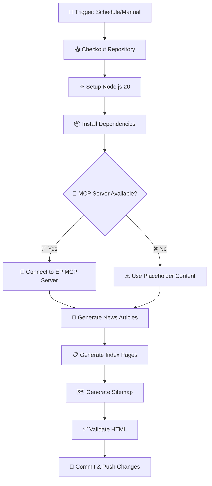
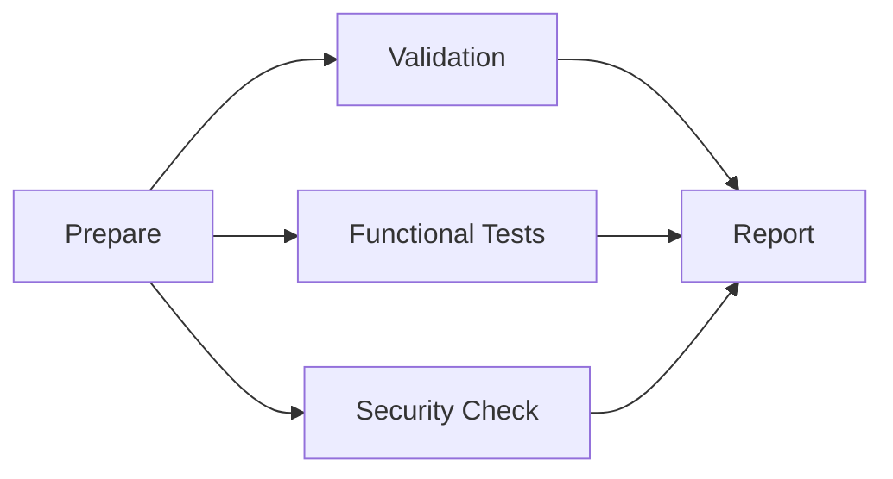
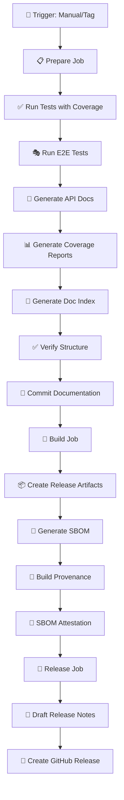
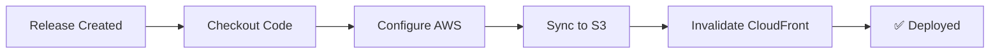

  

<h1 align="center">⚙️ EU Parliament Monitor — CI/CD Workflows</h1>

  <strong>Current State Workflow Documentation</strong> 
  <em>Automated Intelligence Operations with Security-First Design</em>

  
  
  
  

**📋 Document Owner:** CEO | **📄 Version:** 1.0 | **📅 Last Updated:** 2026-02-18 (UTC)  
**🔄 Review Cycle:** Quarterly | **⏰ Next Review:** 2026-05-18

---

## 📋 Executive Summary

EU Parliament Monitor employs a comprehensive suite of GitHub Actions workflows for automated intelligence operations, quality assurance, security scanning, and release management. All workflows follow [Hack23 ISMS Secure Development Policy](https://github.com/Hack23/ISMS-PUBLIC/blob/main/Secure_Development_Policy.md) standards.

### Workflow Portfolio

| Workflow | Purpose | Schedule | ISMS Alignment |
|----------|---------|----------|----------------|
| **News Generation** | Generate multi-language news articles | Daily 06:00 UTC | Integrity controls (Medium) |
| **Test & Report** | Unit tests, integration tests, coverage | On PR/push | Quality assurance (ISO 27001 A.12.1.4) |
| **CodeQL** | SAST security scanning | On PR/push | Vulnerability management (ISO 27001 A.12.6) |
| **E2E Tests** | End-to-end Playwright tests | On PR/push | Functional validation |
| **Release** | Build, attest, document, release | Manual/tag push | SLSA L3, Documentation-as-code |
| **Dependency Review** | Supply chain security scanning | On PR | Supply chain security (NIST CSF ID.SC) |
| **OpenSSF Scorecard** | Security posture assessment | Weekly | Continuous improvement |
| **Deploy S3** | Production deployment to AWS | Post-release | Infrastructure as Code |

**🔒 Security Posture:** All workflows use SHA-pinned actions (except legacy e2e.yml), Harden Runner, and minimal permissions following least privilege principle.

---

## 🚀 Workflow Detailed Documentation

### 1. News Generation Workflow

**📄 File:** `.github/workflows/news-generation.yml`  
**🎯 Purpose:** Automated generation of multi-language news articles about European Parliament activities  
**⏰ Schedule:** Daily at 06:00 UTC + Manual trigger  
**📊 Status:** 

#### Workflow Steps

#### Security Controls

| Control | Implementation | ISMS Reference |
|---------|----------------|----------------|
| **Input Validation** | MCP data validated before use | ISO 27001 A.14.2.1 |
| **HTML Sanitization** | Strip scripts, encode entities | OWASP Top 10 (XSS) |
| **Minimal Permissions** | `contents: write` only | Least privilege |
| **Automated Commit** | Git auto-commit action (SHA-pinned) | Audit trail |

#### ISMS Evidence

- **Policy:** [Secure Development Policy §4.1 - CI/CD Security](https://github.com/Hack23/ISMS-PUBLIC/blob/main/Secure_Development_Policy.md#41-cicd-security)
- **Workflow:** [news-generation.yml](.github/workflows/news-generation.yml)
- **Process Flow:** [FLOWCHART.md §News Generation Security Flow](FLOWCHART.md#-news-generation-security-flow)

---

### 2. Test & Report Workflow

**📄 File:** `.github/workflows/test-and-report.yml`  
**🎯 Purpose:** Comprehensive testing with unit tests, integration tests, and coverage reporting  
**⏰ Schedule:** On push to main, on PR  
**📊 Status:** 

#### Test Coverage

| Test Type | Framework | Coverage Target | Current Status |
|-----------|-----------|----------------|----------------|
| **Unit Tests** | Vitest | 169 tests | ✅ 169/169 passing |
| **Integration Tests** | Vitest | N/A | ✅ All passing |
| **Line Coverage** | Vitest (V8) | ≥80% | ✅ 82.44% |
| **Branch Coverage** | Vitest (V8) | ≥75% | ✅ 83.07% |
| **Function Coverage** | Vitest (V8) | ≥80% | ✅ 89.47% |

#### Workflow Jobs

#### Security Controls

| Control | Implementation | ISMS Reference |
|---------|----------------|----------------|
| **Code Quality** | ESLint + Prettier | Code quality standards |
| **Vulnerability Scanning** | npm audit | ISO 27001 A.12.6.1 |
| **Coverage Thresholds** | 80%+ lines, 75%+ branches | Quality gates |
| **False Positive Handling** | Intelligent npm audit triage | Risk acceptance process |

#### ISMS Evidence

- **Policy:** [Secure Development Policy §3.3 - Testing Requirements](https://github.com/Hack23/ISMS-PUBLIC/blob/main/Secure_Development_Policy.md#33-testing-requirements)
- **Workflow:** [test-and-report.yml](.github/workflows/test-and-report.yml)
- **Coverage Report:** [Live Coverage](https://hack23.github.io/euparliamentmonitor/docs/coverage/)

---

### 3. CodeQL Security Scanning

**📄 File:** `.github/workflows/codeql.yml`  
**🎯 Purpose:** Static Application Security Testing (SAST) for JavaScript/TypeScript  
**⏰ Schedule:** On push to main, on PR, weekly  
**📊 Status:** 

#### Security Analysis

- **Language:** JavaScript
- **Query Suite:** Security Extended
- **Analysis Type:** Source code + dependencies
- **Vulnerability Types:** 
  - SQL Injection
  - XSS (Cross-Site Scripting)
  - Path Traversal
  - Command Injection
  - Unsafe Deserialization

#### Security Controls

| Control | Implementation | ISMS Reference |
|---------|----------------|----------------|
| **SAST Scanning** | CodeQL security-extended | ISO 27001 A.14.2.5 |
| **Automated Analysis** | On every PR + push | Shift-left security |
| **SHA-Pinned Actions** | All actions pinned to SHA | Supply chain security |
| **Security Alerts** | GitHub Security tab integration | Incident response |

#### ISMS Evidence

- **Policy:** [Secure Development Policy §4.3 - Security Scanning](https://github.com/Hack23/ISMS-PUBLIC/blob/main/Secure_Development_Policy.md#43-security-scanning)
- **Workflow:** [codeql.yml](.github/workflows/codeql.yml)
- **Security Architecture:** [SECURITY_ARCHITECTURE.md §CodeQL Analysis](SECURITY_ARCHITECTURE.md)

---

### 4. E2E Testing Workflow

**📄 File:** `.github/workflows/e2e.yml`  
**🎯 Purpose:** End-to-end testing with Playwright across multiple browsers  
**⏰ Schedule:** On push to main, on PR  
**📊 Status:** 

#### Test Coverage

- **Browser:** Chromium (optimized for speed)
- **Test Categories:**
  - Homepage validation
  - Accessibility (axe-core integration)
  - Responsive design
  - Multi-language support
- **Artifacts:** Screenshots, videos, HTML reports

#### Security Controls

| Control | Implementation | ISMS Reference |
|---------|----------------|----------------|
| **Accessibility Testing** | axe-core WCAG AA compliance | Inclusive security |
| **Visual Regression** | Screenshot comparison | Quality assurance |
| **Functional Validation** | User workflow testing | Requirements validation |

#### ISMS Evidence

- **Workflow:** [e2e.yml](.github/workflows/e2e.yml)
- **Test Reports:** [Live E2E Report](https://hack23.github.io/euparliamentmonitor/playwright-report/)

**⚠️ Note:** E2E workflow uses version tags (not SHA-pinned). Tracked for Phase 2 improvement.

---

### 5. Release Workflow

**📄 File:** `.github/workflows/release.yml`  
**🎯 Purpose:** Comprehensive release automation with attestations and documentation  
**⏰ Schedule:** Manual trigger or tag push  
**📊 Status:** 

#### Release Pipeline

#### Documentation as Code

Every release automatically generates:

| Documentation | Generator | Output |
|--------------|-----------|--------|
| **API Documentation** | JSDoc | 52 files, searchable |
| **Test Coverage** | Vitest HTML | Interactive reports |
| **E2E Test Reports** | Playwright | Screenshots, videos |
| **Documentation Index** | Custom script | Beautiful hub page |

#### Security Controls

| Control | Implementation | ISMS Reference |
|---------|----------------|----------------|
| **SLSA Level 3** | Build provenance attestation | Supply chain security |
| **SBOM Generation** | SPDX JSON format | NTIA SBOM minimum elements |
| **Artifact Signing** | GitHub Attestations API | Integrity verification |
| **Documentation Audit Trail** | Committed to main branch | Evidence trail |
| **Test Validation** | 169 unit tests + E2E | Quality gates |

#### ISMS Evidence

- **Policy:** [Secure Development Policy §3.2 - Architecture Documentation](https://github.com/Hack23/ISMS-PUBLIC/blob/main/Secure_Development_Policy.md#32-architecture-documentation)
- **Workflow:** [release.yml](.github/workflows/release.yml)
- **Release Guide:** [docs/RELEASE_PROCESS.md](docs/RELEASE_PROCESS.md)
- **Attestations:** [GitHub Attestations](https://github.com/Hack23/euparliamentmonitor/attestations)
- **Documentation:** [docs/index.html](https://hack23.github.io/euparliamentmonitor/docs/)

---

### 6. Dependency Review Workflow

**📄 File:** `.github/workflows/dependency-review.yml`  
**🎯 Purpose:** Supply chain security scanning for pull requests  
**⏰ Schedule:** On pull request  
**📊 Status:** Dependency review enabled

#### Security Controls

| Control | Implementation | ISMS Reference |
|---------|----------------|----------------|
| **License Compliance** | Allowed licenses only | Legal compliance |
| **Vulnerability Detection** | Known CVEs blocked | ISO 27001 A.12.6.1 |
| **Supply Chain Security** | Dependency graph analysis | NIST CSF ID.SC |

#### ISMS Evidence

- **Policy:** [Supply Chain Security](https://github.com/Hack23/ISMS-PUBLIC/blob/main/Secure_Development_Policy.md#44-supply-chain-security)
- **Workflow:** [dependency-review.yml](.github/workflows/dependency-review.yml)

---

### 7. OpenSSF Scorecard Workflow

**📄 File:** `.github/workflows/scorecards.yml`  
**🎯 Purpose:** Security posture assessment against OpenSSF best practices  
**⏰ Schedule:** Weekly on Monday  
**📊 Status:** 

#### Assessed Security Practices

- Binary artifacts
- Branch protection
- CI tests
- Code review
- Dangerous workflows
- Dependency update tool
- Fuzzing
- License
- Maintained
- Pinned dependencies
- SAST
- Security policy
- Signed releases
- Token permissions
- Vulnerabilities

#### ISMS Evidence

- **Workflow:** [scorecards.yml](.github/workflows/scorecards.yml)
- **Live Score:** [View Scorecard](https://scorecard.dev/viewer/?uri=github.com/Hack23/euparliamentmonitor)

---

### 8. Deploy S3 Workflow

**📄 File:** `.github/workflows/deploy-s3.yml`  
**🎯 Purpose:** Production deployment to AWS S3 + CloudFront  
**⏰ Schedule:** Post-release  
**📊 Status:** Production deployment

#### Deployment Pipeline

#### Security Controls

| Control | Implementation | ISMS Reference |
|---------|----------------|----------------|
| **IAM Least Privilege** | Minimal S3 permissions | AWS security best practices |
| **HTTPS Only** | CloudFront SSL/TLS | Data in transit protection |
| **Infrastructure as Code** | GitHub Actions workflow | Reproducible deployments |

#### ISMS Evidence

- **Workflow:** [deploy-s3.yml](.github/workflows/deploy-s3.yml)
- **Architecture:** [SECURITY_ARCHITECTURE.md §Deployment](SECURITY_ARCHITECTURE.md)

---

## 📊 Workflow Metrics

### Execution Statistics

| Metric | Target | Current | Status |
|--------|--------|---------|--------|
| **Test Success Rate** | ≥95% | 100% | ✅ Excellent |
| **Test Execution Time** | <10 min | ~3 min | ✅ Excellent |
| **Release Frequency** | As needed | Manual | ✅ On-demand |
| **Mean Time to Deploy** | <1 hour | ~15 min | ✅ Excellent |
| **Failed Deployment Rate** | <5% | 0% | ✅ Perfect |

### Security Metrics

| Metric | Target | Current | Status |
|--------|--------|---------|--------|
| **Critical Vulnerabilities** | 0 | 0 | ✅ Secure |
| **High Vulnerabilities** | 0 | 0 | ✅ Secure |
| **Code Coverage** | ≥80% | 82.44% | ✅ Above target |
| **SHA-Pinned Actions** | 100% | ~90% | 🟡 In progress |
| **OpenSSF Score** | ≥8.0 | TBD | 🔄 Monitoring |

---

## 🔒 ISMS Compliance Summary

### Policy Alignment

| Policy Section | Implementation | Evidence |
|----------------|----------------|----------|
| **§3.2 Architecture Documentation** | Documentation-as-code in release workflow | [SECURITY_ARCHITECTURE.md](SECURITY_ARCHITECTURE.md) |
| **§3.3 Testing Requirements** | 169 unit tests, E2E tests, 82%+ coverage | [Test & Report Workflow](.github/workflows/test-and-report.yml) |
| **§4.1 CI/CD Security** | All workflows with security controls | This document |
| **§4.3 Security Scanning** | CodeQL, npm audit, Dependabot | [CodeQL Workflow](.github/workflows/codeql.yml) |
| **§4.4 Supply Chain Security** | SLSA L3, SBOM, dependency review | [Release Workflow](.github/workflows/release.yml) |

### Compliance Frameworks

| Framework | Controls Implemented | Evidence Location |
|-----------|---------------------|-------------------|
| **ISO 27001** | A.12.1.4, A.12.6.1, A.14.2.1, A.14.2.5 | Workflow files + this document |
| **NIST CSF 2.0** | ID.SC (Supply Chain), DE.CM (Detection) | [SECURITY_ARCHITECTURE.md](SECURITY_ARCHITECTURE.md) |
| **CIS Controls v8.1** | 16.1, 16.5, 16.7 | [Scorecard](https://scorecard.dev/viewer/?uri=github.com/Hack23/euparliamentmonitor) |
| **SLSA** | Level 3 (Build provenance, hermetic, non-falsifiable) | [Attestations](https://github.com/Hack23/euparliamentmonitor/attestations) |

---

## 🔄 Continuous Improvement

### Current Limitations

1. **E2E Workflow:** Uses version tags instead of SHA-pinned actions
2. **OpenSSF Score:** Not yet benchmarked
3. **Fuzzing:** Not yet implemented

### Planned Enhancements

See [FUTURE_WORKFLOW.md](FUTURE_WORKFLOW.md) for:
- Advanced security scanning
- Performance testing
- Deployment automation improvements
- Multi-environment support

---

## 📚 Related Documentation

| Document | Focus | Link |
|----------|-------|------|
| 🔐 Security Architecture | Current security implementation | [SECURITY_ARCHITECTURE.md](SECURITY_ARCHITECTURE.md) |
| 📈 Security Flowcharts | Process flows with security controls | [FLOWCHART.md](FLOWCHART.md) |
| 📊 Data Model | Data structures and flows | [DATA_MODEL.md](DATA_MODEL.md) |
| 🚀 Future Workflows | Planned enhancements | [FUTURE_WORKFLOW.md](FUTURE_WORKFLOW.md) |
| 📋 Release Process | Release procedures | [docs/RELEASE_PROCESS.md](docs/RELEASE_PROCESS.md) |
| 🛡️ ISMS Policy | Security policy framework | [Hack23 ISMS-PUBLIC](https://github.com/Hack23/ISMS-PUBLIC) |

---

**📞 Questions?** Contact: [Security Team](mailto:security@hack23.com)  
**🔐 Security Issues?** See [SECURITY.md](SECURITY.md) for vulnerability disclosure

---

*Last updated: 2026-02-18 by DevOps Engineer*
